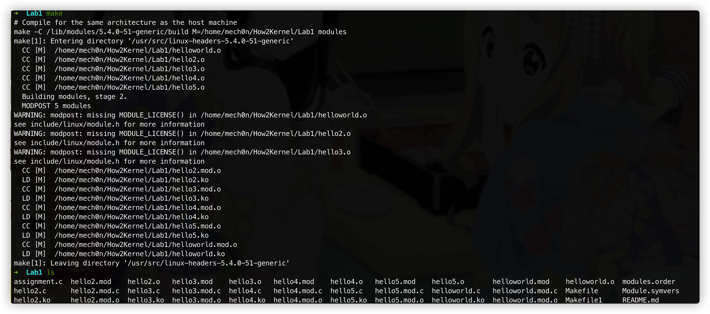
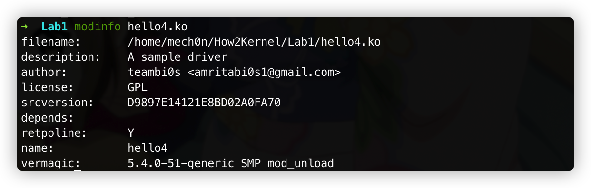
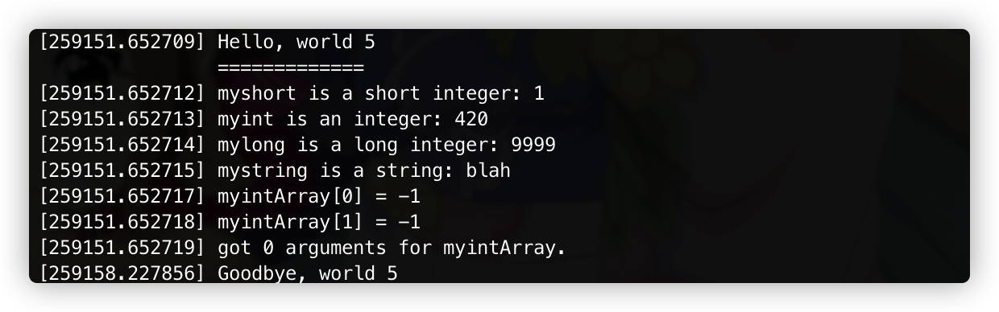
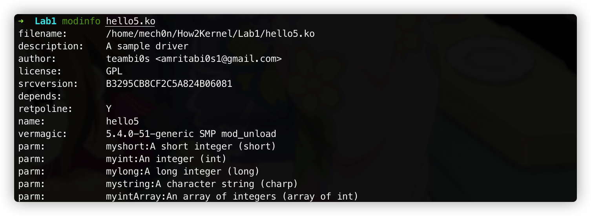
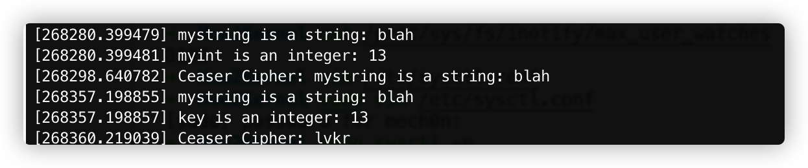

# How2Kernel-Lab1

> 总是想学pwn内核，又总是摸不着头脑，暂且找一个仓库学学看:[How2Kernel](https://github.com/R3x/How2Kernel)

#### 0x1 Helloworld

由于我的内核是5.4.0-51:

```shell
➜  Lab1 uname -r
5.4.0-51-generic
```

所以修改了一下`Makefile`:

```makefile
ifneq  ($(KERNELRELEASE),)
obj-m += helloworld.o
obj-m += hello2.o
obj-m += hello3.o
obj-m += hello4.o
obj-m += hello5.o
else
KDIR :=  ../kernel_source/linux-5.4.1
#KDIR := /lib/modules/$(shell uname -r)/build
PWD:=$(shell pwd)
all:
	make -C $(KDIR) M=$(PWD) modules
clean:
	rm -f *.ko *.mod.c *.mod *.mod.o modules.order  Module.symvers *.o
endif
```

`HelloWorld`部分内核文件：

```c
/* Module 1 - "Hello World" */
#include <linux/module.h>	/* Needed by all modules */
#include <linux/kernel.h>	/* Needed for KERN_ALERT */

/*
 * Called when the module is inserted
 */
int init_module(void)
{
	printk(KERN_INFO "Hello world 1.\n");

	/*
	 * return value :
         *      0 means successful
         *      non 0 means init_module failed and module can't be loaded.
         */
	return 0;
}

/*
 * Called when the module is removed from the kernel
 */
void cleanup_module(void)
{
        /* Cleanup module should always be of type void */
	printk(KERN_INFO "Goodbye world 1.\n");
}
```

编译模块：



然后加载模块：

```shell
➜  Lab1 sudo insmod helloworld.ko
➜  Lab1 sudo rmmod helloworld.ko
➜  Lab1 dmesg | tail
```


#### 0x2 Hello2.c

`init_module`是默认的模块的入口，如果指定其他的函数作为模块的入口就需要`module_init`函数。

`init_module()`是真正的入口，`module_init`是宏，如果在模块中使用`module_init()`，最后还是调用的到`init_module()`，具体可以参考[源码](https://elixir.bootlin.com/linux/latest/source/include/linux/module.h#L130)。

同理，`module_exit()`也是如此。

```c
/* Each module must use one module_init(). */
#define module_init(initfn)					\
	static inline initcall_t __maybe_unused __inittest(void)		\
	{ return initfn; }					\
	int init_module(void) __copy(initfn) __attribute__((alias(#initfn)));

/* This is only required if you want to be unloadable. */
#define module_exit(exitfn)					\
	static inline exitcall_t __maybe_unused __exittest(void)		\
	{ return exitfn; }					\
	void cleanup_module(void) __copy(exitfn) __attribute__((alias(#exitfn)));
```

所以模块还可以写成这样：

```c
/*
 *  Demonstrating the module_init() and module_exit() macros.
 *  This is preferred over using init_module() and cleanup_module().
 */
#include <linux/module.h>	/* Needed by all modules */
#include <linux/kernel.h>	/* Needed for KERN_ALERT */
#include <linux/init.h>		/* Needed for the macros */

static int __init hello_2_init(void)
{
	printk(KERN_INFO "Hello, world 2\n");
	return 0;
}

static void __exit hello_2_exit(void)
{
	printk(KERN_INFO "Goodbye, world 2\n");
}

module_init(hello_2_init);
module_exit(hello_2_exit);
```

加载模块：


#### 0x3 Hello3.c

> We now try to define a global variable and print its value during the insmod to the kernel logs.
>
> You are introduced to the __initdata macro.

补充知识：[内核中的宏定义__init,__initdata,__exitdata](https://blog.csdn.net/rikeyone/article/details/51545999)

[源码](https://elixir.bootlin.com/linux/latest/source/include/linux/init.h#L50)：

```c
/* These are for everybody (although not all archs will actually
   discard it in modules) */
#define __init		__section(.init.text) __cold  __latent_entropy __noinitretpoline
#define __initdata	__section(.init.data)
#define __initconst	__section(.init.rodata)
#define __exitdata	__section(.exit.data)
#define __exit_call	__used __section(.exitcall.exit)
```

所以在新的程序里，我们把`hello3_data`初始化到`.data`段。

```c
/*  
 *  Illustrating the __init, __initdata and __exit macros.
 */
#include <linux/module.h>	/* Needed by all modules */
#include <linux/kernel.h>	/* Needed for KERN_ALERT */
#include <linux/init.h>		/* Needed for the macros */

/*
 * Data gets initalized during the insertion process itself.
 */
static int hello3_data __initdata = 3;

static int __init hello_3_init(void)
{
	printk(KERN_INFO "Hello, world %d\n", hello3_data);
	return 0;
}

static void __exit hello_3_exit(void)
{
	printk(KERN_INFO "Goodbye, world 3\n");
}

/*
 * Macros defined in the kernel itself for
 * calling functions during insertion and deletion
 */
module_init(hello_3_init);
module_exit(hello_3_exit);
```

加载模块：


#### 0x4 Hello4.c

> Learn to License your driver with the GPL license and add information about your driver.

补充知识：[[Linux Kernel] 簡單 hello world: License and Module 介紹(part 3)](https://blog.wu-boy.com/2010/07/linux-kernel-%E7%B0%A1%E5%96%AE-hello-world-license-and-module-%E4%BB%8B%E7%B4%B9part-3/)

```c
/* Generic info of form tag = "info" */
#define MODULE_INFO(tag, info) __MODULE_INFO(tag, tag, info)

/* For userspace: you can also call me... */
#define MODULE_ALIAS(_alias) MODULE_INFO(alias, _alias)

/* Soft module dependencies. See man modprobe.d for details.
 * Example: MODULE_SOFTDEP("pre: module-foo module-bar post: module-baz")
 */
#define MODULE_SOFTDEP(_softdep) MODULE_INFO(softdep, _softdep)

/*
 * MODULE_FILE is used for generating modules.builtin
 * So, make it no-op when this is being built as a module
 */
#ifdef MODULE
#define MODULE_FILE
#else
#define MODULE_FILE	MODULE_INFO(file, KBUILD_MODFILE);
#endif

/*
 * The following license idents are currently accepted as indicating free
 * software modules
 *
 *	"GPL"				[GNU Public License v2]
 *	"GPL v2"			[GNU Public License v2]
 *	"GPL and additional rights"	[GNU Public License v2 rights and more]
 *	"Dual BSD/GPL"			[GNU Public License v2
 *					 or BSD license choice]
 *	"Dual MIT/GPL"			[GNU Public License v2
 *					 or MIT license choice]
 *	"Dual MPL/GPL"			[GNU Public License v2
 *					 or Mozilla license choice]
 *
 * The following other idents are available
 *
 *	"Proprietary"			[Non free products]
 *
 * Both "GPL v2" and "GPL" (the latter also in dual licensed strings) are
 * merely stating that the module is licensed under the GPL v2, but are not
 * telling whether "GPL v2 only" or "GPL v2 or later". The reason why there
 * are two variants is a historic and failed attempt to convey more
 * information in the MODULE_LICENSE string. For module loading the
 * "only/or later" distinction is completely irrelevant and does neither
 * replace the proper license identifiers in the corresponding source file
 * nor amends them in any way. The sole purpose is to make the
 * 'Proprietary' flagging work and to refuse to bind symbols which are
 * exported with EXPORT_SYMBOL_GPL when a non free module is loaded.
 *
 * In the same way "BSD" is not a clear license information. It merely
 * states, that the module is licensed under one of the compatible BSD
 * license variants. The detailed and correct license information is again
 * to be found in the corresponding source files.
 *
 * There are dual licensed components, but when running with Linux it is the
 * GPL that is relevant so this is a non issue. Similarly LGPL linked with GPL
 * is a GPL combined work.
 *
 * This exists for several reasons
 * 1.	So modinfo can show license info for users wanting to vet their setup
 *	is free
 * 2.	So the community can ignore bug reports including proprietary modules
 * 3.	So vendors can do likewise based on their own policies
 */
#define MODULE_LICENSE(_license) MODULE_FILE MODULE_INFO(license, _license)

/*
 * Author(s), use "Name <email>" or just "Name", for multiple
 * authors use multiple MODULE_AUTHOR() statements/lines.
 */
#define MODULE_AUTHOR(_author) MODULE_INFO(author, _author)

/* What your module does. */
#define MODULE_DESCRIPTION(_description) MODULE_INFO(description, _description)
```

啊这。😅

```c
/* Not Yet Implemented */
#define MODULE_SUPPORTED_DEVICE(name)
```

走走程序：

```c
/*  
 *  Demonstrates module documentation.
 */
#include <linux/module.h>
#include <linux/kernel.h>
#include <linux/init.h>
#define DRIVER_AUTHOR "teambi0s <amritabi0s1@gmail.com>"
#define DRIVER_DESC   "A sample driver"

static int __init init_hello_4(void)
{
	printk(KERN_INFO "Hello, world 4\n");
	return 0;
}

static void __exit cleanup_hello_4(void)
{
	printk(KERN_INFO "Goodbye, world 4\n");
}

module_init(init_hello_4);
module_exit(cleanup_hello_4);

/* 
 * To remove the "tainted module" message we licence
 * the code as GPL. 
 */
MODULE_LICENSE("GPL");

MODULE_AUTHOR(DRIVER_AUTHOR);	/* Who wrote this module? */
MODULE_DESCRIPTION(DRIVER_DESC);	/* What does this module do */

/*  
 *  This module uses /dev/testdevice.  The MODULE_SUPPORTED_DEVICE macro might
 *  be used in the future to help automatic configuration of modules, but is 
 *  currently unused other than for documentation purposes.
 */
MODULE_SUPPORTED_DEVICE("testdevice");
```

加载模块：


查看信息：



#### 0x5 Hello5.c

> Learn to pass arguments to the kernel module while inserting it. And then use it

补充知识：[送參數到 module 中](https://ithelp.ithome.com.tw/articles/10158541)

> 當然可以在載入 module 的同時帶參數進去，只不過不是用傳統的 argc/argv 的方式。在 Linux kernel 中，必須藉助 module_param() 巨集 (定義在 linux/moduleparam.h 中) 來達成。
>
> ​																																							--- [送參數到 module 中](https://ithelp.ithome.com.tw/articles/10158541)

贴代码：

```c
/*
 *  hello-5.c - Demonstrates command line argument passing to a module.
 */
#include <linux/module.h>
#include <linux/moduleparam.h>
#include <linux/kernel.h>
#include <linux/init.h>
#include <linux/stat.h>

MODULE_LICENSE("GPL");

MODULE_AUTHOR("teambi0s <amritabi0s1@gmail.com>");
MODULE_DESCRIPTION("A sample driver");

static short int myshort = 1;
static int myint = 420;
static long int mylong = 9999;
static char *mystring = "blah";
static int myintArray[2] = { -1, -1 };
static int arr_argc = 0;

/* 
 * module_param(foo, int, 0000)
 * The first param is the parameters name
 * The second param is it's data type
 * The final argument is the permissions bits, 
 * for exposing parameters in sysfs (if non-zero) at a later stage.
 */

module_param(myshort, short, S_IRUSR | S_IWUSR | S_IRGRP | S_IWGRP);
MODULE_PARM_DESC(myshort, "A short integer");
module_param(myint, int, S_IRUSR | S_IWUSR | S_IRGRP | S_IROTH);
MODULE_PARM_DESC(myint, "An integer");
module_param(mylong, long, S_IRUSR);
MODULE_PARM_DESC(mylong, "A long integer");
module_param(mystring, charp, 0000);
MODULE_PARM_DESC(mystring, "A character string");

/*
 * module_param_array(name, type, num, perm);
 * The first param is the parameter's (in this case the array's) name
 * The second param is the data type of the elements of the array
 * The third argument is a pointer to the variable that will store the number
 * of elements of the array initialized by the user at module loading time
 * The fourth argument is the permission bits
 */
module_param_array(myintArray, int, &arr_argc, 0000);
MODULE_PARM_DESC(myintArray, "An array of integers");

static int __init hello_5_init(void)
{
	int i;
	printk(KERN_INFO "Hello, world 5\n=============\n");
	printk(KERN_INFO "myshort is a short integer: %hd\n", myshort);
	printk(KERN_INFO "myint is an integer: %d\n", myint);
	printk(KERN_INFO "mylong is a long integer: %ld\n", mylong);
	printk(KERN_INFO "mystring is a string: %s\n", mystring);
	for (i = 0; i < (sizeof myintArray / sizeof (int)); i++)
	{
		printk(KERN_INFO "myintArray[%d] = %d\n", i, myintArray[i]);
	}
	printk(KERN_INFO "got %d arguments for myintArray.\n", arr_argc);
	return 0;
}

static void __exit hello_5_exit(void)
{
	printk(KERN_INFO "Goodbye, world 5\n");
}

module_init(hello_5_init);
module_exit(hello_5_exit);
```

加载模块：



参数信息：通过 `modinfo` 可以看到这个 `module` 的参数。



#### 0x6 assignment.c

> - Take a string as a argument during `insmod`
> - Have a integer variable 'key' defined as 13.
> - Print the string taken from the user and the key in the init_module()
> - Perform Ceaser Cipher on the string and print the result during cleanup_module()
> - Add the name of the file in the Makefile
> - Compile and test it.

实现代码：

```c
/*  
 *  
 * 
 */
#include <linux/module.h>	/* Needed by all modules */
#include <linux/kernel.h>	/* Needed for KERN_ALERT */
#include <linux/init.h>		/* Needed for the macros */
#include <linux/string.h>

// Take a string as a argument during insmod
static char *mystring = "blah";
module_param(mystring, charp, 0000);
MODULE_PARM_DESC(mystring, "A character string");
// Have a integer variable 'key' defined as 13.
static int key = 13;
module_param(key, int, S_IRUSR | S_IWUSR | S_IRGRP | S_IROTH);
MODULE_PARM_DESC(key, "An integer");

static int __init assignment_init(void)
{
  // Print the string taken from the user and the key in the init_module()
  printk(KERN_INFO "mystring is a string: %s\n", mystring);
  printk(KERN_INFO "key is an integer: %d\n", key);
  return 0;
}

static void __exit assignment_exit(void)
{
  /* Your Code here */
  // Perform Ceaser Cipher on the string and print the result during cleanup_module()
  int i;
  char result[100] = {0};
  char small_letter[26]={'a','b','c','d','e','f','g','h','i','j','k','l','m','n','o','p','q','r','s','t','u','v','w','x','y','z'};
  char big_letter[26]={'A','B','C','D','E','F','G','H','I','J','K','L','M','N','O','P','Q','R','S','T','U','V','W','X','Y','Z'};
  int m = strlen(mystring);
  for(i=0;i<m;i++) {
      if (mystring[i] >= 'A' && mystring[i] <= 'Z') {
          result[i] = big_letter[((mystring[i] - 'A') + 10) % 26];
      } else if (mystring[i] >= 'a' && mystring[i] <= 'z') {
          result[i] = small_letter[((mystring[i] - 'a') + 10) % 26];
      } else result[i] = mystring[i];
  }
  printk(KERN_INFO "Ceaser Cipher: %s\n", result);
}

module_init(assignment_init);
module_exit(assignment_exit);
```

编译加载：

```makefile
ifneq (${KERNELRELEASE},)
obj-m += helloworld.o
obj-m += hello2.o
obj-m += hello3.o
obj-m += hello4.o
obj-m += hello5.o
obj-m += assignment.o
# Assignment module here
else
KERNEL_SOURCE := /lib/modules/$(shell uname -r)/build
#../kernel_source/linux-4.18.16/ # ../kernel_source/linux-5.4.1/
PWD=$(shell pwd)
default:
	# Compile for the same architecture as the host machine
	make -C $(KERNEL_SOURCE) M=${PWD} modules
arm:
	# Cross compile for arm64/aarch64 architecture - Cross compiler needed !!!  
	ARCH=arm64 CROSS_COMPILE=aarch64-linux-gnu- $(MAKE) -C $(KERNEL_SOURCE) M=${PWD} modules
clean:
	# Cleans the Directory - removes all the files that were created
	$(MAKE) -C /lib/modules/$(shell uname -r)/build M=$(PWD) clean
	#rm -f *.ko *.mod.c *.mod *.mod.o modules.order  Module.symvers *.o 
endif
```



