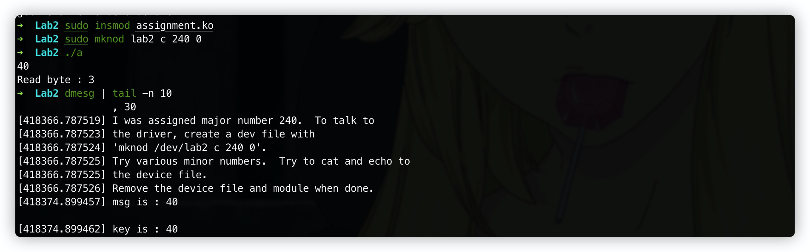

# How2Kernel Lab2

#### 0x1 assignment.c

> Assignment module : Make changes to the assignment from lab1 using ioctl so that  we can change the xor key

就是说修改一下Lab1的`assignment.c`用`ioctl`来实现一个可以修改`key`的模块。

偷个懒，直接使用作者实现的`ioctl`来写了，实现一个`write`来输入一个字符串转换成`int`赋值给`key`，一个`read`来读出现在的`key`。

贴代码：

```c
/*  
 * Assignment module : Make changes to the assignment from lab1 using ioctl so that 
 * we can change the xor key
 */

#include <linux/module.h> /* Needed by all modules */
#include <linux/kernel.h> /* Needed for KERN_ALERT */
#include <linux/init.h>   /* Needed for the macros */
#include <linux/fs.h>
#include <asm/uaccess.h> /* for put_user */
#include <linux/string.h>

#define DEVICE_NAME "lab2" /* Dev name as it appears in /proc/devices   */
#define BUF_LEN 80         /* Max length of the message from the device */

static int procfile_open(struct inode *inode, struct file *file);
static int procfile_release(struct inode *inode, struct file *file);
static ssize_t procfile_read(struct file *file, char *buffer, size_t buffer_length, loff_t *offset);
static ssize_t procfile_write(struct file *file, const char *buffer, size_t count, loff_t *offset);
long procfile_ioctl(struct file *file, unsigned int ioctl_num, unsigned long ioctl_param);

enum
{
        IOCTL_SET_MSG,
        IOCTL_GET_MSG,
        IOCTL_GET_NTH_BYTE
};

static int Major;           /* Major number assigned to our device driver */
static int Device_Open = 0; /* Is device open?  
				 * Used to prevent multiple access to device */
static char msg[BUF_LEN];   /* The msg the device will give when asked */
static char *msg_Ptr;
static int key = 13;
static char Message[BUF_LEN];
module_param(key, int, S_IRUSR | S_IWUSR | S_IRGRP | S_IROTH);
MODULE_PARM_DESC(key, "An integer");

static struct file_operations fops_struct =
    {
        .read = procfile_read,
        .write = procfile_write,
        .open = procfile_open,
        .release = procfile_release,
        .unlocked_ioctl = procfile_ioctl,
};

long procfile_ioctl(struct file *file, unsigned int ioctl_num, unsigned long ioctl_param)
{
        int i;
        char *temp;
        char ch;

        /*
	 * Switch according to the ioctl called
	 */
        switch (ioctl_num)
        {
        case IOCTL_SET_MSG:
                /*
		 * Receive a pointer to a message (in user space) and set that
		 * to be the device's message.  Get the parameter given to
		 * ioctl by the process.
		 */
                temp = ioctl_param;

                /*
		 * Find the length of the message
		 */
                get_user(ch, temp);
                for (i = 0; ch && i < BUF_LEN; i++, temp++)
                        get_user(ch, temp);

                procfile_write(file, ioctl_param, i, 0);
                break;

        case IOCTL_GET_MSG:
                break;

        case IOCTL_GET_NTH_BYTE:
                break;
        }

        return 0;
}

/* 
 * Called when a process tries to open the device file, like
 * "cat /dev/xxx"
 */
static int procfile_open(struct inode *inode, struct file *file)
{
        static int counter = 0;
        if (Device_Open)
                return -EBUSY;
        Device_Open++;
        try_module_get(THIS_MODULE);

        return 0;
}

/* 
 * Called when a process closes the device file.
 */
static int procfile_release(struct inode *inode, struct file *file)
{
        Device_Open--; /* We're now ready for our next caller */

        /* 
	 * Decrement the usage count, or else once you opened the file, you'll
	 * never get get rid of the module. 
	 */
        module_put(THIS_MODULE);

        return 0;
}

static ssize_t procfile_write(struct file *file, const char *buffer, size_t count, loff_t *offset)
{
        int i;
        int n;
        unsigned char sign = 0;

        memset(msg, 0, BUF_LEN);

        for (i = 0; i < count && i < BUF_LEN; i++)
                get_user(msg[i], buffer + i);
        msg[i] = 0;
        printk(KERN_INFO "msg is : %s\n", msg);

        msg_Ptr = msg;
        while (*msg_Ptr == ' ')
        {
                msg_Ptr++;
        }
        if (*msg_Ptr == '-')
        {
                sign = 1;
                msg_Ptr++;
        }
        else if (*msg_Ptr == '+')
        {
                msg_Ptr++;
        }
        n = 0;
        while ('0' <= *msg_Ptr && '9' >= *msg_Ptr)
                {
                        n = n * 10 + *msg_Ptr++ - '0';
                }
        
        n = sign ? -n : n;
        key = n;
        printk(KERN_INFO "key is : %d\n", key);
        /* 
	 * Again, return the number of input characters used 
	 */
        return i;
}

static ssize_t procfile_read(struct file *file, char *buffer, size_t buffer_length, loff_t *offset)
{
        printk(KERN_INFO "key is : %d\n", key);
}

static int __init assignment_init(void)
{
        Major = register_chrdev(0, DEVICE_NAME, &fops_struct);

        if (Major < 0)
        {
                printk("Registering the character device failed with %d\n",
                       Major);
                return Major;
        }

        printk(KERN_INFO "I was assigned major number %d.  To talk to\n", Major);
        printk(KERN_INFO "the driver, create a dev file with\n");
        printk(KERN_INFO "'mknod /dev/lab2 c %d 0'.\n", Major);
        printk(KERN_INFO "Try various minor numbers.  Try to cat and echo to\n");
        printk(KERN_INFO "the device file.\n");
        printk(KERN_INFO "Remove the device file and module when done.\n");

        return 0;
}

static void __exit assignment_exit(void)
{
        /* 
	 * Unregister the device 
	 */
        unregister_chrdev(Major, DEVICE_NAME);
}

module_init(assignment_init);
module_exit(assignment_exit);

```

然后一个调用这个模块的`demo`:

```c
/*
 *  ioctl.c - the process to use ioctl's to control the kernel module
 *
 *  Until now we could have used cat for input and output.  But now
 *  we need to do ioctl's, which require writing our own process.
 */

/* 
 * device specifics, such as ioctl numbers and the
 * major device file. 
 */

#include <stdio.h>
#include <stdlib.h>
#include <fcntl.h>		/* open */
#include <unistd.h>		/* exit */

#define DEVICE_FILE_NAME "lab2"

void
ioctl_set_msg(int file_desc, char *message)
{
  int ret_val;

  ret_val = ioctl(file_desc, 0, message);

  if (ret_val < 0) {
    printf("ioctl_set_msg failed:%d\n", ret_val);
    exit(-1);
  }
}

/* 
 * Main - Call the ioctl functions 
 */
int
main()
{
  int file_desc;

  file_desc = open(DEVICE_FILE_NAME, 0);
  if (file_desc < 0) {
    printf("Can't open device file: %s\n", DEVICE_FILE_NAME);
    exit(-1);
  }
	char buf[100];
	printf("Read byte : %d\n", read(0, buf, 100));
  ioctl_set_msg(file_desc, buf);

  close(file_desc);
}
```

模块加载之后需要`mknod`来创建一个字符设备文件。

`sudo mknod lab2 c 240 0`

#### 0x2 结果

还是得先改一下`Makefile`:

```makefile
ifneq (${KERNELRELEASE},)
obj-m += ioctl.o
obj-m += chardev.o
obj-m += assignment.o
# Assignment module here
else
KERNEL_SOURCE := /lib/modules/$(shell uname -r)/build
#../kernel_source/linux-4.18.16/
PWD := $(shell pwd)
default:
	# Compile for the same architecture as the host machine
	$(MAKE) -C $(KERNEL_SOURCE) M=${PWD} modules
	gcc -static -o demo demo.c
arm:
	# Cross compile for arm64/aarch64 architecture - Cross compiler needed !!!
	ARCH=arm64 CROSS_COMPILE=aarch64-linux-gnu- $(MAKE) -C $(KERNEL_SOURCE) M=${PWD} modules
clean:
	# Cleans the Directory - removes all the files that were created
	$(MAKE) -C $(KERNEL_SOURCE) M=${PWD} clean
	rm demo
endif
```

