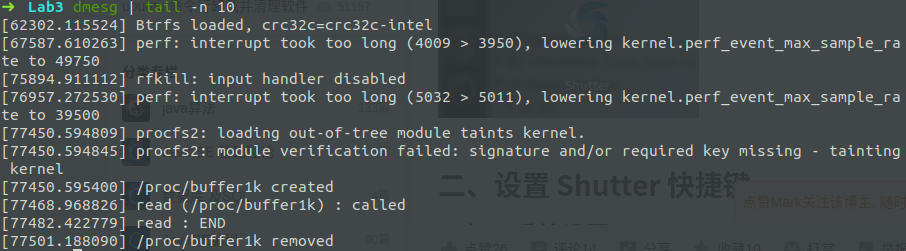
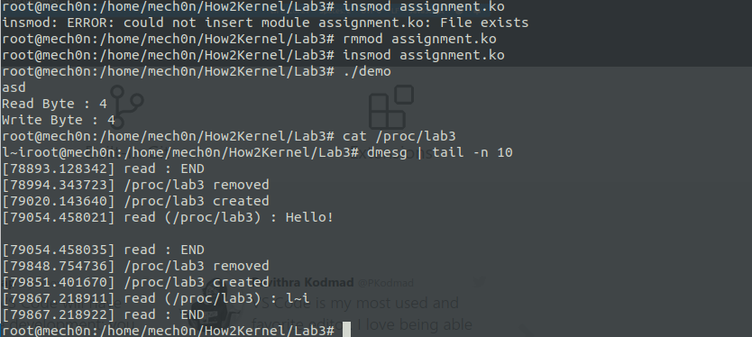

# How2Kernel-Lab3

> In Linux, there is an additional mechanism for the kernel and kernel modules to send information to processes --- the /proc file system. Originally designed to allow easy access to information about processes (hence the name), it is now used by every bit of the kernel which has something interesting to report, such as /proc/modules which provides the list of modules and /proc/meminfo which stats memory usage statistics.
>
> The method to use the proc file system is very similar to the one used with device drivers --- a structure is created with all the information needed for the /proc file, including pointers to any handler functions (in our case there is only one, the one called when somebody attempts to read from the /proc file). Then, init_module registers the structure with the kernel and cleanup_module unregisters it.

#### 0x1 procfs2.c

> procfs2.c - create a "file" in /proc, file can be written to and read from.

之所以我先运行一下这个程序，是因为我的`assignment.c`是通过这个改的。😆

直接贴一下运行结果吧：



反正就是通过`read`函数读取`/proc/bufer1k`文件可以调用这个内核模块。

#### 0x2 assignment.c

> - Take a string as input from the user by implementing write for the procfs file.
> - Have an integer variable 'key' defined as 13
> - Perform a single key xor on the string with the given key and print the resulting hex encoded string by implementing read for the procfs file.
> - Add to Makefile and test.

读入一串字符串，然后挨个儿用`key`异或。

代码：

```c
/*  
 * Perform a single key xor on the string with the given key and print 
 * the resulting hex encoded string by implementing read 
 * for the procfs file. 
 * 
 */
#include <linux/module.h>  /* Specifically, a module */
#include <linux/kernel.h>  /* We're doing kernel work */
#include <linux/proc_fs.h> /* Necessary because we use the proc fs */
#include <linux/uaccess.h> /* for copy_from_user */
#include <linux/string.h> /* for strlen */

/* Include other required Header Files*/
#define PROCFS_MAX_SIZE 1024
#define PROCFS_NAME "lab3"

static int key = 13;
module_param(key, int, S_IRUSR | S_IWUSR | S_IRGRP | S_IROTH);
MODULE_PARM_DESC(key, "An integer");

/**
 *
 * This structure hold information about the /proc file
 *
 */
static struct proc_dir_entry *Our_Proc_File;
/**
 * The buffer used to store character for this module
 *
 */
static char procfs_buffer[PROCFS_MAX_SIZE];
/**
 * The size of the buffer
 *
 */
static unsigned long procfs_buffer_size = 0;

static ssize_t procfile_write(struct file *file, const char *buffer, size_t count, loff_t *offset)
{
  /* get buffer size */
  procfs_buffer_size = count;
  if (procfs_buffer_size > PROCFS_MAX_SIZE)
  {
    procfs_buffer_size = PROCFS_MAX_SIZE;
  }
  /* write data to the buffer */
  if (copy_from_user(procfs_buffer, buffer, procfs_buffer_size))
  {
    return -EFAULT;
  }

  int i = 0;
  for (i = 0; i < strlen(procfs_buffer); i++)
  {
    procfs_buffer[i] ^= key;
  }
  return procfs_buffer_size;
}

static ssize_t procfile_read(struct file *file, char *buffer, size_t buffer_length, loff_t *offset)
{
  static int flag = 0;
  if (flag)
  {
    printk(KERN_INFO "read : END\n");
    flag = 0;
    return 0;
  }
  printk(KERN_INFO "read (/proc/%s) : %s\n", PROCFS_NAME, procfs_buffer);
  flag = 1;
  return sprintf(buffer, procfs_buffer);
}

static struct file_operations fops_struct = {

    .read = procfile_read,
    .write = procfile_write,
};

static int __init assignment_init(void)
{
  /* create the /proc file */
  Our_Proc_File = proc_create(PROCFS_NAME, 0644, NULL, &fops_struct);
  if (Our_Proc_File == NULL)
  {
    remove_proc_entry(PROCFS_NAME, NULL);
    printk(KERN_ALERT "Error: Could not initialize /proc/%s\n",
           PROCFS_NAME);
    return -ENOMEM;
  }
  //        Our_Proc_File->owner       = THIS_MODULE;
  //        Our_Proc_File->mode        = S_IFREG | S_IRUGO;
  //        Our_Proc_File->uid         = 0;
  //        Our_Proc_File->gid         = 0;
  //        Our_Proc_File->size        = 37;
  printk(KERN_INFO "/proc/%s created\n", PROCFS_NAME);
  return 0; /* everything is ok */
}

static void __exit assignment_exit(void)
{
  remove_proc_entry(PROCFS_NAME, NULL);
  printk(KERN_INFO "/proc/%s removed\n", PROCFS_NAME);
}

module_init(assignment_init);
module_exit(assignment_exit);
```

一个调用模块的`demo.c`

```c
#include <stdio.h>
#include <stdlib.h>
#include <fcntl.h>     /* open */
#include <unistd.h>    /* exit */
#include <sys/ioctl.h> /* ioctl */

#define DEVICE_FILE_NAME "/proc/lab3"
#define PROCFS_MAX_SIZE 1024

int main()
{
    int file_desc;

    file_desc = open(DEVICE_FILE_NAME, O_RDWR);
    if (file_desc < 0)
    {
        printf("Can't open file: %s\n", DEVICE_FILE_NAME);
        exit(-1);
    }

    char str[PROCFS_MAX_SIZE] = {0};
    int len = read(0, str, PROCFS_MAX_SIZE);
    printf("Read Byte : %d\n", len);
    printf("Write Byte : %d\n", write(file_desc, str, len));

    close(file_desc);
}
```

修改`Makefile`然后`make`和加载模块：



