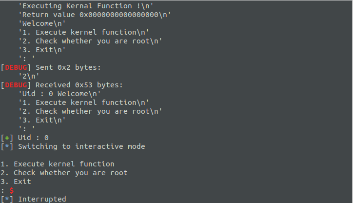

# How2Kernel-Lab4

> Find your first kernel primitives

没啥可分析的。。

`user.c`的`execute_kernel_function()`函数就是调用的内核的`call_func()`函数。

而`call_func()`函数：

```c
static long 
call_func(struct call_arg * call_arg_ptr)
{
  unsigned long (* call )(unsigned long);
  long ret;
  struct call_arg call_args;
  if(copy_from_user(&call_args,call_arg_ptr,
                    sizeof(struct call_arg)))
    {
                return -EFAULT;
    }
  printk("Calling function @ 0x%016lx \nWith argument  0x%016lx\n"
         ,call_args.fn_addr
         ,call_args.args);
  call =(void *) call_args.fn_addr;
  ret = call(call_args.args);
  return ret;
}
```

这个函数就是提供一个函数地址和函数参数，然后调用这个函数执行。

所以就是执行`commit_creds(prepare_kernel_cred(0))`。



[脚本贴在这里了。](https://gist.github.com/Mech0n/0328b692998e1ff6f10f4dc26ce8ea84)