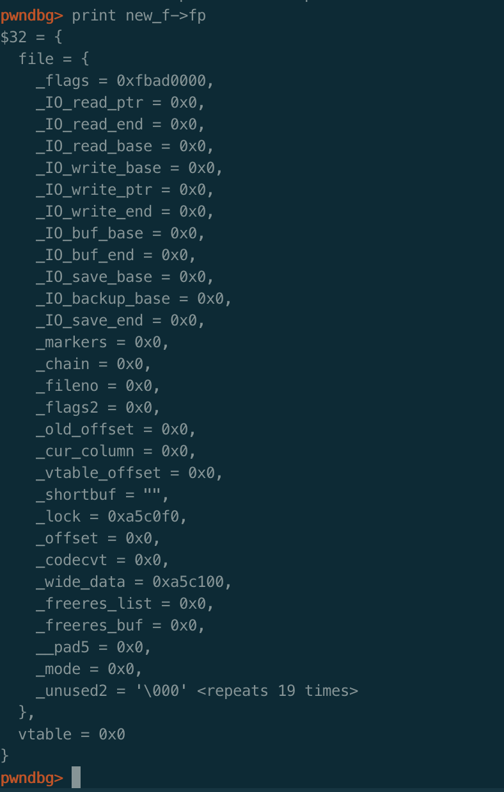
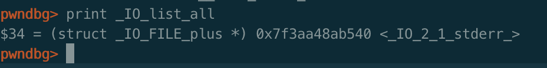

**欢迎关注公众号[平凡路上](https://mp.weixin.qq.com/s/TR-JuE2nl3W7ZmufAfpBZA)，平凡路上是一个致力于二进制漏洞分析与利用经验交流的公众号。**

## 前言

最近打算详细整理下`IO FILE`相关的笔记，不少地方都是知道个大概，因此这次打算从源码出发，把IO FILE相关的东西都过一遍。

思路大致是`fopen`、`fwrite`以及`fread`之类的IO函数的源码分析，再到libc2.24对vtable检查之前的利用方式，再到vtable检查的分析以及相应的对抗方式。

第一篇fopen详解，主要是基于源码的分析，源码的动态调试建议大家使用带调试符号的glibc，再次给大家推荐[**pwn_debug**](https://github.com/ray-cp/pwn_debug)，可以很方便的安装带调试符号的glibc，使用debug模式即可。

## 源码分析

首先编写一个简单的调用fopen函数的c程序。
```c
#include<stdio.h>

int main(){

    FILE*fp=fopen("test","wb");
    char *ptr=malloc(0x20);
    return 0;
}
```
编译出来之后使用pwn_debug的debug模式开启程序，或者指定带调试符号的glibc，我这里使用的glibc版本是2.23。接下来开始分析。

gdb跟进去fopen函数，可以看到fopen实际上是 `_IO_new_fopen`函数，该函数在`/libio/iofopen.c`文件中，可以看到它调用的是`__fopen_internal`：
```c
_IO_FILE *
_IO_new_fopen (const char *filename, const char *mode)
{
  return __fopen_internal (filename, mode, 1);
}
```
跟进去`__fopen_internal`中，关键源码如下：
```c
_IO_FILE *
__fopen_internal (const char *filename, const char *mode, int is32)
{
  struct locked_FILE
  {
    struct _IO_FILE_plus fp;
#ifdef _IO_MTSAFE_IO
    _IO_lock_t lock;
#endif
    struct _IO_wide_data wd;
  } *new_f = (struct locked_FILE *) malloc (sizeof (struct locked_FILE));  ## step 1 分配内存

...

  _IO_no_init (&new_f->fp.file, 0, 0, &new_f->wd, &_IO_wfile_jumps); ## step 2 null初始化结构体数据 
...

  _IO_JUMPS (&new_f->fp) = &_IO_file_jumps; ## 设置vtable为_IO_file_jumps
  _IO_file_init (&new_f->fp); ## step 3 将file结构体链接进去_IO_list_all

...
  # step 4 打开文件
  if (_IO_file_fopen ((_IO_FILE *) new_f, filename, mode, is32) != NULL)
    return __fopen_maybe_mmap (&new_f->fp.file);

}
```
整个`__fopen_internal`函数包含四个部分：
1. `malloc`分配内存空间。
2. `_IO_no_init` 对file结构体进行`null`初始化。
3. `_IO_file_init`将结构体链接进`_IO_list_all`链表。
4. `_IO_file_fopen`执行系统调用打开文件。

下面详细分析跟进去每个子函数进行分析。

### malloc分配内存空间
可以看到首先调用`malloc`函数分配了一个`struct locked_FILE`大小的结构体，这个结构体比函数刚开始的地方定义，在64位系统中为0x230，该结构体包含三个`_IO_FILE_plus`、`_IO_lock_t`、`_IO_wide_data`，其中`_IO_FILE_plus`为使用的`IO FILE`的结构体。执行完`malloc`后内存状态如下：


### _IO_no_init 对file结构体进行null初始化
在分配完空间后，接着就调用`_IO_no_init`函数去null初始化结构体，跟进去该函数，函数在`/libio/genops.c`中：
```c
void
_IO_old_init (_IO_FILE *fp, int flags)
{
  fp->_flags = _IO_MAGIC|flags;
  fp->_flags2 = 0;
  fp->_IO_buf_base = NULL;
  fp->_IO_buf_end = NULL;
  fp->_IO_read_base = NULL;
  fp->_IO_read_ptr = NULL;
  fp->_IO_read_end = NULL;
  fp->_IO_write_base = NULL;
  fp->_IO_write_ptr = NULL;
  fp->_IO_write_end = NULL;
  fp->_chain = NULL; /* Not necessary. */

  fp->_IO_save_base = NULL;
  fp->_IO_backup_base = NULL;
  fp->_IO_save_end = NULL;
  fp->_markers = NULL;
  fp->_cur_column = 0;
...
  fp->_vtable_offset = 0;
...
}
void
_IO_no_init (_IO_FILE *fp, int flags, int orientation,
         struct _IO_wide_data *wd, const struct _IO_jump_t *jmp)
{
  _IO_old_init (fp, flags);
  fp->_mode = orientation;
  ...
      ## 初始化fp的_wide_data字段
      fp->_wide_data = wd;
      fp->_wide_data->_IO_buf_base = NULL;
      fp->_wide_data->_IO_buf_end = NULL;
      fp->_wide_data->_IO_read_base = NULL;
      fp->_wide_data->_IO_read_ptr = NULL;
      fp->_wide_data->_IO_read_end = NULL;
      fp->_wide_data->_IO_write_base = NULL;
      fp->_wide_data->_IO_write_ptr = NULL;
      fp->_wide_data->_IO_write_end = NULL;
      fp->_wide_data->_IO_save_base = NULL;
      fp->_wide_data->_IO_backup_base = NULL;
      fp->_wide_data->_IO_save_end = NULL;

      fp->_wide_data->_wide_vtable = jmp;
    ...
  fp->_freeres_list = NULL;
}
```
可以看到函数最主要的功能是初始化`locked_FILE`里面的`_IO_FILE_plus`结构体，基本上将所有的值都初始化为null以及默认值，同时将`_wide_data`字段赋值并初始化。初始化结束后，FILE结构体如下：


### _IO_file_init将结构体链接进_IO_list_all
在执行完`_IO_no_init`函数后，回到`__fopen_internal`函数，函数将`_IO_FILE_plus`结构体的vtable设置成了`_IO_file_jumps`，然后调用`_IO_file_init`将`_IO_FILE_plus`结构体链接进入`_IO_list_all`链表，跟进去函数，函数在`/libio/fileops.c`中：
```c
void
_IO_new_file_init (struct _IO_FILE_plus *fp)
{
  
  fp->file._offset = _IO_pos_BAD;
  fp->file._IO_file_flags |= CLOSED_FILEBUF_FLAGS;
  ## 调用_IO_link_in和设置_fileno
  _IO_link_in (fp);
  fp->file._fileno = -1;
}
libc_hidden_ver (_IO_new_file_init, _IO_file_init)
```
看到这个函数的主体就是调用了`_IO_link_in`函数，跟进去，函数在`/libio/genops.c`中：
```c
void
_IO_link_in (struct _IO_FILE_plus *fp)
{
  ## 检查flag的标志位是否是_IO_LINKED
  if ((fp->file._flags & _IO_LINKED) == 0)
    {
      ## 设置_IO_LINKED标志位
      fp->file._flags |= _IO_LINKED;
      ...
      fp->file._chain = (_IO_FILE *) _IO_list_all;
      _IO_list_all = fp;
      ++_IO_list_all_stamp;
      ...
    }
}
libc_hidden_def (_IO_link_in)
```
之前一直都知道FILE结构体是通过`_IO_list_all`的单链表进行管理的，这里`_IO_link_in`函数的功能是检查FILE结构体是否包含`_IO_LINKED`标志，如果不包含则表示这个结构体没有链接进入`_IO_list_all`，则再后面把它链接进入`_IO_list_all`链表，同时设置FILE结构体的`_chain`字段为之前的链表的值，否则直接返回。

所以`_IO_file_init`主要功能是将FILE结构体链接进入`_IO_list_all`链表，在没执行`_IO_file_init`函数前`_IO_list_all`指向的是`stderr`结构体：

执行完后可以看到`_IO_list_all`指向的是申请出来的结构体：

同时此时FILE结构体的`_chain`字段指向了之前的`stderr`结构体：


### _IO_file_fopen打开文件句柄

将FILE结构体链接到`_IO_list_all`链表后，程序返回到`__fopen_internal`中，接下来就调用`_IO_new_file_fopen`函数，跟进去该函数，函数在`libio/fileops.c`文件中：
```c
_IO_FILE *
_IO_new_file_fopen (_IO_FILE *fp, const char *filename, const char *mode,
            int is32not64)
{
  
  ...
  ## 检查文件是否以打开，打开则返回
  if (_IO_file_is_open (fp))
    return 0;
  ## 设置文件打开模式
  switch (*mode)
    {
    case 'r':
      omode = O_RDONLY;
      read_write = _IO_NO_WRITES;
      break;
      ...    
     }
  ...
  ## 调用_IO_file_open函数
  result = _IO_file_open (fp, filename, omode|oflags, oprot, read_write,
              is32not64);
  ...
}
libc_hidden_ver (_IO_new_file_fopen, _IO_file_fopen)
```
函数先检查文件描述符是否打开，然后设置文件打开的模式，最后调用`_IO_file_open`函数，跟进去`_IO_file_open`函数，该函数在`/libio/fileops.c`里面：
```c
_IO_FILE *
_IO_file_open (_IO_FILE *fp, const char *filename, int posix_mode, int prot,
           int read_write, int is32not64)
{
  int fdesc;

  ...
  # 调用系统函数open打开文件  
  fdesc = open (filename, posix_mode | (is32not64 ? 0 : O_LARGEFILE), prot);
  ...
  # 将文件描述符设置到FILE结构体的相应字段_fileno里
  fp->_fileno = fdesc;
  ...
  #再次调用_IO_link_in
  _IO_link_in ((struct _IO_FILE_plus *) fp);
  return fp;
}
libc_hidden_def (_IO_file_open)
```
函数的主要功能就是执行系统调用`open`打开文件，并将文件描述符赋值给FILE结构体的`_fileno `字段，最后再次调用`_IO_link_in`函数，确保该结构体被链接进入`_IO_list_all`链表。

执行完`_IO_new_file_fopen`函数后，FILE结构体为：


该函数执行完后，程序返回FILE结构体指针，分析结束

## 小结

看完代码后，可以将fopen整体的流程可以归纳为：
1. `malloc`分配内存空间。
2. `_IO_no_init` 对file结构体进行`null`初始化。
3. `_IO_file_init`将结构体链接进`_IO_list_all`链表。
4. `_IO_file_fopen`执行系统调用打开文件。

整个流程还是比较简单的，fopen返回之后`_IO_list_all`链表指向返回的FILE结构体，且FILE结构体的_chain字段指向之前的结构体（没有其他额外打开文件的话，将是指向`stderr`），同时其他的字段大多都是默认的null值，`vtable`存储的是`__GI__IO_file_jumps`函数表，截图如下。


文章先发于[安全客](https://www.anquanke.com/post/id/177910)
