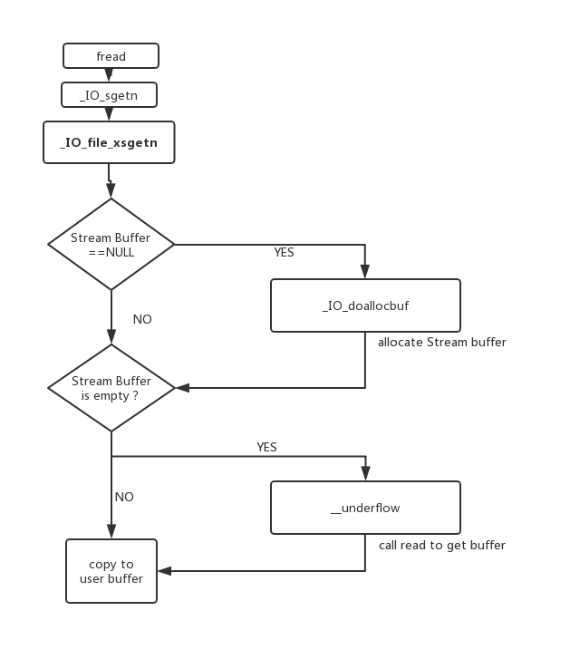
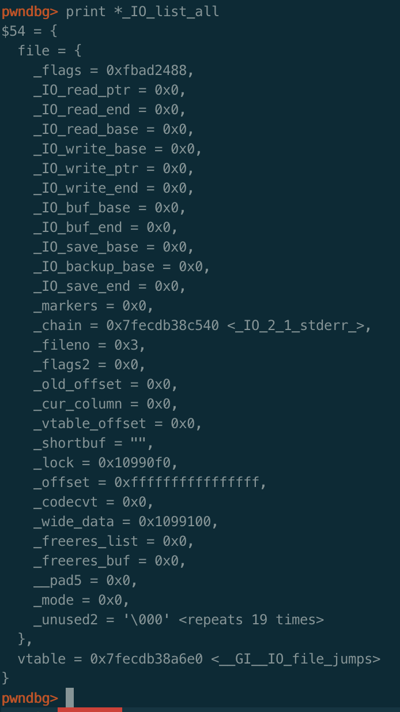
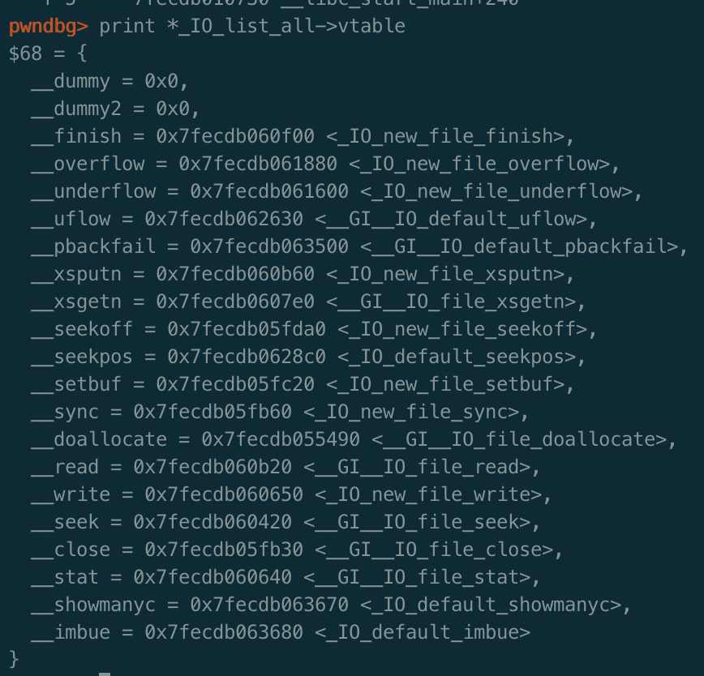
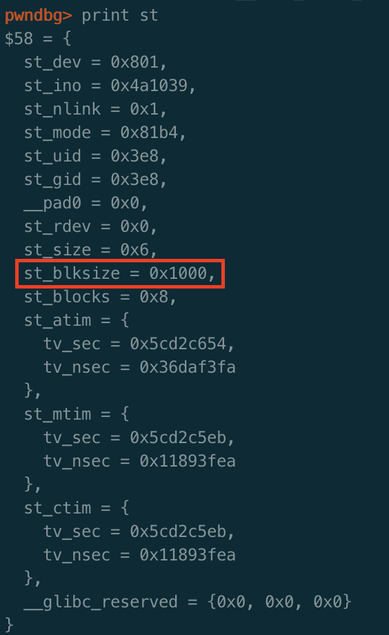
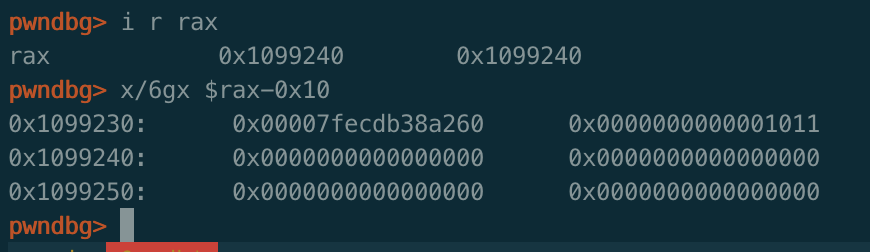
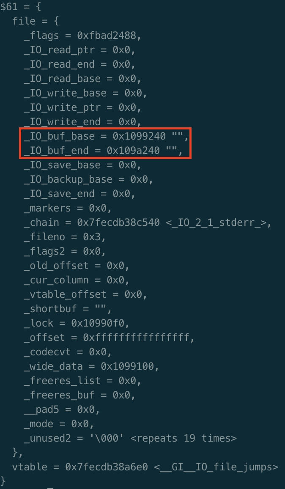
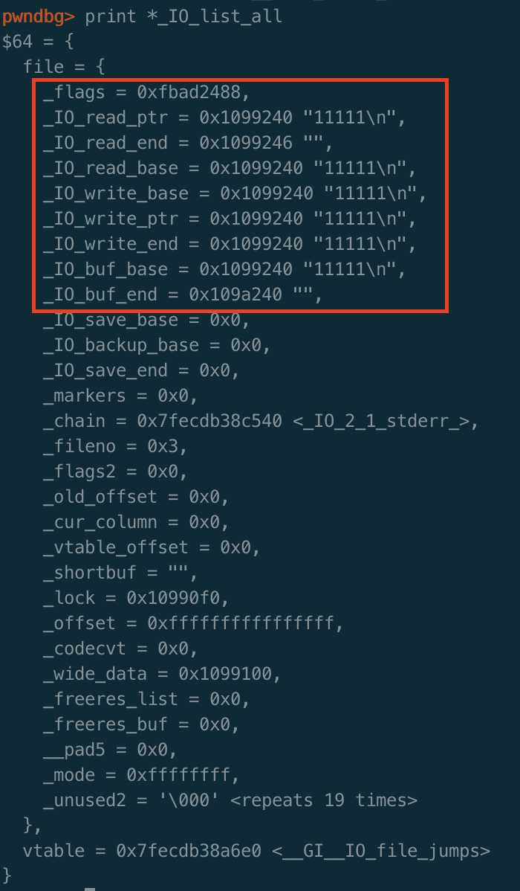

> **欢迎关注公众号[平凡路上](https://mp.weixin.qq.com/s/TR-JuE2nl3W7ZmufAfpBZA)，平凡路上是一个致力于二进制漏洞分析与利用经验交流的公众号。**

这是IO FILE系列的第二篇文章，主要写的是对于`fread`函数的源码分析，描述`fread`读取文件流的主要流程以及函数对IO FILE结构体以及结构体中的`vtable`的操作。流程有点小复杂，入坑需谨慎。

## 总体流程
第一篇文章[fopen](https://ray-cp.github.io/archivers/IO_FILE_fopen_analysis)的分析，讲述了系统如何为FILE结构体分配内存并将其链接进入`_IO_list_all`的。

这篇文章则是说在创建了文件FILE以后，`fread`如何实现从文件中读取数据的。在开始源码分析之前，我先把fread的流程图给贴出来，后面在分析源码的时候，可以适时的参考下流程图，增进理解：

从图中可以看到，整体流程为`fread`调用`_IO_sgetn`，`_IO_sgetn`调用`vtable`中的`_IO_XSGETN`也就是`_IO_file_xsgetn`，`_IO_file_xsgetn`是`fread`实现的核心函数。它的流程简单总结为：

1. 判断`fp->_IO_buf_base`输入缓冲区是否为空，如果为空则调用的`_IO_doallocbuf`去初始化输入缓冲区。
2. 在分配完输入缓冲区或输入缓冲区不为空的情况下，判断输入缓冲区是否存在数据。
3. 如果输入缓冲区有数据则直接拷贝至用户缓冲区，如果没有或不够则调用`__underflow`函数执行系统调用读取数据到输入缓冲区，再拷贝到用户缓冲区。

## 源码分析

仍然是基于glibc2.23的源码分析，使用带符号的glibc对程序进行调试。

fread的函数原型是：
```c
size_t fread(void *ptr, size_t size, size_t nmemb, FILE *stream);
The  function fread() reads nmemb items of data, each size bytes long, from the stream pointed to by stream, storing them at the location given by ptr.
```

demo程序如下：
```c
#include<stdio.h>

int main(){
    char data[20];
    FILE*fp=fopen("test","rb");
    fread(data,1,20,fp);
    return 0;
}
```
要让程序可以运行，执行命令`echo 111111>test`，然后gdb加载程序，断点下在fread，开始一边看源码，一边动态跟踪流程。

程序运行起来后，可以看到断在`_IO_fread`函数。在开始之前我们先看下FILE结构体`fp`的内容，从图里可以看到此时的`_IO_read_ptr`和`_IO_buf_base`等指针都还是空的，后面的分析一个很重要的步骤也是看这些指针是如何被赋值以及发挥作用的：


vtable中的指针内容如下：


`fread`实际上是`_IO_fread`函数，文件目录为`/libio/iofread.c`：

```c
_IO_size_t
_IO_fread (void *buf, _IO_size_t size, _IO_size_t count, _IO_FILE *fp)
{
  _IO_size_t bytes_requested = size * count;
  _IO_size_t bytes_read;
  ...
  # 调用_IO_sgetn函数
  bytes_read = _IO_sgetn (fp, (char *) buf, bytes_requested);
  ...
  return bytes_requested == bytes_read ? count : bytes_read / size;
}
libc_hidden_def (_IO_fread)
```
`_IO_fread`函数调用`_IO_sgetn`函数，跟进去该函数：
```c
_IO_size_t
_IO_sgetn (_IO_FILE *fp, void *data, _IO_size_t n)
{
  /* FIXME handle putback buffer here! */
  return _IO_XSGETN (fp, data, n);
}
libc_hidden_def (_IO_sgetn)
```
看到其调用了`_IO_XSGETN`函数，查看它定义：
```c
#define _IO_XSGETN(FP, DATA, N) JUMP2 (__xsgetn, FP, DATA, N)
```
实际上就是FILE结构体中`vtable`的`__xsgetn`函数，跟进去`/libio/fileops.c`：
```c
_IO_size_t
_IO_file_xsgetn (_IO_FILE *fp, void *data, _IO_size_t n)
{
  _IO_size_t want, have;
  _IO_ssize_t count;
  char *s = data;

  want = n;

  if (fp->_IO_buf_base == NULL)
    {
      ...
      # 第一部分，如果fp->_IO_buf_base为空的话则调用`_IO_doallocbuf`
      _IO_doallocbuf (fp);
    }

  while (want > 0)
    {
    
      have = fp->_IO_read_end - fp->_IO_read_ptr;
    ## 第二部分，输入缓冲区里已经有足够的字符，则直接把缓冲区里的字符给目标buf  
    	if (want <= have)   
  {
    memcpy (s, fp->_IO_read_ptr, want);
    fp->_IO_read_ptr += want;
    want = 0;
  }
      else
  {
        ## 第二部分，输入缓冲区里有部分字符，但是没有达到fread的size需求，先把已有的拷贝至目标buf
    if (have > 0)  
      {
      ...
        memcpy (s, fp->_IO_read_ptr, have);
        s += have;
        
        want -= have;
        fp->_IO_read_ptr += have;
      }
    
     
    if (fp->_IO_buf_base
        && want < (size_t) (fp->_IO_buf_end - fp->_IO_buf_base))
      {
      ## 第三部分，输入缓冲区里不能满足需求，调用__underflow读入数据
        if (__underflow (fp) == EOF)  
    break;

        continue;
      }
    ...
  return n - want;
}
libc_hidden_def (_IO_file_xsgetn)
```

`_IO_file_xsgetn`是处理`fread`读入数据的核心函数，分为三个部分：
* 第一部分是`fp->_IO_buf_base`为空的情况，表明此时的FILE结构体中的指针未被初始化，输入缓冲区未建立，则调用`_IO_doallocbuf`去初始化指针，建立输入缓冲区。
* 第二部分是输入缓冲区里有输入，即`fp->_IO_read_ptr`小于`fp->_IO_read_end`，此时将缓冲区里的数据直接拷贝至目标buff。
* 第三部分是输入缓冲区里的数据为空或者是不能满足全部的需求，则调用`__underflow`调用系统调用读入数据。

接下来对`_IO_file_xsgetn`这三部分进行跟进并分析。

### 初始化输入缓冲区

首先是第一部分，在`fp->_IO_buf_base`为空时，也就是输入缓冲区未建立时，代码调用`_IO_doallocbuf`函数去建立输入缓冲区。跟进`_IO_doallocbuf`函数，看下它是如何初始化输入缓冲区，为输入缓冲区分配空间的，文件在`/libio/genops.c`中：
```c
void
_IO_doallocbuf (_IO_FILE *fp)
{
  if (fp->_IO_buf_base) # 如何输入缓冲区不为空，直接返回
    return;
  if (!(fp->_flags & _IO_UNBUFFERED) || fp->_mode > 0) #检查标志位
    if (_IO_DOALLOCATE (fp) != EOF) ## 调用vtable函数
      return;
  _IO_setb (fp, fp->_shortbuf, fp->_shortbuf+1, 0);
}
libc_hidden_def (_IO_doallocbuf)
```
函数先检查`fp->_IO_buf_base`是否为空，如果不为空的话表明该输入缓冲区已被初始化，直接返回。如果为空，则检查`fp->_flags`看它是不是`_IO_UNBUFFERED`或者`fp->_mode`大于0，如果满足条件调用FILE的`vtable`中的`_IO_file_doallocate`，跟进去该函数，在`/libio/filedoalloc.c`中：
```c
_IO_file_doallocate (_IO_FILE *fp)
{
  _IO_size_t size;
  char *p;
  struct stat64 st;

  ...
  size = _IO_BUFSIZ;
  ...
  if (fp->_fileno >= 0 && __builtin_expect (_IO_SYSSTAT (fp, &st), 0) >= 0) 
    # 调用`_IO_SYSSTAT`获取FILE信息
   {
     ... 
     if (st.st_blksize > 0)
     size = st.st_blksize;
     ...
   }
 p = malloc (size);
 ...
 _IO_setb (fp, p, p + size, 1); 
  # 调用`_IO_setb`设置FILE缓冲区
  return 1;
}
libc_hidden_def (_IO_file_doallocate)
```
可以看到`_IO_file_doallocate`函数是分配输入缓冲区的实现函数，首先调用`_IO_SYSSTAT`去获取文件信息，`_IO_SYSSTAT`函数是`vtable`中的` __stat`函数，获取文件信息，修改相应需要申请的`size`。可以看到在执行完`_IO_SYSSTAT`函数后，`st`结构体的值为：

因此`size`被修改为`st.st_blksize`所对应的大小0x1000，接着调用malloc去申请内存，申请出来的堆块如下：

空间申请出来后，调用`_IO_setb`，跟进去看它干了些啥，文件在`/libio/genops.c`中：

```c
void
_IO_setb (_IO_FILE *f, char *b, char *eb, int a)
{
  ...
	# 设置_IO_buf_base 
  f->_IO_buf_base = b; 
  # 设置_IO_buf_end
  f->_IO_buf_end = eb; 
  ...
}
libc_hidden_def (_IO_setb)
```
函数相对比较简单的就是设置了`_IO_buf_base`和`_IO_buf_end`，可以预料到`_IO_setb`函数执行完后，fp的这两个指针被赋上值了：

到此，初始化缓冲区就完成了，函数返回`_IO_file_doallocate`后，接着`_IO_file_doallocate`也返回，回到`_IO_file_xsgetn`函数中。

### 拷贝输入缓冲区数据
初始化缓冲区完成之后，代码返回到`_IO_file_xsgetn`函数中，程序就进入到第二部分：拷贝输入缓冲区数据，如果输入缓冲区里存在已输入的数据，则把它直接拷贝到目标缓冲区里。

这部分比较简单，需要说明下的是从这里可以看出来`fp->_IO_read_ptr`指向的是输入缓冲区的起始地址，`fp->_IO_read_end`指向的是输入缓冲区的结束地址。

将`fp->_IO_read_end - fp->_IO_read_ptr`之间的数据通过`memcpy`拷贝到目标缓冲区里。

### 执行系统调用读取数据

在输入缓冲区为0或者是不能满足需求的时候则会执行最后一步`__underflow`去执行系统调用`read`读取数据，并放入到输入缓冲区里。

因为demo里第一次读取数据，此时的`fp->_IO_read_end`以及`fp->_IO_read_ptr`都是0，因此会进入到`__underflow`，跟进去细看，文件在`/libio/genops.c`中：
```c
int
__underflow (_IO_FILE *fp)
{
  
  # 额外的检查
  ...
  if (fp->_IO_read_ptr < fp->_IO_read_end)
    return *(unsigned char *) fp->_IO_read_ptr;
  ...
  # 调用_IO_UNDERFLOW
  return _IO_UNDERFLOW (fp);
}
libc_hidden_def (__underflow)
```
函数稍微做一些检查就会调用`_IO_UNDERFLOW`函数，其中一个检查是如果`fp->_IO_read_ptr`小于`fp->_IO_read_end`则表明输入缓冲区里存在数据，可直接返回，否则则表示需要继续读入数据。

检查都通过的话就会调用`_IO_UNDERFLOW`函数，该函数是FILE结构体`vtable`里的`_IO_new_file_underflow`，跟进去看，文件在`/libio/fileops.c`里：
```c
int
_IO_new_file_underflow (_IO_FILE *fp)
{
  _IO_ssize_t count;
  ...
  ## 如果存在_IO_NO_READS标志，则直接返回
  if (fp->_flags & _IO_NO_READS)
    {
      fp->_flags |= _IO_ERR_SEEN;
      __set_errno (EBADF);
      return EOF;
    }
  ## 如果输入缓冲区里存在数据，则直接返回
  if (fp->_IO_read_ptr < fp->_IO_read_end)
    return *(unsigned char *) fp->_IO_read_ptr;
  ...
  ## 如果没有输入缓冲区，则调用_IO_doallocbuf分配输入缓冲区
  if (fp->_IO_buf_base == NULL)
    {
      ...
      _IO_doallocbuf (fp);
    }
  ...
  ## 设置FILE结构体指针
  fp->_IO_read_base = fp->_IO_read_ptr = fp->_IO_buf_base;
  fp->_IO_read_end = fp->_IO_buf_base;
  fp->_IO_write_base = fp->_IO_write_ptr = fp->_IO_write_end
    = fp->_IO_buf_base;
  ##调用_IO_SYSREAD函数最终执行系统调用读取数据
  count = _IO_SYSREAD (fp, fp->_IO_buf_base,
           fp->_IO_buf_end - fp->_IO_buf_base);
  ...
  ## 设置结构体指针
  fp->_IO_read_end += count;
  ...
  return *(unsigned char *) fp->_IO_read_ptr;
}
libc_hidden_ver (_IO_new_file_underflow, _IO_file_underflow)
```
这个`_IO_new_file_underflow`函数，是最终调用系统调用的地方，在最终执行系统调用之前，仍然有一些检查，整个流程为：
1. 检查FILE结构体的`_flag`标志位是否包含`_IO_NO_READS`，如果存在这个标志位则直接返回`EOF`，其中`_IO_NO_READS`标志位的定义是`#define _IO_NO_READS 4 /* Reading not allowed */`。
2. 如果`fp->_IO_buf_base`为`null`，则调用`_IO_doallocbuf`分配输入缓冲区。
3. 接着初始化设置FILE结构体指针，将他们都设置成`fp->_IO_buf_base`
4. 调用`_IO_SYSREAD`（`vtable`中的`_IO_file_read`函数），该函数最终执行系统调用`read`，读取文件数据，数据读入到`fp->_IO_buf_base`中，读入大小为输入缓冲区的大小`fp->_IO_buf_end - fp->_IO_buf_base`。
5. 设置输入缓冲区已有数据的`size`，即设置`fp->_IO_read_end`为`fp->_IO_read_end += count`。

其中第二步里面的如果`fp->_IO_buf_base`为`null`，则调用`_IO_doallocbuf`分配输入缓冲区，似乎有点累赘，因为之前已经分配了，这个原因我在最后会说明。

其中第四步的`_IO_SYSREAD`（`vtable`中的`_IO_file_read`函数）的源码比较简单，就是执行系统调用函数read去读取文件数据，文件在`libio/fileops.c`，源码如下：
```c
_IO_ssize_t
_IO_file_read (_IO_FILE *fp, void *buf, _IO_ssize_t size)
{
   return (__builtin_expect (fp->_flags2 & _IO_FLAGS2_NOTCANCEL, 0)
           ? read_not_cancel (fp->_fileno, buf, size)
           : read (fp->_fileno, buf, size));
 }
```
`_IO_file_underflow`函数执行完毕以后，FILE结构体中各个指针已被赋值，且文件数据已读入，输入缓冲区里已经有数据，结构体值如下，其中`fp->_IO_read_ptr`指向输入缓冲区数据的开始位置，`fp->_IO_read_end`指向输入缓冲区数据结束的位置：


函数执行完后，返回到`_IO_file_xsgetn`函数中，由于`while`循环的存在，重新执行第二部分，此时将输入缓冲区拷贝至目标缓冲区，最终返回。

至此，对于fread的源码分析结束。


## 其他输入函数

完整分析了fread函数之后，还想知道其他一些函数（scanf、gets）等函数时如何通过stdin实现输入的，我编写了源码，并将断点下在了read函数之前，看他们时如何调用去的。

首先是scanf，其最终调用read函数时栈回溯如下：
```c
read
_IO_new_file_underflow at fileops.c
__GI__IO_default_uflow at genops.c
_IO_vfscanf_internal at vfscanf.c
__isoc99_scanf at  at isoc99_scanf.c
main ()
__libc_start_main

```
可以看到scanf最终也是调用stdin的vtable中的`_IO_new_file_underflow`去调用read的。不过它并不是使用`_IO_file_xsgetn`，而是使用vtable中的`__uflow`，源码如下：
```c
int
_IO_default_uflow (_IO_FILE *fp)
{
  int ch = _IO_UNDERFLOW (fp);
  if (ch == EOF)
    return EOF;
  return *(unsigned char *) fp->_IO_read_ptr++;
}
libc_hidden_def (_IO_default_uflow)
```
`__uflow`函数基本上啥都没干直接就调用了`_IO_new_file_underflow`因此最终也是`_IO_new_file_underflow`实现的输入。

再看看`gets`函数，函数调用栈如下，与scanf基本一致：
```
read
__GI__IO_file_underflow
__GI__IO_default_uflow
gets
main
 __libc_start_main+240
```
再试了试fscanf等，仍然是一样的，仍然是最终通过`_IO_new_file_underflow`实现的输入。虽然不能说全部的io输入都是通过`_IO_new_file_underflow`函数最终实现的输入，但是应该也可以说大部分是使用`_IO_new_file_underflow`函数实现的。

但是仍然有一个问题，由于`__uflow`直接就调用了`_IO_new_file_underflow`函数，那么输入缓冲区是在哪里建立的呢，为了找到这个问题的答案，我在程序进入到fscanf函数后又在`malloc`函数下了个断点，然后栈回溯：
```c
malloc
__GI__IO_file_doallocate
__GI__IO_doallocbuf
__GI__IO_file_underflow
__GI__IO_default_uflow
__GI__IO_vfscanf
__isoc99_fscanf
main
__libc_start_main
```
原来是在`__GI__IO_file_underflow`分配的空间，回到上面看该函数的源码，确实有一段判断输入缓冲区如果为空则调用`__GI__IO_doallocbuf`函数建立输入缓冲区的代码，这就解释了`__GI__IO_file_underflow`第二步中为啥还会有个输入缓冲区判断的原因了，不得不感慨，代码写的真巧妙。

## 小结

在结束之前我想总结下`fread`在执行系统调用read前对vtable里的哪些函数进行了调用，具体如下：
* `_IO_sgetn`函数调用了vtable的`_IO_file_xsgetn`。
* `_IO_doallocbuf`函数调用了vtable的`_IO_file_doallocate`以初始化输入缓冲区。
* vtable中的`_IO_file_doallocate`调用了vtable中的`__GI__IO_file_stat`以获取文件信息。
* `__underflow`函数调用了vtable中的`_IO_new_file_underflow`实现文件数据读取。
* vtable中的`_IO_new_file_underflow`调用了vtable`__GI__IO_file_read`最终去执行系统调用read。

先提一下，后续如果想**通过IO FILE实现任意读**的话，最关键的函数应是`_IO_new_file_underflow`，它里面有个标志位的判断，是后面构造利用需要注意的一个比较重要条件：
```c
  ## 如果存在_IO_NO_READS标志，则直接返回
  if (fp->_flags & _IO_NO_READS)
    {
      fp->_flags |= _IO_ERR_SEEN;
      __set_errno (EBADF);
      return EOF;
    }
```

终于结束了，写的有些凌乱，将就看看吧。

文章先发于[安全客](https://www.anquanke.com/post/id/177958)
