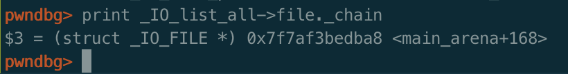

**欢迎关注公众号[平凡路上](https://mp.weixin.qq.com/s/TR-JuE2nl3W7ZmufAfpBZA)，平凡路上是一个致力于二进制漏洞分析与利用经验交流的公众号。**


上一篇介绍了libc2.23之前版本的劫持vtable以及FSOP的利用方法。如今vtable包含了如此多的函数，功能这么强大，没有保护的机制实在是有点说不过去。在大家都开始利用修改vtable指针进行控制程序流的时候，glibc在2.24以后加入了相应的检查机制，使得传统的修改vtable指针指向可控内存的方法失效。但道高一尺，魔高一丈，很快又出现了新的绕过方式。本篇文章主要介绍libc2.24以后的版本对于vtable的检查以及相应的绕过方式。

之前几篇文章的传送门：

- [IO FILE之fopen详解](https://ray-cp.github.io/archivers/IO_FILE_fopen_analysis)
- [IO FILE之fread详解](https://ray-cp.github.io/archivers/IO_FILE_fread_analysis)
- [IO FILE之fwrite详解](https://ray-cp.github.io/archivers/IO_FILE_fwrite_analysis)
- [IO FILE之fclose详解](https://ray-cp.github.io/archivers/IO_FILE_fclose_analysis)
- [IO FILE之劫持vtable及FSOP](https://ray-cp.github.io/archivers/IO_FILE_vtable_hajack_and_fsop)


## vtable check机制分析

glibc 2.24引入了`vtable check`，先体验一下它的检查，使用上篇文章中的东华杯的pwn450的exp，但将glibc改成2.24。（使用[pwn_debug](https://github.com/ray-cp/pwn_debug)的话，将exp里面的`debug('2.23')`改成`debug('2.24')`就可以了，或者使用local模式）。

在2.24的glibc中直接运行exp，可以看到报了如下的错误：

可以看到第一句`memory corruption`的错误在2.23版本也是有的，第二句的错误`Fatal error: glibc detected an invalid stdio handle`是新出现的，看起来似乎是对IO的句柄进行了检测导致错误。

glibc2.24的源码中搜索该字符串，定位在`_IO_vtable_check`函数中。根据函数名猜测应该是对vtable进行了检查，之前exp中是修改vtable指向了堆，可能是导致检查不过的原因。

下面进行动态调试进行确认，首先搞清楚在哪里下断。对vtable的检查应该是在vtable调用之前，FSOP触发的vtable函数`_IO_OVERFLOW`是在`_IO_flush_all_lockp`函数中进行调用的，因此将断点下在`_IO_flush_all_lockp`处。

开始跟踪程序，发现在执行`_IO_OVERFLOW`时，先执行到了`IO_validate_vtable`函数，然而看函数调用`_IO_OVERFLOW`时并没有明显的调用`IO_validate_vtable`函数的痕迹，猜测`_IO_OVERFLOW`宏的定义发生了变化。查看它的定义：
```c
#define _IO_OVERFLOW(FP, CH) JUMP1 (__overflow, FP, CH)
```
再查看`JUMP1`的定义：
```c
#define JUMP1(FUNC, THIS, X1) (_IO_JUMPS_FUNC(THIS)->FUNC) (THIS, X1)
```
最后再看`_IO_JUMPS_FUNC`的定义：
```c
# define _IO_JUMPS_FUNC(THIS) \
  (IO_validate_vtable                                                   \
   (*(struct _IO_jump_t **) ((void *) &_IO_JUMPS_FILE_plus (THIS) \
           + (THIS)->_vtable_offset)))
```
原来是在最终调用vtable的函数之前，内联进了`IO_validate_vtable`函数，跟进去该函数，源码如下，文件在`/libio/libioP.h`中：
```c
static inline const struct _IO_jump_t *
IO_validate_vtable (const struct _IO_jump_t *vtable)
{
  uintptr_t section_length = __stop___libc_IO_vtables - __start___libc_IO_vtables;
  const char *ptr = (const char *) vtable;
  uintptr_t offset = ptr - __start___libc_IO_vtables;
  if (__glibc_unlikely (offset >= section_length)) //检查vtable指针是否在glibc的vtable段中。
    /* The vtable pointer is not in the expected section.  Use the
       slow path, which will terminate the process if necessary.  */
    _IO_vtable_check ();
  return vtable;
}
```
可以看到glibc中是有一段完整的内存存放着各个vtable，其中`__start___libc_IO_vtables`指向第一个vtable地址`_IO_helper_jumps`，而`__stop___libc_IO_vtables`指向最后一个vtable`_IO_str_chk_jumps`结束的地址：

往常覆盖vtable到堆栈上的方式无法绕过此检查，会进入到`_IO_vtable_check`检查中，这就是开始报错的最终输出错误语句的函数了，跟进去，文件在`/libio/vtables.c`中：

```c
void attribute_hidden
_IO_vtable_check (void)
{
#ifdef SHARED
  /* Honor the compatibility flag.  */
  void (*flag) (void) = atomic_load_relaxed (&IO_accept_foreign_vtables);
#ifdef PTR_DEMANGLE
  PTR_DEMANGLE (flag);
#endif
  if (flag == &_IO_vtable_check) //检查是否是外部重构的vtable
    return;

  /* In case this libc copy is in a non-default namespace, we always
     need to accept foreign vtables because there is always a
     possibility that FILE * objects are passed across the linking
     boundary.  */
  {
    Dl_info di;
    struct link_map *l;
    if (_dl_open_hook != NULL
        || (_dl_addr (_IO_vtable_check, &di, &l, NULL) != 0
            && l->l_ns != LM_ID_BASE)) //检查是否是动态链接库中的vtable
      return;
  }

...

  __libc_fatal ("Fatal error: glibc detected an invalid stdio handle\n");
}
```
进入该函数意味着目前的vtable不是glibc中的vtable，因此`_IO_vtable_check`判断程序是否使用了外部合法的vtable（重构或是动态链接库中的vtable），如果不是则报错。

glibc2.24中vtable中的check机制可以小结为：

1. 判断vtable的地址是否处于glibc中的vtable数组段，是的话，通过检查。
2. 否则判断是否为外部的合法vtable（重构或是动态链接库中的vtable），是的话，通过检查。
3. 否则报错，输出`Fatal error: glibc detected an invalid stdio handle`，程序退出。

所以最终的原因是：exp中的vtable是堆的地址，不在vtable数组中，且无法通过后续的检查，因此才会报错。

## 绕过vtable check

vtable check的机制已经搞清楚了，该如何绕过呢？

第一个想的是，是否还能将vtable覆盖成外部地址？根据vtable check的机制要想将vtable覆盖成外部地址且仍然通过检查，可以有两种方式：

1. 使得`flag == &_IO_vtable_check`
2. 使`_dl_open_hook!= NULL`

第一种方式不可控，因为flag的获取和比对是类似canary的方式，其对应的汇编代码如下：
```c
0x7fefca93d927 <_IO_vtable_check+7>     mov    rax, qword ptr [rip + 0x32bb2a] <0x7fefcac69458>
0x7fefca93d92e <_IO_vtable_check+14>    ror    rax, 0x11
0x7fefca93d932 <_IO_vtable_check+18>    xor    rax, qword ptr fs:[0x30]
0x7fefca93d93b <_IO_vtable_check+27>    cmp    rax, rdi
```
我们无法控制`fs:[0x30]`和得到它的值，因此不容易控制`flag == &_IO_vtable_check`条件。

而对于第二种方式，理论上可行，但是如果我们可以找到存在往`_dl_open_hook`中写值的方法，完全利用该方法来进行更为简单的利用（如写其他`hook`）。

看起来无法将vtable覆盖成外部地址了，还有其他啥方法？

目前来说，存在两种办法：

* 使用内部的vtable`_IO_str_jumps`或`_IO_wstr_jumps`来进行利用。
* 使用缓冲区指针来进行任意内存读写。

这里主要描述第一个方法使用内部的vtable`_IO_str_jumps`或`_IO_wstr_jumps`来进行利用，第二个方法由于篇幅限制且功能也相对较独立，将在下一篇中阐述。

如何利用`_IO_str_jumps`或`_IO_wstr_jumps`完成攻击？在vtable的check机制出现后，大佬们发现了vtable数组中存在`_IO_str_jumps`以及`_IO_wstr_jumps`两个vtable，`_IO_wstr_jumps`与`_IO_str_jumps`功能基本一致，只是`_IO_wstr_jumps`是处理wchar的，因此这里以`_IO_str_jumps`为例进行说明，后者利用方法完全相同。

`_IO_str_jumps`的函数表如下

函数表中存在两个函数`_IO_str_overflow`以及`_IO_str_finish`，其中`_IO_str_finish`源代码如下，在文件`/libio/strops.c`中：

```c
void
_IO_str_finish (_IO_FILE *fp, int dummy)
{
  if (fp->_IO_buf_base && !(fp->_flags & _IO_USER_BUF))
    (((_IO_strfile *) fp)->_s._free_buffer) (fp->_IO_buf_base); //执行函数
  fp->_IO_buf_base = NULL;
  
  _IO_default_finish (fp, 0);
}
```
可以看到，它使用了IO 结构体中的值当作函数地址来直接调用，如果满足条件，将直接将`fp->_s._free_buffer`当作函数指针来调用。

看到这里利用的方式应该就很明显了。首先，当然仍然需要绕过之前的`_IO_flush_all_lokcp`函数中的输出缓冲区的检查`_mode<=0`以及`_IO_write_ptr>_IO_write_base`进入到`_IO_OVERFLOW`中。

接着就是关键的构造IO FILE结构体的部分。首先是vtable检查的绕过，我们可以将vtable的地址覆盖成`_IO_str_jumps-8`的地址，这样会使得`_IO_str_finish`函数成为了伪造的vtable地址的`_IO_OVERFLOW`函数（因为`_IO_str_finish`偏移为`_IO_str_jumps`中0x10，而`_IO_OVERFLOW`为0x18）。这个vtable（地址为`_IO_str_jumps-8`）可以绕过检查，因为它在vtable的地址段中。

构造好vtable之后，需要做的就是构造IO FILE结构体其他字段来进入把`fp->_s._free_buffer`当作指针的调用。先构造`fp->_IO_buf_base`不为空，而且看到后面它将作为第一个参数，因此可以使用`/bin/sh`的地址；然后构造`fp->_flags`要不包含`_IO_USER_BUF`，它的定义为`#define _IO_USER_BUF 1`，即`fp->_flags`最低位为0。满足这两个条件，将会使用IO 结构体中的指针当作函数指针来调用。

最后构造`fp->_s._free_buffer`为`system`或`one gadget`的地址，最后调用`(fp->_s._free_buffer) (fp->_IO_buf_base)`，`fp->_IO_buf_base`为第一个参数。

`_IO_str_jumps`中的另一个函数`_IO_str_overflow`也存在该情况，但是它所需的条件会更为复杂一些，原理一致，就不进行描述了，有兴趣的可以自己去看。而另一个vtable`_IO_wstr_jumps`与`_IO_str_jumps`表中的函数指针功能一致，因此也是完全一样的使用方法。

最后，如果libc中没有`_IO_wstr_jumps`与`_IO_str_jumps`表的符号，给出定位`_IO_str_jumps`与`_IO_wstr_jumps`的方法：

* 定位`_IO_str_jumps`表的方法，`_IO_str_jumps`是vtable中的倒数第二个表，可以通过vtable的最后地址减去`0x168`。
* 定位`_IO_wstr_jumps`表的方法，可以通过先定位`_IO_wfile_jumps`，得到它的偏移后再减去`0x240`即是`_IO_wstr_jumps`的地址。

## 实践

最后给出两道题进行相应的实践，实际体验下如何使用`_IO_str_jumps`来绕过vtable check。从网上筛选了一圈，找了两道题。一道题是hctf 2017的babyprintf，应该是很经典的一道题了；一道是ASIS2018的fifty-dollars，这道题用了FSOP中的两次`_chain`链接，很有意思，值得一看。

### babyprintf

题目中格式化字符串以及堆溢出很明显。

但是格式化字符串漏洞使用`__printf_chk`，该函数限制了格式化字符串在使用`%a$p`时需要同时使用`%1$p`至`%a$p`才可以，并且禁用了`%n`。因此只能使用漏洞来泄露地址。

堆溢出利用的方法与上篇的东华杯pwn450的用法基本一致，覆盖`top chunk`的`size`，使得系统调用`sysmalloc`将top chunk放到unsorted bin里，然后利用`unsorted bin attack`改写`_IO_list_all`，指向伪造好的IO 结构体，vtable使用的地址是`_IO_str_jumps-8`，最后构造出来的IO结构体数据如下：


其中`fp->_mode`为0且`fp->_IO_write_ptr>_fp->_IO_write_base`，通过了`house of orange`的检查，可以进入到`_IO_OVERFLOW`的调用；同时vtable表指向`_IO_str_jumps-8`在vtable段中，也可绕过vtable的check机制；最后`fp->_flags`为0，`fp->_IO_buf_base`不为空，且指向`/bin/sh`字符串地址，可以顺利进入到`(fp->_s._free_buffer) (fp->_IO_buf_base)`的调用。在exp中可以使用[pwn_debug](https://github.com/ray-cp/pwn_debug)`IO_FILE_plus`模块的`str_finish_check`函数来检查所构造的字段是否能通过检查。

vtable表指针如下，可以看到当前的`__overflow`函数确实为`_IO_str_finish`：


最后再看跳转的目标地址，确实为`system`函数且参数`_IO_buf_base`为`/bin/sh`的地址，因此执行`system("/bin/sh")`，成功拿到shell。


当然这题也可以用fastbin attack做，因为top chunksize不够的时候是使用`free`函数来释放的，因此也会放到fastbin中去。

### fifty_dollars

这题是一道菜单题，提供申请、打印以及释放的功能，`free`了以后指针没清空，导致`uaf`，可以实现堆地址任意写的功能。

先说一下如何使用`uaf`构造出unsroted bin，如下面一个demo，主要是通过fastbin attack修改相应chunk的size，再释放时，将会释放至unsorted bin中：
```c
A=alloc(0)
B=alloc(1)
C=alloc(2)
delete(A)
delete(B)
delete(A)
#此时形成fastbin attack
A=alloc(0,data=p64(addressof(C)-0x10) # 修改fastbin的fd指向c-0x10
B=alloc(1)
A=alloc(0)

evil=alloc(3,data=p64(0)+p64(0xb1)) #修改C的size为0xb0
delete(C) #此时C将被释放至
```
可通过释放到fastbin的链表中，再show可以泄露出堆地址；通过将堆块释放到unsorted bin中，再show可泄露libc地址。

这题的限制是只能申请`0x60`大小的堆块，使用house of orange攻击的时候无法把unsorted bin 释放到small bin为0x60的数组中（即满足`fp->_chain`指向我们的堆块中），为此只能想办法释放一个最终形成`fp->_chain->_chain`指向我们堆块的地址的堆块（即大小为`0xb0`的堆块）。通过两次`chain`的索引，最终实现控制IO FILE结构，调用`_IO_OVERFLOW`控制程序执行流。


最后伪造`_IO_list_all`结构如下，`_IO_list_all`指向`unsorted bin`的指针的位置：

`_IO_list_all->_chain`指向`unsorted bin+0x68`的位置即smallbin size为0x60的位置：

`_IO_list_all->_chain->_chain`指向`unsorted bin+0xb8`的位置，即smallbin size为0xb0的位置，此时由于存在我们已经释放的堆的地址，因此它指向了我们伪造的结构。


堆内容的构造则和上一题babyprintf没有区别，甚至可以使用同一个模版，不再细说。覆盖vtalbe为`_IO_str_jumps-8`，绕过vtable的check，同时设置好IO FILE的字段绕过相应检查，最终进入到`_IO_flush_all_lockp`触发FSOP，经过两次`_chain`的索引就会执行`system("/bin/sh")`。

主要利用FSOP两次`_chain`的思想，还是很有意思的。

## 小结

这是本系列的倒数第二篇文章，介绍了vtable的check机制和其相应的绕过方法之一。vtable数组中的各个成员都有其相应的功能，最终在里面找到了`_IO_str_jumps`与`_IO_wstr_jumps`两个虚表来实现利用。

相关文件和脚本在[github](https://github.com/ray-cp/ctf-pwn/tree/master/PWN_CATEGORY/IO_FILE/vtable_str_jumps)

文章首发于[先知](https://xz.aliyun.com/t/5579)社区

## 参考链接
1. [Hctf-2017-babyprintf-一个有趣的PWN-writeup](https://bbs.pediy.com/thread-222735.htm)
2. [通过一道pwn题探究_IO_FILE结构攻击利用](https://www.anquanke.com/post/id/164558#h2-5)
3. [IO FILE 学习笔记](https://veritas501.space/2017/12/13/IO%20FILE%20学习笔记/)


