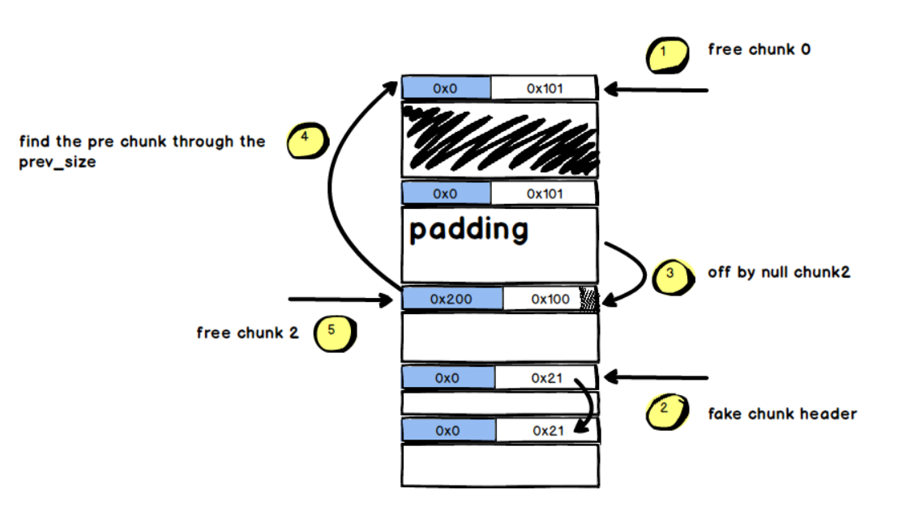
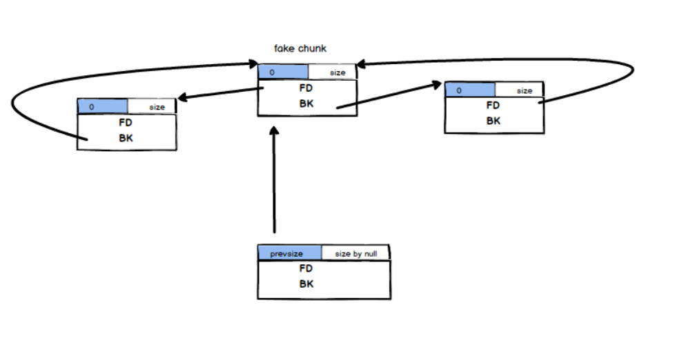

## Glibc 2.29 Off  By Null 

> 参考学习[[原创]glibc2.29下的off-by-null](https://bbs.pediy.com/thread-257901.htm)、[Off by Null的前世今生](https://www.anquanke.com/post/id/208407)

#### 0x1 新加入的保护

向低地址合并的时候加入新的检测：

```c
/* consolidate backward */
if (!prev_inuse(p)) {
    prevsize = prev_size (p);
    size += prevsize;
    p = chunk_at_offset(p, -((long) prevsize));
    if (__glibc_unlikely (chunksize(p) != prevsize))
        malloc_printerr ("corrupted size vs. prev_size while consolidating");
    unlink_chunk (av, p);
}
```

即检查`chunksize(p) != prevsize)`，如下图，参考在2.23下的Off By Null，就是加入了在``free(chunk2)`的时候检测`chunk2->pre_size`和`chunk0->size`是否相等。



#### 0x2 绕过

所以现在的目的是绕过一下两个检测：

- 向低地址合并检测：

  ```c
  if (__glibc_unlikely (chunksize(p) != prevsize))
      malloc_printerr ("corrupted size vs. prev_size while consolidating");
  ```

- `unlink`检测：

  ```c
  if (__builtin_expect (FD->bk != P || BK->fd != P, 0))
      malloc_printerr (check_action, "corrupted double-linked list", P, AV);
  ```

>  t1an5g师傅的思路：
>
> 利用largebin残留的fd_nextsize和bk_nextsize两个指针，smallbin残留的bk指针，以及fastbin的fd指针。构造出一个如下的布局：
>
> 

