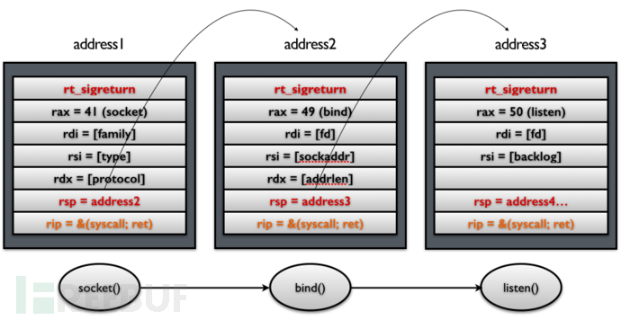

[Sigreturn Oriented Programming (SROP) Attack攻击原理](https://www.freebuf.com/articles/network/87447.html)

[mctrain ](https://www.freebuf.com/author/mctrain)2015-12-01 15:11:02 724847 7

本文原创作者：mctrain

**去年投了**[**一篇文章**](http://drops.wooyun.org/tips/3071)**，介绍**[**BROP攻击**](http://www.scs.stanford.edu/brop/)**。反响还挺好的，也帮助了很多人去理解这个非常smart的攻击原理。当然大家也可以去**[**我的博客**](http://ytliu.info/blog/2014/06/01/blind-return-oriented-programming-brop-attack-er/)**看这个攻击的重现。**

这次我想介绍另一个类ROP攻击，叫SROP，和BROP一样，这个工作也是发表在国际安全领域最顶级会议[Oakland 2014](http://www.ieee-security.org/TC/SP2014)上，被评选为当年的[Best Student Papers](http://www.ieee-security.org/TC/SP2014/awards.html)。论文的题目叫做**`Framing Signals — A Return to Portable Shellcode`**，作者是来自Vrije Universiteit Amsterdam的Erik Bosman，以下是相关paper和slides的链接：

[paper](http://www.ieee-security.org/TC/SP2014/papers/FramingSignals-AReturntoPortableShellcode.pdf)

[slides](https://tc.gtisc.gatech.edu/bss/2014/r/srop-slides.pdf)

首先，我觉得这也是一个非常有趣的攻击，虽然在去年就已经发表了，但是我在网上并没有找到太多相关的信息，在最近一年的研究领域也没有太多对它的[引用](https://scholar.google.com/scholar?cites=5919093237976555977&as_sdt=2005&sciodt=0,5&hl=zh-CN)，所以我觉得很有必要推广一下。但是在我看完paper之后，觉得这篇paper写得并不是很容易让人理解，很多句子都晦涩难懂，不过这些都不重要，重要的是，这个攻击确实很有效，里面提到，在不同版本的Unix系统（如GNU Linux，BSD，iOS/Mac OS X等）中被使用了40多年的Signal机制，存在一个很容易被攻击者利用的设计缺陷，而这个缺陷所产生的相应的攻击，即文中所描述的SROP，和传统的ROP攻击相比显得更加简单，可靠，可移植。

接下来，我会从ROP攻击开始讲起，然后引入SROP的攻击原理，其中会涉及到Signal机制的相关背景，最后，我会介绍一些相应的防御措施。

**ROP背景介绍**

**ROP攻击的出现**

[Stack Overflow](https://zh.wikipedia.org/wiki/Stack_Overflow) 和[DEP (Data Execution Prevention)](https://en.wikipedia.org/wiki/Data_Execution_Prevention)我在这里就不介绍了，简单来说，就是最早的code injection攻击在现在的操作系统中基本上不能使用，因此出现了ROP，也就是所谓的Return Oriented Programming，其中也包括比较早期的Return-to-libc。ROP的主要思想就是攻击者不需要自己注入代码（因为在DEP的保护下，注入的代码不可执行），而是利用系统已有的代码片段来构造攻击。这里之所以叫ROP，是因为其改变控制流的方式是用系统中的return指令（比如x86中的`ret`）。

这里需要说明的是，在栈操作中，return指令是唯一一个可以通过控制栈上的数据改变指令流的指令，它的效果等同于：

```
pop %eax
jmp %eax
```

即将IP设置成栈上的某个值。因此如果我们可以控制栈上的数据，就可以控制执行流。

**ROP攻击的原理**

这里举一个最简单的例子来说明如何利用ROP来实现一条内存赋值语句：`Mem[v2] = v1`，其中`v2`是一个内存地址，`v1`是一个值。


这里我们先把`Mem[v2] = v1`这条内存赋值语句转化成汇编代码：

```
mov %eax v1; 
mov %ebx v2;
mov [%ebx], %eax
```

将`v1`的值赋给`%eax`，将`v2`的值（即内存地址）赋给`%ebx`，最后将`%eax`的值赋给`%ebx`地址指向的内存。

我们将这段代码翻译成可以通过ROP的方式执行的代码：

```
addr1: pop eax; ret
addr2: pop ebx; ret
addr3: mov [ebx], eax
```

其中`addr1`、`addr2`、`addr3`都是相应指令的内存地址，我们将每一行称为一个“gadget”。通过像上图中那样构造栈上的数据就可以完成和上面汇编相同的效果。如果不清楚可以自己代入试一试，这里就不详述了。

你可能会问，单纯构造一个内存赋值语句有什么用呢？其中最广泛的应用就是为参数赋值。假设我们希望用ROP的方式调用一个system call，那么我们就可以用上面的这种方式为这个system call填上参数，最后在栈上填上`syscall`（或者`int 80`）指令的内存地址就可以了。

**ROP攻击的前提条件**

讲到这里，如果你对上面有了初步的理解，就可能会觉得好像ROP确实很厉害，能够随意调用system call（比如调用`execve`来开启一个shell；或者调用`mprotect`来将栈设置成可执行，等等）。然而事实上ROP并没有想象中的那么简单。要完成一个成功的ROP攻击，需要有很多前提条件，这里列举几个最重要的：

```
1. 首先必须要有一个buffer overflow的漏洞（当然这个前提基本上所有攻击都必须得有）；
2. 攻击者需要事先决定好完成攻击过程的所有gadgets。对于上面提到的赋值操作，总共只需要3个gadgets，每个gadget最长两条指令，但是如果需要进行一些复杂的操作，就有可能需要有很多gadgets；除了gadgets的数量多之外，单个gadget的指令数也需要考虑；
3. 攻击者需要在被攻击程序所在的进程地址空间中找到所有的这些gadgets的首地址，并且将其填在栈的合适位置上。
```

这三个前提条件，造成了传统的ROP对于攻击者来说具备了一定的难度，加上现在操作系统中的一系列保护机制（比如ASLR），使得寻找gadgets的地址变得更难了。而且对于攻击者来说，他攻击每个不同的应用程序都需要单独精心构造大量的gadgets，这也使得ROP的可复用性变得很差。

以上的这些，都是我们接下来将要介绍的SROP所想要解决的问题。

**SROP攻击原理**

SROP的全称是Sigreturn Oriented Programming。在这里`sigreturn`是一个系统调用，它在unix系统发生signal的时候会被间接地调用。

在开始介绍SROP的攻击原理之前，我们需要先对signal的背景进行一个简单的说明。

**Signal in Unix-like System**

Signal这套机制在1970年代就被提出来并整合进了UNIX内核中，它在现在的操作系统中被使用的非常广泛，比如内核要杀死一个进程（`kill -9 $PID`），再比如为进程设置定时器，或者通知进程一些异常事件等等。

如下图所示，当内核向某个进程发起（deliver）一个signal，该进程会被暂时挂起（suspend），进入内核（1），然后内核为该进程保存相应的上下文，跳转到之前注册好的signal handler中处理相应signal（2），当signal handler返回之后（3），内核为该进程恢复之前保存的上下文，最后恢复进程的执行（4）。


在这四步过程中，第三步是关键，即如何使得用户态的signal handler执行完成之后能够顺利返回内核态。在类UNIX的各种不同的系统中，这个过程有些许的区别，但是大致过程是一样的。这里以Linux为例：

在第二步的时候，内核会帮用户进程将其上下文保存在该进程的栈上，然后在栈顶填上一个地址`rt_sigreturn`，这个地址指向一段代码，在这段代码中会调用`sigreturn`系统调用。因此，当signal handler执行完之后，栈指针（stack pointer）就指向`rt_sigreturn`，所以，signal handler函数的最后一条`ret`指令会使得执行流跳转到这段sigreturn代码，被动地进行`sigreturn`系统调用。下图显示了栈上保存的用户进程上下文、signal相关信息，以及`rt_sigreturn`：


我们将这段内存称为一个`Signal Frame`。

在内核`sigreturn`系统调用处理函数中，会根据当前的栈指针指向的`Signal Frame`对进程上下文进行恢复，并返回用户态，从挂起点恢复执行。

看到这里，你看出什么问题了吗？如果还没有，建议你再倒回去仔细想想，因为我马上就要揭晓答案了。

**Signal机制缺陷利用**

好了，我们先来看看内核在这个过程中扮演了什么角色？首先，内核替用户进程将其上下文保存在`Signal Frame`中，然后，内核利用这个`Signal Frame`恢复用户进程的上下文，done！那么，问题来了： 

第一、这个`Signal Frame`是被保存在用户进程的地址空间中的，是用户进程可读写的；

第二、内核并没有将保存的过程和恢复的过程进行一个比较，也就是说，在`sigreturn`这个系统调用的处理函数中，内核并没有判断当前的这个`Signal Frame`就是之前内核为用户进程保存的那个`Signal Frame`。

按照作者slides里面的说法，“kernel agnostic about signal handlers”既是一个优点，因为内核不需要花精力来记录其发起的signal，但是，这也是一个缺点，正因为内核对其的不可知性，使得恶意的用户进程可以对其进行伪造！

**例子：一个最简单的攻击**

让我们先来假设一个攻击者可以控制用户进程的栈，那么它就可以伪造一个`Signal Frame`，如下图所示：


在这个伪造的`Signal Frame`中，将`rax`设置成59（即`execve`系统调用号），将`rdi`设置成字符串`/bin/sh`的地址（该字符串可以是攻击者写在栈上的），将`rip`设置成系统调用指令`syscall`的内存地址，最后，将`rt_sigreturn`手动设置成`sigreturn`系统调用的内存地址。那么，当这个伪造的`sigreturn`系统调用返回之后，相应的寄存器就被设置成了攻击者可以控制的值，在这个例子中，一旦`sigreturn`返回，就会去执行`execve`系统调用，打开一个shell。

这是一个最简单的攻击。在这个攻击中，有4个前提条件：

```
第一，攻击者可以通过stack overflow等漏洞控制栈上的内容；
第二，需要知道栈的地址（比如需要知道自己构造的字符串`/bin/sh`的地址）；
第三，需要知道`syscall`指令在内存中的地址；
第四，需要知道`sigreturn`系统调用的内存地址。
```

和传统的ROP相比，这个最简单的SROP攻击只需要找到两个gadgets就可以了。但是在这个攻击中，攻击者所产生的效果只能调用一个syscall，当syscall返回之后就失去了对执行流的控制了，显然不能满足大部分要求。

**利用SROP构造系统调用串（System call chains）**

那么，我们如何利用上面这套机制来连续地进行系统调用呢？其实方法很简单，除了上面的步骤之外，只需要再额外添加一个对栈指针`rsp`的控制就行了，如下图所示：



另外我们需要把原来单纯的`syscall` gadget换成`syscall; ret` gadget。在这个过程中，每次`syscall`返回之后，栈指针都会指向下一个`Signal Frame`，因此，在这个时候执行`ret`指令，就会再次调用`sigreturn`系统调用。这样就可以通过操作栈来达到连续进行系统调用的效果。

**两个重要的gadgets**

那么，我们在哪里能找到上面提到的这两个gadgets呢？

对于第一个gadget `sigreturn`，这里需要提一下，`sigreturn`这个系统调用和别的系统调用有一个不同的地方，即一般的应用程序不会主动调用它，而是像之前介绍的，由内核将相应地址填到栈上，使得应用进程被动地调用。因此在系统中一般会有一段代码专门用来调用`sigreturn`，论文作者发现，在不同的类UNIX系统中，这段代码会出现在不同的位置，如下图所示：


其中在`Linux < 3.11 ARM`（也就是大部分现在Android所使用的内核），以及`FreeBSB 9.2 x86_64`，都可以在固定的内存地址中找到这个gadget，而在其它系统中，一般被保存在`libc`库的内存中，如果有ASLR保护的话似乎没有那么容易找到。

而对于第二个gadget `syscall; ret`，如下图所示：


如果是`Linux < 3.3 x86_64`（在Debian 7.0， Ubuntu Long Term Support， CentOS 6系统中默认内核），则可以直接在固定地址[vsyscall]中找到这段代码片段。其中`vsyscall`是用来加速`time()`，`gettimeofday()`和`getcpu()`这三个系统调用的机制，虽然现在已经被`vsyscall-emulate`和`vdso`机制所代替，但在稍微比较早一点的内核中依然是被默认支持的。具体可以看[lwn](http://lwn.net/)的[这个post](https://lwn.net/Articles/446528/)。

除了上面提到的这两个可能存在在固定地址的gadgets之外，在其它系统中，这两个gadgets似乎并没有那么容易找到，特别是在有ALSR保护的系统中。但是，如果我们将其和传统的ROP来进行比较的话，就可以发现，它把整个攻击的代价拉低了一个档次，难怪作者认为SROP "is among the lowest hanging fruit available to an attacker."

**`sigreturn`这个gadget是必须的吗？**

如果我们将`sigreturn`当做一个系统调用来看待的话，那么其实这个单独的gadget并不是必须的。因为我们可以将`rax`寄存器设置成15（sigreturn的系统调用号），然后调用一个`syscall`，效果和调用一个`sigreturn`是一样一样的。那么，问题就从“如何找到一个`sigreturn` gadget”变成了“如何控制寄存器`rax`的值”。而`rax`这个寄存器非常特殊，它除了被用来指定系统调用的调用号之外，也是函数返回值最后存放的地方。因此，我们可以利用控制函数返回值来控制`rax`寄存器的值。具体的做法因人而异，但是这为攻击者提供了另外一个思路，有兴趣可以去看论文。在论文中，简单来说，作者在受害者进程调用对网络文件描述符进行`read`系统调用的时候传输不同数量的字节数来控制`read`调用的返回值，来最终达到控制`rax`寄存器的效果的，非常smart的一个做法！

**SROP应用场景**

正如上文所说，利用SROP，我们可以构造一系列的系统调用串，利用这个方法，我们可以做很多事情。

**应用场景一：后门（Backdoor）**

首先，作者提出，可以通过这种方法构造一个后门（backdoor）。后门的意思就是攻击者在系统中隐藏一个可以被触发的点，当某些比较少见的特定操作发生之后，会触发一个动作，这个动作一般是打开一个端口让攻击者通过网络连接进系统，从而对系统进行控制。后门最重要的特点是隐蔽，不容易被杀毒软件检查出来。所以说如果后门是一段可执行代码，那么就很容易被杀毒软件检测到，而如果后门是隐藏在数据域中，那么就能做到非常隐蔽。SROP就为其提供了一个强有力的工具：system call chain。整个过程如下图所示：


在这个过程中，攻击者利用`inotify API`来监控一个文件，当这个文件被访问（比如攻击者在发起的请求中读取这个文件的内容），则后续的系统调用链被触发，打开一个socket，等待连接。同时通过一个`alarm`系统调用设置一个定时器，如果在5秒钟没有人对这个socket发起连接请求，则将其关闭，否则建立连接，并调用`execve`系统调用打开一个shell。

这就是一个典型的后门，可以用SROP完成。

**应用场景二：系统调用代理（System call proxy）**

在这个应用场景中，作者提到了如何绕过诸如`iOS`、`Mac OS X`等系统进行的代码签名（code signing）保护机制。在代码签名保护机制下，程序中不能存在恶意代码片段（否则无法经过Apple官方的验证）。但是SROP可以解决这个问题，我们可以在代码中进行一个网络连接，然后通过构造特定的请求来执行一些恶意的操作。在这里，作者提出一种系统调用代理的机制，原理和我之前介绍的系统调用串的原理差不多，就是通过执行一系列的`read`系统调用来设置各个参数，最后利用这些参数构造一个特定的系统调用，如下如所示：


**SROP的防范**

最后我们来提一下SROP的防范。从三个角度出发，作者提出了三种方法：

**Gadgets Prevention**

在`两个重要的gadgets`这章我提到，在当前的几种不同的操作系统中，`sigreturn`和`syscall; ret`这两个gadgets非常容易被找到，特别是在`vsyscall`这种特别不安全的机制存在的情况下。因此我们应该尽量避免这种机制，让ASLR等保护机制物尽其用，使得攻击者很难找到这些gadgets。

当然这种方法并不能从本质上解决SROP的问题。

**Signal Frame Canaries**

这种方法借鉴于[stack canaries](https://en.wikipedia.org/wiki/Buffer_overflow_protection#Canaries)机制，即在`Signal Frame`的`rt_sigreturn`字段之前插入一段随机生成的字节，如果发生overflow，则该段字节会被破坏，从而在发生`sigreturn`之前会被检测到。

当然，针对stack canaries的攻击也很多，其同样不能从本质上防止SROP的发生。

**Break kernel agnostic**

这就要追溯到SROP的本质问题了，就是内核对Signal的不可知性。如果我们在内核处理`sigreturn`系统调用的时候判断一下当前的`Signal Frame`是否是由内核之前创建的，那么这个问题就能从根本上解决。当然，这就涉及到要修改内核的一些底层的设计了，可能也会引入一些新的问题。

**Proof of Concept（PoC）**

如果大家对这个攻击感兴趣，可以从这里下载一个非常简单的[PoC](https://github.com/eQu1NoX/srop-poc)，当然按照其作者的说法，SROP已经被整合进[binjitsu](https://binjitsu.readthedocs.org/)这个框架了。之后如果有时间，我也会对这个PoC以及binjitsu框架做一个介绍。

***原创作者：mctrain，本文属FreeBuf原创奖励计划文章，未经作者本人及FreeBuf许可，切勿私自转载**