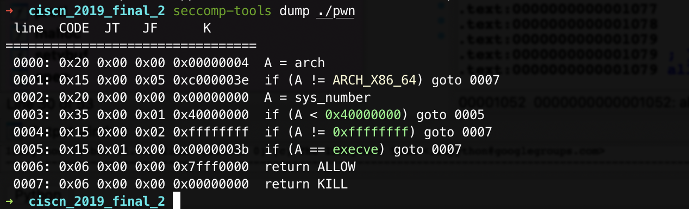
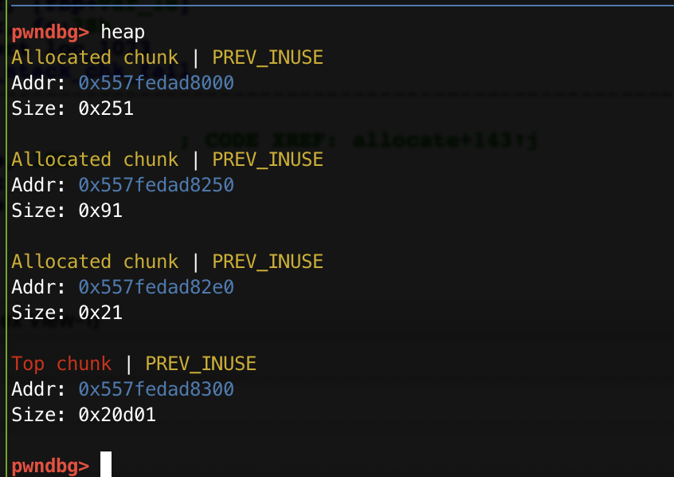
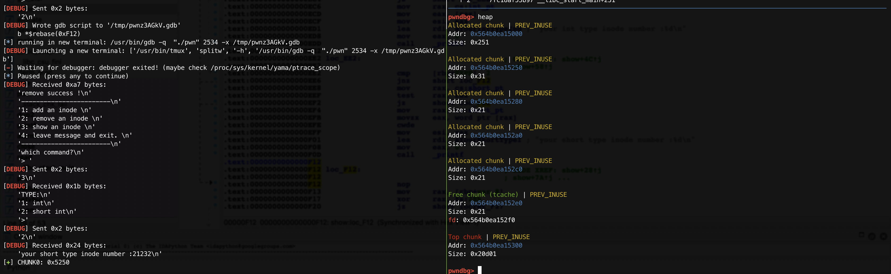
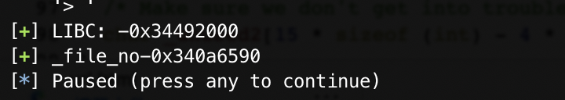
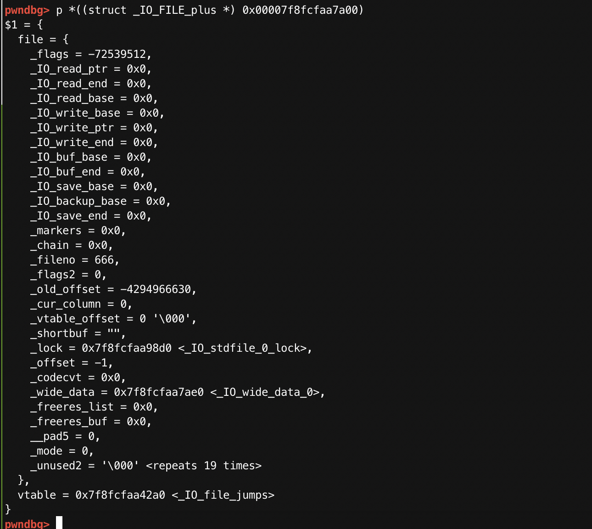
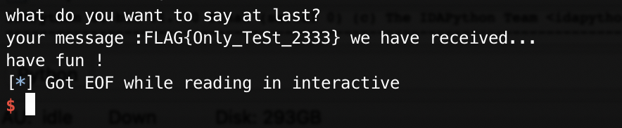

# BUUCTF平台 CISCN-Final-2

> 从[Railgun's Blog](http://www.pwn4fun.com/pwn/buuctf-pwn-writeup-part3.html#ciscn2019final2)学习的。

#### 0x0 `IO_FILE`结构体 && `dup2()`

```c
/* The tag name of this struct is _IO_FILE to preserve historic
   C++ mangled names for functions taking FILE* arguments.
   That name should not be used in new code.  */
struct _IO_FILE
{
  int _flags;                /* High-order word is _IO_MAGIC; rest is flags. */
  /* The following pointers correspond to the C++ streambuf protocol. */
  char *_IO_read_ptr;        /* Current read pointer */
  char *_IO_read_end;        /* End of get area. */
  char *_IO_read_base;        /* Start of putback+get area. */
  char *_IO_write_base;        /* Start of put area. */
  char *_IO_write_ptr;        /* Current put pointer. */
  char *_IO_write_end;        /* End of put area. */
  char *_IO_buf_base;        /* Start of reserve area. */
  char *_IO_buf_end;        /* End of reserve area. */
  /* The following fields are used to support backing up and undo. */
  char *_IO_save_base; /* Pointer to start of non-current get area. */
  char *_IO_backup_base;  /* Pointer to first valid character of backup area */
  char *_IO_save_end; /* Pointer to end of non-current get area. */
  struct _IO_marker *_markers;
  struct _IO_FILE *_chain;
  int _fileno;
  int _flags2;
  __off_t _old_offset; /* This used to be _offset but it's too small.  */
  /* 1+column number of pbase(); 0 is unknown. */
  unsigned short _cur_column;
  signed char _vtable_offset;
  char _shortbuf[1];
  _IO_lock_t *_lock;
#ifdef _IO_USE_OLD_IO_FILE
};
```

`_fileno`的`offset`是`0x70`

`dup2()`:

> 相关函数：open, close, fcntl, dup
>
> 头文件：#include <unistd.h>
>
> 定义函数：int dup2(int odlfd, int newfd);
>
> **函数说明：dup2()用来复制参数oldfd 所指的文件描述词, 并将它拷贝至参数newfd 后一块返回. 若参数newfd为一已打开的文件描述词, 则newfd 所指的文件会先被关闭. dup2()所复制的文件描述词, 与原来的文件描述词共享各种文件状态, 详情可参考dup().**
>
> 返回值：当复制成功时, 则返回最小及尚未使用的文件描述词. 若有错误则返回-1, errno 会存放错误代码.
>
> **附加说明：dup2()相当于调用fcntl(oldfd, F_DUPFD, newfd); 请参考fcntl().
>
> 错误代码：EBADF 参数fd 非有效的文件描述词, 或该文件已关闭**
>
> [来自C语言中文网](http://c.biancheng.net/cpp/html/232.html)

#### 0x1 安全防护

```shell
➜  ciscn_2019_final_2 checksec pwn
[*] '/home/mech0n/pwn/buu/ciscn_2019_final_2/pwn'
    Arch:     amd64-64-little
    RELRO:    Full RELRO
    Stack:    Canary found
    NX:       NX enabled
    PIE:      PIE enabled
```

安全都开了。还限制了`system`和`exec`类函数。



#### 0x2 程序分析

又是一个经典的菜单题目:

`menu()`

```c
unsigned __int64 menu()
{
  unsigned __int64 v0; // ST08_8

  v0 = __readfsqword(0x28u);
  puts("------------------------");
  puts("1: add an inode ");
  puts("2: remove an inode ");
  puts("3: show an inode ");
  puts("4: leave message and exit. ");
  puts("------------------------");
  printf("which command?\n> ");
  return __readfsqword(0x28u) ^ v0;
}
```

`add()`

```c
unsigned __int64 allocate()
{
  int *CHUNK_INT; // rbx
  __int16 number; // ax
  int type; // [rsp+4h] [rbp-1Ch]
  unsigned __int64 v4; // [rsp+8h] [rbp-18h]

  v4 = __readfsqword(0x28u);
  printf("TYPE:\n1: int\n2: short int\n>");
  type = get_atoi();
  if ( type == 1 )
  {
    int_pt = malloc(0x20uLL);
    if ( !int_pt )
      exit(-1);
    bool = 1;
    printf("your inode number:");
    CHUNK_INT = (int *)int_pt;
    *CHUNK_INT = get_atoi();
    *((_DWORD *)int_pt + 2) = *(_DWORD *)int_pt;
    puts("add success !");
  }
  if ( type == 2 )
  {
    short_pt = malloc(0x10uLL);
    if ( !short_pt )
      exit(-1);
    bool = 1;
    printf("your inode number:");
    number = get_atoi();
    *(_WORD *)short_pt = number;
    *((_WORD *)short_pt + 4) = *(_WORD *)short_pt;
    puts("add success !");
  }
  return __readfsqword(0x28u) ^ v4;
}
```

`add()`里我们不能自定义`malloc()`的`size`，可以选择写入`4 Bytes`或者`2 Bytes`的内容，**考虑部分写地址**。

`delete()`

```c
unsigned __int64 delete()
{
  int type; // [rsp+4h] [rbp-Ch]
  unsigned __int64 v2; // [rsp+8h] [rbp-8h]

  v2 = __readfsqword(0x28u);
  if ( bool )
  {
    printf("TYPE:\n1: int\n2: short int\n>");
    type = get_atoi();
    if ( type == 1 && int_pt )
    {
      free(int_pt);                             // UAF
      bool = 0;
      puts("remove success !");
    }
    if ( type == 2 && short_pt )
    {
      free(short_pt);                           // UAF
      bool = 0;
      puts("remove success !");
    }
  }
  else
  {
    puts("invalid !");
  }
  return __readfsqword(0x28u) ^ v2;
}
```

这里可以Double Free。~~这里有`bool`变量限制Double Free~~

`show()`

```c
unsigned __int64 show()
{
  int Count; // eax
  int TYPE; // [rsp+4h] [rbp-Ch]
  unsigned __int64 v3; // [rsp+8h] [rbp-8h]

  v3 = __readfsqword(0x28u);
  Count = show_time--;
  if ( Count )
  {
    printf("TYPE:\n1: int\n2: short int\n>");
    TYPE = get_atoi();
    if ( TYPE == 1 && int_pt )
      printf("your int type inode number :%d\n", *(unsigned int *)int_pt);
    if ( TYPE == 2 && short_pt )
      printf("your short type inode number :%d\n", (unsigned int)*(signed __int16 *)short_pt);
  }
  return __readfsqword(0x28u) ^ v3;
}
```

这里有点不舒服，只能输出`3`次，就是只能最多输出`4 Bytes`，可以输出`2 Bytes`或者`2 Bytes`。

```c
fd = open("flag", 0);
if ( fd == -1 )
{
  puts("no such file :flag");
  exit(-1);
}
dup2(fd, 666);
```

还有就是，`flag`被读到程序里，文件描述符为`666`。

还有一个函数在最后被调用：

`byebye()`

```c
void __noreturn bye_bye()
{
  char str; // [rsp+0h] [rbp-70h]
  unsigned __int64 v1; // [rsp+68h] [rbp-8h]

  v1 = __readfsqword(0x28u);
  puts("what do you want to say at last? ");
  __isoc99_scanf("%99s", &str);
  printf("your message :%s we have received...\n", &str);
  puts("have fun !");
  exit(0);
}
```

#### 0x3 利用思路

1.  Double Free通过`short`类型的`show()`，来输出chunk的低4位地址，（我们并不需要完整的heap地址，也没办法写入heap的完整地址）

   调试：

   

2. Double Free来修改一个chunk的`size`足以被扔到Unsorted Bin，然后用一个chunk填满Tcache。让被修改的chunk被扔进Unsorted Bin。通过`int`类型的`show()`，来输出的Libc的低位地址，得到libc。（同样我们也没办法处理完整的libc地址）

   调试：

   

   

3. Double Free来修改`stdin`的`_fileno`为`666`，从而`scanf()`的时候可以直接从`flag`文件读取内容，通过最后的`byebye()`函数读取`flag`文件，然后输出给我们，从而得到`flag`。

   调试:

   

   

#### 0x4 [EXP](https://gist.github.com/Mech0n/66df30aa03074bbc94cb3ce7779f2a19)

