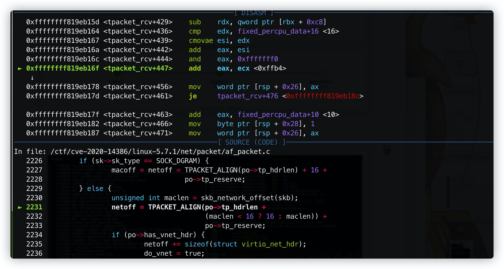
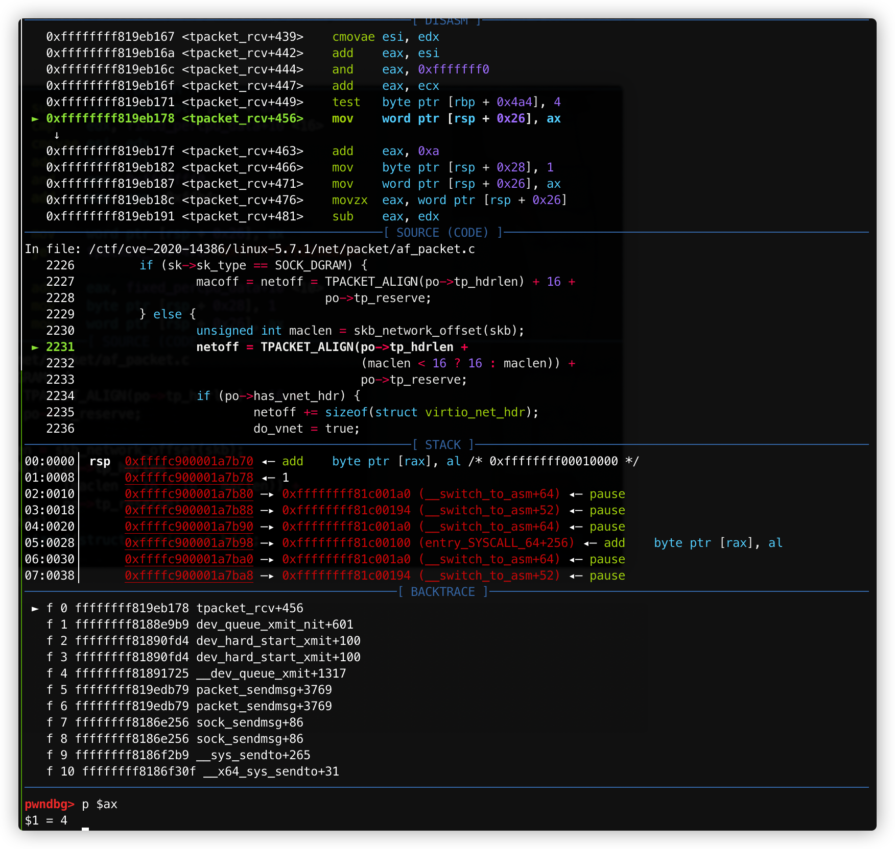
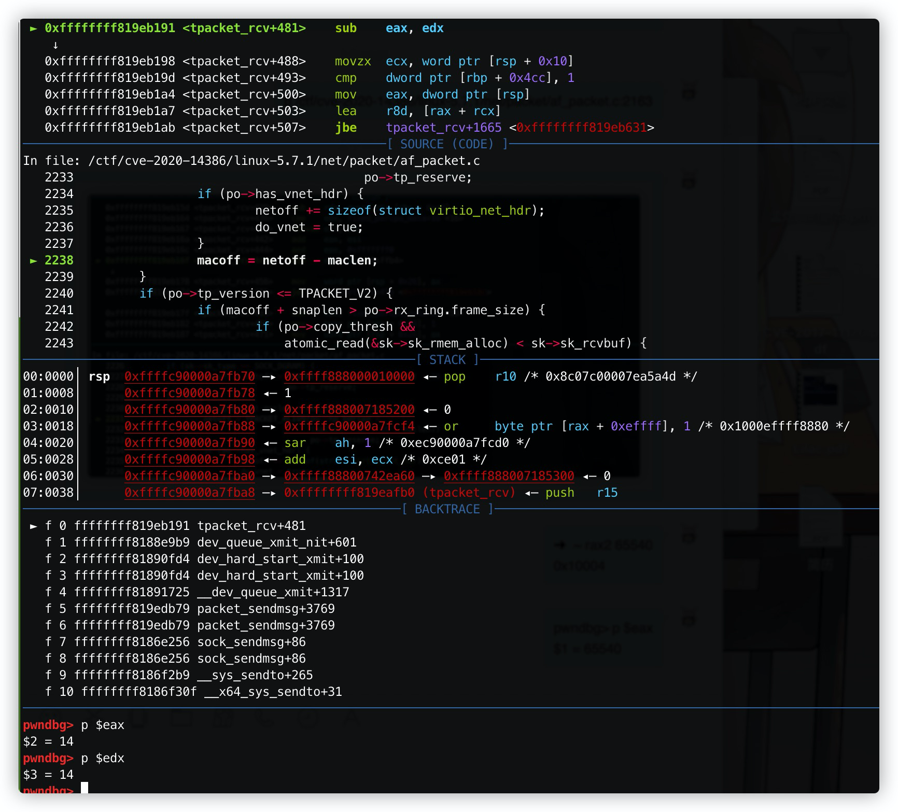
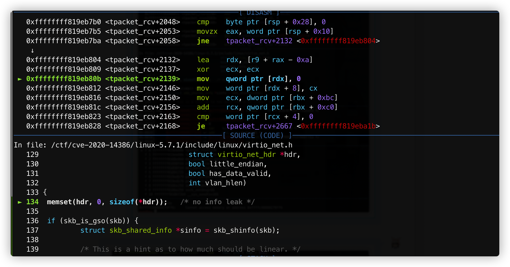
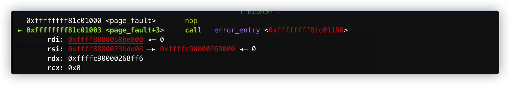

# CVE-2020-14386 POC复现

### 0x1 测试环境

- [Linux 5.7.1](https://mirrors.edge.kernel.org/pub/linux/kernel/v5.x/linux-5.7.1.tar.gz)
- GCC 7.5.0

记录一些调试和编译时期的坑：

- 需要准备编译环境：

  ```shell
  wget http://archive.ubuntu.com/ubuntu/pool/universe/d/dwarves-dfsg/dwarves_1.17-1_amd64.deb
  dpkg -i dwarves_1.17-1_amd64.deb
  
  [BTF: .tmp_vmlinux.btf: pahole version v1.15 is too old, need at least v1.16](https://askubuntu.com/questions/1280414/btf-tmp-vmlinux-btf-pahole-version-v1-15-is-too-old-need-at-least-v1-16)
  ```

### 0x2 漏洞分析 & 动态调试

Patch:

> Using `tp_reserve` to calculate `netoff` can overflow as `tp_reserve` is `unsigned int` and `netoff` is `unsigned short`.
>
> This may lead to `macoff` receving a smaller value then `sizeof(struct virtio_net_hdr)`, and if `po->has_vnet_hdr` is set, an `out-of-bounds` write will occur when calling `virtio_net_hdr_from_skb`.

```diff
 net/packet/af_packet.c | 7 ++++++-
 1 file changed, 6 insertions(+), 1 deletion(-)

diff --git a/net/packet/af_packet.c b/net/packet/af_packet.c
index 29bd405adbbd..d37435906859 100644
--- a/net/packet/af_packet.c
+++ b/net/packet/af_packet.c
@@ -2168,7 +2168,8 @@ static int tpacket_rcv(struct sk_buff *skb, struct net_device *dev,
 	int skb_len = skb->len;
 	unsigned int snaplen, res;
 	unsigned long status = TP_STATUS_USER;
-	unsigned short macoff, netoff, hdrlen;
+	unsigned short macoff, hdrlen;
+	unsigned int netoff;
 	struct sk_buff *copy_skb = NULL;
 	struct timespec64 ts;
 	__u32 ts_status;
@@ -2237,6 +2238,10 @@ static int tpacket_rcv(struct sk_buff *skb, struct net_device *dev,
 		}
 		macoff = netoff - maclen;
 	}
+	if (netoff > USHRT_MAX) {
+		atomic_inc(&po->tp_drops);
+		goto drop_n_restore;
+	}
 	if (po->tp_version <= TPACKET_V2) {
 		if (macoff + snaplen > po->rx_ring.frame_size) {
 			if (po->copy_thresh &&
```

Patch中描述的很详细，在`tpacket_rcv`中，由于`netoff`和`tp_reserve`的`size`不一致导致整数溢出漏洞，从而越界读写。

#### 整数溢出

```c
// /net/packet/af_packet.c:2231
	netoff = TPACKET_ALIGN(po->tp_hdrlen +
				       (maclen < 16 ? 16 : maclen)) +
				       po->tp_reserve;
```

这个地方，`po->tp_reserve`值为`0xffb4`，得到的`maclen`为`0xe`，经过`(maclen < 16 ? 16 : maclen)` 计算，`maclen`值变成`0x10`，`po->tp_hdrlen`的值为`0x43`，经计算，`netoff`值`0x10004`，由于`netoff`是`unsigned short`类型，所以截断导致`netoff`值为`0x4`。



```shell
pwndbg> p $eax
$1 = 65540

➜  ~ rax2 65540
0x10004
```

截断：



然后经过一个计算，通过`netoff`设置`maclen`的值为`0`：

```c
if (po->has_vnet_hdr) {
      netoff += sizeof(struct virtio_net_hdr);
      do_vnet = true;
}

macoff = netoff - maclen;
```



#### 越界访问

前期设置`netoff`和`maclen`都是为了越界访问做准备：

```c
	if (do_vnet &&
	    virtio_net_hdr_from_skb(skb, h.raw + macoff -
				    sizeof(struct virtio_net_hdr),
				    vio_le(), true, 0))
```

`virtio_net_hdr_from_skb`是个`inline`函数，`h.raw`为存储一个内核地址`0xffffc90000269000`，`maclean`的值为`0`，`sizeof(struct virtio_net_hdr)`为`0xa`，计算的值存在`rdx`中，`rdx=0xffffc90000268ff6`：

```gdb
0xffffc90000268ff6:     Cannot access memory at address 0xffffc90000268ff6
```

此时进入`virtio_net_hdr_from_skb`：

```c
static inline int virtio_net_hdr_from_skb(const struct sk_buff *skb,
					  struct virtio_net_hdr *hdr,
					  bool little_endian,
					  bool has_data_valid,
					  int vlan_hlen)
{
	memset(hdr, 0, sizeof(*hdr));   /* no info leak */
```

导致越界访问，内核Crash。



Crash



### 0x3 POC

[POC](https://www.openwall.com/lists/oss-security/2020/09/03/3/2)

### 0x4 Reference

[CVE-2020-14386：Linux内核AF_PACKET权限提升漏洞分析](https://xz.aliyun.com/t/8410)

[oss-security - CVE-2020-14386: Linux kernel: af_packet.c](https://www.openwall.com/lists/oss-security/2020/09/03/3)

