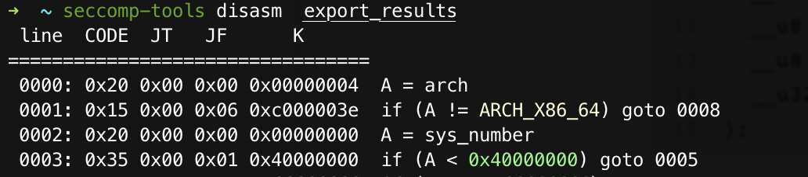

# [佛系更新……]`prctl()` in CTF

> 赛题里经常见到`prctl()`，每次都查资料，每次都忘，这次决定把每次的见到的记录一下。

详细见[prctl(2) — Linux manual page](https://man7.org/linux/man-pages/man2/prctl.2.html)

##### 函数声明

```c
 #include <sys/prctl.h>

 int prctl(int option, unsigned long arg2, unsigned long arg3,
           unsigned long arg4, unsigned long arg5);
```

##### 描述

prctl - operations on a process or thread

`prctl()`用来对进程就行操作。

 `prctl()` is called with a first argument describing what to do (with values defined in <linux/prctl.h>), and further arguments with a   significance depending on the first one.

##### 使用过的几个参数：

`prctl()`函数的第一个参数就是来描述想要做的事情。在`linux/prctl.h`里定义的很多可选参数。

这里选几个见过的来描述好了：

###### `PR_SET_NO_NEW_PRIVS`

```
PR_SET_NO_NEW_PRIVS (since Linux 3.5)
      Set the calling thread's no_new_privs attribute to the value
      in arg2.  With no_new_privs set to 1, execve(2) promises not
      to grant privileges to do anything that could not have been
      done without the execve(2) call (for example, rendering the
      set-user-ID and set-group-ID mode bits, and file capabilities
      non-functional).  Once set, the no_new_privs attribute cannot
      be unset.  The setting of this attribute is inherited by chil‐
      dren created by fork(2) and clone(2), and preserved across
      execve(2).

      Since Linux 4.10, the value of a thread's no_new_privs
      attribute can be viewed via the NoNewPrivs field in the
      /proc/[pid]/status file.

      For more information, see the kernel source file Documenta‐
      tion/userspace-api/no_new_privs.rst (or Documenta‐
      tion/prctl/no_new_privs.txt before Linux 4.13).  See also
      seccomp(2).
```

这个参数会很常见：`prctl(38, 1LL, 0LL, 0LL, 0LL);`

```c
//[include/linux/prctl.h](https://code.woboq.org/userspace/include/linux/prctl.h.html)
#define PR_SET_NO_NEW_PRIVS	38
```

简单来说，就是当第一个参数是`PR_SET_NO_NEW_PRIVS`的时候，第二个参数就是`no_new_privs`，然后当其值为`1`时，我们就没办法使用`execve()`，这个设置还会继承到子进程。

###### `PR_SET_SECCOMP`

```c
#define PR_SET_SECCOMP	22

PR_SET_SECCOMP (since Linux 2.6.23)
   Set the secure computing (seccomp) mode for the calling  thread,
   to limit the available system calls.  The more recent seccomp(2)
   system  call  provides  a  superset  of  the  functionality   of
   PR_SET_SECCOMP.

   The  seccomp  mode is selected via arg2.  (The seccomp constants
   are defined in <linux/seccomp.h>.)

   With arg2 set to SECCOMP_MODE_STRICT, the only system calls that
   the  thread is permitted to make are read(2), write(2), _exit(2)
   (but not exit_group(2)), and sigreturn(2).  Other  system  calls
   result  in  the  delivery  of  a  SIGKILL signal.  Strict secure
   computing mode is useful for number-crunching applications  that
   may  need  to  execute  untrusted byte code, perhaps obtained by
   reading from a pipe or socket.  This operation is available only
   if the kernel is configured with CONFIG_SECCOMP enabled.

   With  arg2  set  to  SECCOMP_MODE_FILTER  (since Linux 3.5), the
   system calls allowed are defined by  a  pointer  to  a  Berkeley
   Packet  Filter  passed  in  arg3.  This argument is a pointer to
   struct sock_fprog; it can be designed to filter arbitrary system
   calls and system call arguments.  This mode is available only if
   the kernel is configured with CONFIG_SECCOMP_FILTER enabled.

   If SECCOMP_MODE_FILTER filters permit fork(2), then the  seccomp
   mode  is  inherited by children created by fork(2); if execve(2)
   is  permitted,  then  the  seccomp  mode  is  preserved   across
   execve(2).  If the filters permit prctl() calls, then additional
   filters can be added; they are run in order until the first non-
   allow result is seen.

   For   further   information,   see   the   kernel   source  file
   Documentation/prctl/seccomp_filter.txt.
```

碰到了一道题里是这么写的：

`prctl(22, 2LL, &unk_202070);`

```c
/* Valid values for seccomp.mode and prctl(PR_SET_SECCOMP, <mode>) */
#define SECCOMP_MODE_DISABLED	0 /* seccomp is not in use. */
#define SECCOMP_MODE_STRICT	1 /* uses hard-coded filter. */
# define SECCOMP_MODE_FILTER	2 /* uses user-supplied filter. */
```

补充一下：就是如果`arg2`为`SECCOMP_MODE_STRICT`，则只允许调用`read`,`write`,`_exit`,`sigreturn`这几个系统调用。如果`arg2`为`SECCOMP_MODE_FILTER`，就是BPF过滤，其中对`syscall`的限制通过`arg3`的`BPF`(Berkeley Packet Filter)的相关结构体定义：

```c
/*
 *	Try and keep these values and structures similar to BSD, especially
 *	the BPF code definitions which need to match so you can share filters
 */
struct sock_fprog {	/* Required for SO_ATTACH_FILTER. */
	unsigned short		len;	/* Number of filter blocks */
	struct sock_filter *filter;
};

struct sock_filter {	/* Filter block */
	__u16	code;   /* Actual filter code */
	__u8	jt;	/* Jump true */
	__u8	jf;	/* Jump false */
	__u32	k;      /* Generic multiuse field */
};
```

至于这个结构体，~~在程序里也看不懂~~，直接export出来，使用[seccomp-tools](https://github.com/david942j/seccomp-tools)就可以了。

附上使用方法：

把`filter`结构体的数据export出来然后：

`seccomp-tools disasm  export_result`



##### Reference

[seccomp学习笔记](https://veritas501.space/2018/05/05/seccomp%E5%AD%A6%E4%B9%A0%E7%AC%94%E8%AE%B0/)

[一道 CTF 题目学习 prctl 函数的沙箱过滤规则](https://www.anquanke.com/post/id/186447#h2-7)


