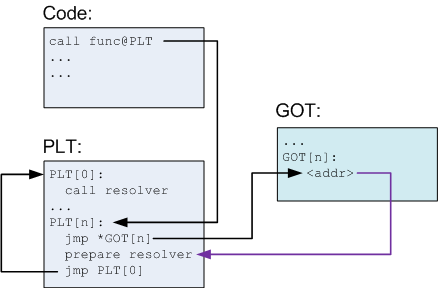

# ret2dl_resolve 学习

新春战“疫”有一道题BFnote，看到有位大佬的wp用到了`ret2dl_resolve`，就赶紧学一学。

### 0x0 ELF 和 PLT延迟绑定

首先需要用到的`section`

```assembly
.dynsym    --> DYNSYM		#动态链接符号表, _dl_fixup会用到
												#(dynamic linking symbol table)
.dynstr    --> STRTAB		#动态链接字符串表, _dl_fixup会用到
.rel.dyn   --> REL			#变量重定位
.rel.plt   --> REL			#函数重定位
.plt       --> PROGBITS	#跳转表, 将位置无关的符号转移到绝对地址俗称													#PLT[0]
.got       --> PROGBITS	#全局变量偏移
.got.plt   --> PROGBITS	#保存全局函数偏移表
```

从延迟绑定的过程来逐步解释。主要关注`prepare resolver`



我们拿实例来解释：

```c
#include <unistd.h>
#include <stdio.h>
#include <string.h>

void vuln() {
    char buf[100];
    setbuf(stdin, buf);
    read(0, buf, 256); //==> 分析这里
}

int main() {
    char buf[100] = "Return to dl_runtime_resolve!\n";
    setbuf(stdout, buf);
    write(1, buf, strlen(buf));
    vuln();
    return 0;
}
```

首先我们进入`vuln()`函数：

```assembly
► 0x8048514 <vuln+41>    call   read@plt <0x80483a0>
        fd: 0x0
        buf: 0xffffd57c —▸ 0xf7e702d8 (setbuffer+200) ◂— add    esp, 0x10
        nbytes: 0x100
```


然后单步进入：

```c
 ► 0x80483a0  <read@plt>                  jmp    dword ptr [_GLOBAL_OFFSET_TABLE_+16] <0x804a010>

   0x80483a6  <read@plt+6>                push   8
   0x80483ab  <read@plt+11>               jmp    0x8048380
    ↓
   0x8048380                              push   dword ptr [_GLOBAL_OFFSET_TABLE_+4] <0x804a004>
   0x8048386                              jmp    dword ptr [0x804a008] <0xf7fee000>
    ↓
   0xf7fee000 <_dl_runtime_resolve>       push   eax
   0xf7fee001 <_dl_runtime_resolve+1>     push   ecx
   0xf7fee002 <_dl_runtime_resolve+2>     push   edx
   0xf7fee003 <_dl_runtime_resolve+3>     mov    edx, dword ptr [esp + 0x10]
   0xf7fee007 <_dl_runtime_resolve+7>     mov    eax, dword ptr [esp + 0xc]
 ► 0xf7fee00b <_dl_runtime_resolve+11>    call   _dl_fixup <0xf7fe77e0>
        arg[0]: 0xf7fc387c (_IO_stdfile_0_lock) ◂— 0x0
        arg[1]: 0xffffd57c —▸ 0xf7e702d8 (setbuffer+200) ◂— add    esp, 0x10

   0xf7fee010 <_dl_runtime_resolve+16>    pop    edx
   0xf7fee011 <_dl_runtime_resolve+17>    mov    ecx, dword ptr [esp]
   0xf7fee014 <_dl_runtime_resolve+20>    mov    dword ptr [esp], eax
   0xf7fee017 <_dl_runtime_resolve+23>    mov    eax, dword ptr [esp + 4]
   0xf7fee01b <_dl_runtime_resolve+27>    ret    0xc
```


首先`push`了两个参数`8(reloc_arg)` 和 `dword ptr [_GLOBAL_OFFSET_TABLE_+4](link_map)`。

*PLT（Procedure Linkage Table）：过程链接表的作用是将位置无关的符号转移到绝对地址。当一个外部符号被调用时，PLT 去引用 GOT 中的其符号对应的绝对地址，然后转入并执行。*

而第一个参数在.plt表：

```shell
.plt:080483A6 ; ---------------------------------------------------------------------------
.plt:080483A6                 push    8
.plt:080483AB                 jmp     sub_8048380
.plt:080483B0 ; [00000006 BYTES: COLLAPSED FUNCTION _strlen. PRESS CTRL-NUMPAD+ TO EXPAND]
```

然后跳转到`0x8048380`（`PLT[0]`）继续让第二个参数入栈：

```shell
.plt:08048380 ; __unwind {
.plt:08048380                 push    ds:dword_804A004
.plt:08048386                 jmp     ds:dword_804A008
```

而第二参数就是链接器的表示信息, 链接的时候就已经写入了,即`link_map=*(GOT+4) ==> GOT[1]`,然后跳转到`*(GOT+8) ==> GOT[2]`，即`_dl_runtime_resolve`程序入口：

```shell
.got.plt:0804A000 _GLOBAL_OFFSET_TABLE_ dd offset _DYNAMIC
.got.plt:0804A004 dword_804A004   dd 0                    ; DATA XREF: sub_8048380↑r
.got.plt:0804A008 dword_804A008   dd 0                    ; DATA XREF: sub_8048380+6↑r
.got.plt:0804A00C off_804A00C     dd offset setbuf        ; DATA XREF: _setbuf↑r
.got.plt:0804A010 off_804A010     dd offset read          ; DATA XREF: _read↑r
.got.plt:0804A014 off_804A014     dd offset strlen        ; DATA XREF: _strlen↑r
.got.plt:0804A018 off_804A018     dd offset __libc_start_main
.got.plt:0804A018                                         ; DATA XREF: ___libc_start_main↑r
.got.plt:0804A01C off_804A01C     dd offset write         ; DATA XREF: _write↑r
.got.plt:0804A01C _got_plt        ends
```


以上，相当于执行了`_dl_runtime_resolve(link_map, reloc_arg)`。

接下来发现`_dl_runtime_resolve()`函数实际上是调用了`_dl_fixup(link_map, reloc_arg)`函数。

另外，`_dl_fixup(link_map, reloc_arg)`是以寄存器来做参数的。

```c
//部分_dl_fixup源码
_dl_fixup(struct link_map *l, ElfW(Word) reloc_arg){
      //首先通过参数reloca_arg计算入口地址,DT_JMPREL即.rel.plt,reloc_offset就是reloc_arg
      const PLTREL *const reloc=(const void*)(D_PTR(l,l_info[DT_JMPREL])+reloc_offset);
      // 通过reloc->r_info(0x107)找到.dynsym中对应的条目
      const ElfW(Sym) *sym = &symtab[ELFW(R_SYM) (reloc->r_info)];
      // 检查reloc->r_info的最低位是否为0x7, 不是则退出
      assert (ELFW(R_TYPE)(reloc->r_info) == ELF_MACHINE_JMP_SLOT);
      //接着到strtab + sym->st_name中找到符号字符串, result为libc的基地址
      result = _dl_lookup_symbol_x (
          strtab+sym->st_name,l,&sym,l->l_scope,version,ELF_RTYPE_CLASS_PLT,flags,NULL);
    // value 就是目标函数相对与libc基地址的偏移地址
    value = DL_FIXUP_MAKE_VALUE(
        result,sym?(LOOKUP_VALUE_ADDRESS(result)+sym->st_value):0);
    // 写入指定的.got表
    return elf_machine_fixup_plt (l, result, refsym, sym, reloc, rel_addr, value);      
}
```

```c
//详细代码
_dl_fixup (
# ifdef ELF_MACHINE_RUNTIME_FIXUP_ARGS
  ELF_MACHINE_RUNTIME_FIXUP_ARGS,
# endif
  struct link_map *l, ElfW(Word) reloc_arg)
{
  const ElfW(Sym) *const symtab = (const void *) D_PTR (l, l_info[DT_SYMTAB]);
  const char *strtab = (const void *) D_PTR (l, l_info[DT_STRTAB]);
// 首先通过参数reloc_arg计算重定位入口，这里的JMPREL即.rel.plt，reloc_offset即reloc_arg
  const PLTREL *const reloc = (const void *) (D_PTR (l, l_info[DT_JMPREL]) + reloc_offset);
// 然后通过reloc->r_info找到.dynsym中对应的条目
  const ElfW(Sym) *sym = &symtab[ELFW(R_SYM) (reloc->r_info)];
  const ElfW(Sym) *refsym = sym;
  void *const rel_addr = (void *)(l->l_addr + reloc->r_offset);
  lookup_t result;
  DL_FIXUP_VALUE_TYPE value;
  /* Sanity check that we're really looking at a PLT relocation.  */
// 这里还会检查reloc->r_info的最低位是不是R_386_JUMP_SLOT=7
  assert (ELFW(R_TYPE)(reloc->r_info) == ELF_MACHINE_JMP_SLOT);
  /* Look up the target symbol.  If the normal lookup rules are not used don't look in the global scope.  */
  if (__builtin_expect (ELFW(ST_VISIBILITY) (sym->st_other), 0) == 0)
  {
    const struct r_found_version *version = NULL;
    if (l->l_info[VERSYMIDX (DT_VERSYM)] != NULL)
    {
      const ElfW(Half) *vernum = (const void *) D_PTR (l, l_info[VERSYMIDX (DT_VERSYM)]);
      ElfW(Half) ndx = vernum[ELFW(R_SYM) (reloc->r_info)] & 0x7fff;
      version = &l->l_versions[ndx];
      if (version->hash == 0)
        version = NULL;
    }
    /* We need to keep the scope around so do some locking. This is not necessary for objects which cannot be unloaded or when we are not using any threads (yet). */
    int flags = DL_LOOKUP_ADD_DEPENDENCY;
    if (!RTLD_SINGLE_THREAD_P)
    {
      THREAD_GSCOPE_SET_FLAG ();
      flags |= DL_LOOKUP_GSCOPE_LOCK;
    }
#ifdef RTLD_ENABLE_FOREIGN_CALL
      RTLD_ENABLE_FOREIGN_CALL;
#endif
// 接着通过strtab+sym->st_name找到符号表字符串，result为libc基地址
    result = _dl_lookup_symbol_x (strtab + sym->st_name, l, &sym, l->l_scope, version, ELF_RTYPE_CLASS_PLT, flags, NULL);
    /* We are done with the global scope.  */
    if (!RTLD_SINGLE_THREAD_P)
      THREAD_GSCOPE_RESET_FLAG ();
#ifdef RTLD_FINALIZE_FOREIGN_CALL
      RTLD_FINALIZE_FOREIGN_CALL;
#endif
    /* Currently result contains the base load address (or link map) of the object that defines sym.  Now add in the symbol offset.  */
// value为libc基址加上要解析函数的偏移地址，也即实际地址
    value = DL_FIXUP_MAKE_VALUE (result, SYMBOL_ADDRESS (result, sym, false));
  }
  else
  {
      /* We already found the symbol.  The module (and therefore its load address) is also known.  */
    value = DL_FIXUP_MAKE_VALUE (l, SYMBOL_ADDRESS (l, sym, true));
    result = l;
  }
  /* And now perhaps the relocation addend.  */
  value = elf_machine_plt_value (l, reloc, value);
  if (sym != NULL && __builtin_expect (ELFW(ST_TYPE) (sym->st_info) == STT_GNU_IFUNC, 0))
    value = elf_ifunc_invoke (DL_FIXUP_VALUE_ADDR (value));
  /* Finally, fix up the plt itself.  */
  if (__glibc_unlikely (GLRO(dl_bind_not)))
    return value;
// 最后把value写入相应的GOT表条目中
  return elf_machine_fixup_plt (l, result, refsym, sym, reloc, rel_addr, value);
}
```

总结一下：

1. 用`link_map`访问`.dynamic`，取出`.dynstr`, `.dynsym`, `.rel.plt`的指针。

2. 利用 `.rel.plt` 头部指针+传入的第二个参数 offset 定位` .rel.plt` 中的 `Elf32_Rel` 结构体，计作`reloc`，

  ```c
  //Elf32_Rel结构体
  /* Relocation table entry without addend (in section of type SHT_REL).  */
  typedef struct
  {
    Elf32_Addr        r_offset;                /* Address */
    Elf32_Word        r_info;                        /* Relocation type and symbol index */
  } Elf32_Rel;
  /* I have seen two different definitions of the Elf64_Rel and
     Elf64_Rela structures, so we'll leave them out until Novell (or
     whoever) gets their act together.  */
  /* The following, at least, is used on Sparc v9, MIPS, and Alpha.  */
  typedef struct
  {
    Elf64_Addr        r_offset;                /* Address */
    Elf64_Xword        r_info;                        /* Relocation type and symbol index */
  } Elf64_Rel;
  ```

  ```shell
  ➜  ~ readelf -r ./bof
  
  Relocation section '.rel.dyn' at offset 0x318 contains 3 entries:
   Offset     Info    Type            Sym.Value  Sym. Name
  08049ffc  00000306 R_386_GLOB_DAT    00000000   __gmon_start__
  0804a040  00000905 R_386_COPY        0804a040   stdin@GLIBC_2.0
  0804a044  00000705 R_386_COPY        0804a044   stdout@GLIBC_2.0
  
  Relocation section '.rel.plt' at offset 0x330 contains 5 entries:
   Offset     Info    Type            Sym.Value  Sym. Name
  0804a00c  00000107 R_386_JUMP_SLOT   00000000   setbuf@GLIBC_2.0
  0804a010  00000207 R_386_JUMP_SLOT   00000000   read@GLIBC_2.0
  0804a014  00000407 R_386_JUMP_SLOT   00000000   strlen@GLIBC_2.0
  0804a018  00000507 R_386_JUMP_SLOT   00000000   __libc_start_main@GLIBC_2.0
  0804a01c  00000607 R_386_JUMP_SLOT   00000000   write@GLIBC_2.0
  ```

  

3. `reloc->r_info (==0x207)  >> 8 (== 2) `作为`.dynsym`的下标，求出当前函数的符号表项`Elf32_Sym`的指针，记作`sym`，检查`reloc->r_info`的最低位是否为`0x7`, 不是则退出。

  ```c
  /* Symbol table entry.  */
  typedef struct
  {
    Elf32_Word        st_name;                /* Symbol name (string tbl index) */
    Elf32_Addr        st_value;                /* Symbol value */
    Elf32_Word        st_size;                /* Symbol size */
    unsigned char        st_info;                /* Symbol type and binding */
    unsigned char        st_other;                /* Symbol visibility */
    Elf32_Section        st_shndx;                /* Section index */
  } Elf32_Sym;
  typedef struct
  {
    Elf64_Word        st_name;                /* Symbol name (string tbl index) */
    unsigned char        st_info;                /* Symbol type and binding */
    unsigned char st_other;                /* Symbol visibility */
    Elf64_Section        st_shndx;                /* Section index */
    Elf64_Addr        st_value;                /* Symbol value */
    Elf64_Xword        st_size;                /* Symbol size */
  } Elf64_Sym;
  ```

  

  ```shell
  Symbol table '.dynsym' contains 10 entries:
     Num:    Value  Size Type    Bind   Vis      Ndx Name
       0: 00000000     0 NOTYPE  LOCAL  DEFAULT  UND
       1: 00000000     0 FUNC    GLOBAL DEFAULT  UND setbuf@GLIBC_2.0 (2)
       2: 00000000     0 FUNC    GLOBAL DEFAULT  UND read@GLIBC_2.0 (2)
       3: 00000000     0 NOTYPE  WEAK   DEFAULT  UND __gmon_start__
       4: 00000000     0 FUNC    GLOBAL DEFAULT  UND strlen@GLIBC_2.0 (2)
       5: 00000000     0 FUNC    GLOBAL DEFAULT  UND __libc_start_main@GLIBC_2.0 (2)
       6: 00000000     0 FUNC    GLOBAL DEFAULT  UND write@GLIBC_2.0 (2)
       7: 0804a044     4 OBJECT  GLOBAL DEFAULT   26 stdout@GLIBC_2.0 (2)
       8: 0804864c     4 OBJECT  GLOBAL DEFAULT   16 _IO_stdin_used
       9: 0804a040     4 OBJECT  GLOBAL DEFAULT   26 stdin@GLIBC_2.0 (2)
  ```

4. 接着通过`strtab(.dynstr)+sym->st_name`找到符号表字符串指针。

  `Elf32_Sym[2]->st_name=0x27`（`.dynsym + Elf32_Sym_size * num`），所以`.dynstr`加上`0x27`的偏移量，就是字符串`read`的指针。`result`为`libc`的基地址。

  ```shell
  LOAD:08048278 ; ELF String Table
  LOAD:08048278 byte_8048278    db 0                    ; DATA XREF: LOAD:080481E8↑o
  LOAD:08048278                                         ; LOAD:080481F8↑o ...
  LOAD:08048279 aLibcSo6        db 'libc.so.6',0
  LOAD:08048283 aIoStdinUsed    db '_IO_stdin_used',0   ; DATA XREF: LOAD:08048258↑o
  LOAD:08048292 aStdin          db 'stdin',0            ; DATA XREF: LOAD:08048268↑o
  LOAD:08048298 aStrlen         db 'strlen',0           ; DATA XREF: LOAD:08048218↑o
  LOAD:0804829F aRead           db 'read',0             ; DATA XREF: LOAD:080481F8↑o
  LOAD:080482A4 aStdout         db 'stdout',0           ; DATA XREF: LOAD:08048248↑o
  LOAD:080482AB aSetbuf         db 'setbuf',0           ; DATA XREF: LOAD:080481E8↑o
  LOAD:080482B2 aLibcStartMain  db '__libc_start_main',0
  LOAD:080482B2                                         ; DATA XREF: LOAD:08048228↑o
  LOAD:080482C4 aWrite          db 'write',0            ; DATA XREF: LOAD:08048238↑o
  LOAD:080482CA aGmonStart      db '__gmon_start__',0   ; DATA XREF: LOAD:08048208↑o
  LOAD:080482D9 aGlibc20        db 'GLIBC_2.0',0
  LOAD:080482E3                 align 4
  LOAD:080482E4                 dd 20000h, 2, 2 dup(20002h), 20001h, 10001h, 1, 10h, 0
  LOAD:08048308                 dd 0D696910h, 20000h, 61h, 0
  LOAD:08048318 ; ELF REL Relocation Table
  ```

5. 然后在动态链接库中解析这个函数的地址，放入GOT表。

最后完成调用函数。

### 0x1 ret2dl_resolve 

`dl_resolve()`可以操作的点:

```assembly
► 0x8048514 <vuln+41>    call   read@plt <0x80483a0>
        fd: 0x0
        buf: 0xffffd57c —▸ 0xf7e702d8 (setbuffer+200) ◂— add    esp, 0x10
        nbytes: 0x100
-----------------------------------------------------------------------------
 ► 0x80483a0  <read@plt>                  jmp    dword ptr [_GLOBAL_OFFSET_TABLE_+16] <0x804a010>

   0x80483a6  <read@plt+6>                push   8
   0x80483ab  <read@plt+11>               jmp    0x8048380
    ↓
   0x8048380                              push   dword ptr [_GLOBAL_OFFSET_TABLE_+4] <0x804a004>
   0x8048386                              jmp    dword ptr [0x804a008] <0xf7fee000>
    ↓
   0xf7fee000 <_dl_runtime_resolve>       push   eax
   0xf7fee001 <_dl_runtime_resolve+1>     push   ecx
   0xf7fee002 <_dl_runtime_resolve+2>     push   edx
   0xf7fee003 <_dl_runtime_resolve+3>     mov    edx, dword ptr [esp + 0x10]
   0xf7fee007 <_dl_runtime_resolve+7>     mov    eax, dword ptr [esp + 0xc]
 ► 0xf7fee00b <_dl_runtime_resolve+11>    call   _dl_fixup <0xf7fe77e0>
        arg[0]: 0xf7fc387c (_IO_stdfile_0_lock) ◂— 0x0
        arg[1]: 0xffffd57c —▸ 0xf7e702d8 (setbuffer+200) ◂— add    esp, 0x10

   0xf7fee010 <_dl_runtime_resolve+16>    pop    edx
   0xf7fee011 <_dl_runtime_resolve+17>    mov    ecx, dword ptr [esp]
   0xf7fee014 <_dl_runtime_resolve+20>    mov    dword ptr [esp], eax
   0xf7fee017 <_dl_runtime_resolve+23>    mov    eax, dword ptr [esp + 4]
   0xf7fee01b <_dl_runtime_resolve+27>    ret    0xc
```


1. 控制`eip`为`PLT[0]`的地址，只需传递一个`index_arg`参数
2. 控制`index_arg`的大小，使指向的`reloc (Elf32_Rel)`的位置落在可控地址（比如`.bss`段）内
3. 伪造`reloc (Elf_Rel)`的`r_info`，使指向的`sym (Elf_Sym)`落在可控地址（比如`.bss`段）内
4. 伪造`sym (Elf_Sym)`的内容，使`sym->st_name`的偏移落在可控地址（比如`.bss`段）内
5. 伪造`Elf_Sym->st_name`为任意库函数，比如说`system`

**每一种情况的演示，在[这篇文章](https://qianfei11.github.io/2019/08/06/A-trip-of-ret2dl-resolve/#Pwned-One-by-One)里有详细清晰说明。**

### 0x3 64位ret2dl_resolve

有时间再写吧，先贴一个[链接](http://rk700.github.io/2015/08/09/return-to-dl-resolve/)

### 0x3 reference

[[原创][新手向]ret2dl-resolve详解](https://bbs.pediy.com/thread-227034.htm)

[A trip of ret2dl-resolve](https://qianfei11.github.io/2019/08/06/A-trip-of-ret2dl-resolve/#Pwned-One-by-One)

[Linux 延迟绑定机制](http://0x4c43.cn/2018/0429/linux-lazy-binding-mechanism/)